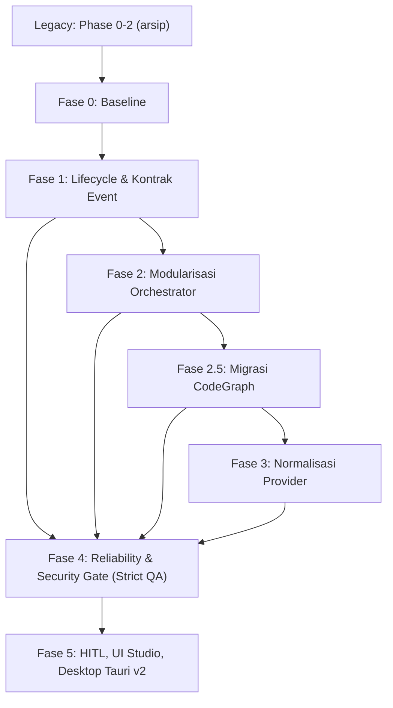

# Roadmap AegisCode: Arsitektur Stabil & Produksi

Dokumen ini adalah satu-satunya roadmap aktif AegisCode (AegisCode Studio & Aegis Agent). Pasangannya adalah arsip [docs/history/legacy-roadmap.md](file:///Users/aditwicaksono/Documents/Project-AI/AegisCode/docs/history/legacy-roadmap.md) yang memuat seluruh fase selesai (Phase 0, 1, 2.1, 2.2, dan RAG lokal). Detail layout UI ada di [docs/ui-design.md](file:///Users/aditwicaksono/Documents/Project-AI/AegisCode/docs/ui-design.md); rujukan mutu di [docs/QA/QA_PLAN.md](file:///Users/aditwicaksono/Documents/Project-AI/AegisCode/docs/QA/QA_PLAN.md) dan [docs/QA/QA_LOGS_RULES.md](file:///Users/aditwicaksono/Documents/Project-AI/AegisCode/docs/QA/QA_LOGS_RULES.md).

---

## 1. Positioning & Prioritas

AegisCode diposisikan sebagai **local-first autonomous coding workbench** untuk repositori produksi yang membutuhkan kontrol, privasi, auditability, dan provider AI fleksibel (BYOK). Bukan pengganti langsung VS Code atau Cursor.

Prinsip: (1) satu alur eksekusi yang dapat dipercaya; (2) satu sumber kebenaran untuk task, queue, history, dan event reasoning; (3) boundary provider yang konsisten; (4) orchestrator kecil dengan tanggung jawab terpisah; (5) pemasaran berdasarkan kontrol dan privasi, bukan jumlah fitur.

| Prioritas | Fokus | Fase |
|---|---|---|
| P0 | Stabilitas alur agent dan state | 0, 1 |
| P1 | Pecah orchestrator dan runtime | 2 |
| P2 | Kontrak data queue, history, reasoning, SSE | 1 |
| P3 | Stabilkan boundary provider | 3 |
| P4 | Quality gate, hardening keamanan browser & regression harness | 4 |
| P5 | Polish produk, HITL, desktop native | 5 |

Aturan: tidak memulai redesain visual, provider baru, atau fitur agent tambahan sebelum P0 dan P1 selesai.

---

## 2. Status Fase

| Fase | Fokus | Status |
| :--- | :--- | :---: |
| Legacy (Phase 0-2.2) | Provider Antigravity, UI Git Facade, Hybrid RAG | Selesai (diarsipkan) |
| Fase 0 | Baseline dan freeze arsitektur | Selesai |
| Fase 1 | Lifecycle task dan kontrak event kanonik | Selesai |
| Fase 2 | Modularisasi orchestrator/runtime | Selesai |
| Fase 2.5 | Migrasi CodeGraph & Relational Intelligence | Selesai |
| Fase 3 | Normalisasi boundary provider | Sedang Berjalan |
| Fase 4 | Reliability gate, isolasi keamanan runner, dan Triple-Gate QA | Direncanakan |
| Fase 5 | HITL guardrails, UI Studio, Tauri v2 | Pasca-Stabilisasi |

---

## 3. Fase 0: Baseline & Freeze Arsitektur

Output: diagram lifecycle task, daftar state dan event resmi beserta pemiliknya, reproducer bug, baseline test dan latensi.

- [x] Tetapkan tag baseline dan catat commit (`baseline-p0-phase0` di `2c09da419eaefaf303163d7d24956895242a5ffb`).
- [x] Jalankan seluruh test provider dan queue yang tersedia.
- [x] Simpan log satu task sukses, gagal, timeout, retry, dan cancel (`docs/QA/fixtures/phase0_canonical_logs/`).
- [x] Reproduksi: loop Antigravity, queue saat agent running, history saat reasoning (`scripts/reproduce_p0_defects.py`).
- [x] Tandai state yang hanya ada di frontend atau hanya di backend (`docs/architecture/task_lifecycle_contracts.md`).
- [x] Hentikan sementara penambahan fitur pada batas P0 (Freeze arsitektur aktif).

## 4. Fase 1: Lifecycle & Kontrak Event

Alur kanonik: Prompt, task preparation, context selection, agent iteration, provider request, tool call/result, permission/approval, perubahan berkas atau jawaban, session event, proyeksi queue/history/UI, hasil terminal.

Model event minimum: `event_id`, `task_id`, `session_id`, `sequence`, `type` (reasoning, tool_call, tool_result, status, error, completed), `status` (queued, running, waiting, completed, failed, cancelled), `payload`, `created_at`.

- [x] Reducer idempotent di backend dan frontend; validasi duplicate dan gap sequence (`taskStateReducer.js` deteksi/resolve missing sequence gap, `store.py` append idempotent).
- [x] Queue, Activity, History, dan Reasoning view diproyeksikan dari event yang sama; tanpa parsing JSON provider per view.
- [x] History dibentuk dari state terminal task/session; aksi CRUD in-situ (rename & delete history di sidebar kiri setara Threads) terintegrasi secara persisten (`.aegis/log/`, backend PATCH/DELETE endpoint, in-memory state); queue tidak bergantung polling tidak konsisten.
- [x] Task tidak masuk scheduler dua kali; pembatalan berhenti pada safe boundary; timeout, retry, malformed response, dan tool error menghasilkan status terminal jelas (atomic scheduler pump guard, deduplikasi cancel token & terminal events, deteksi respons kosong malformed, error_type timeout terstruktur).
- [x] Ketahanan SSE: exponential backoff dengan blended jitter, sinkronisasi `last_event_id`, frame `retry: 1000`, atomic replay & live buffering tanpa event hilang atau ganda (`streaming.py`, `views.py`, `useServerConnection.js`, `useTaskLifecycle.js`).
- [x] Stabilitas PTY: penutupan socket saat ganti proyek, tanpa deadlock (idempotensi thread-safe, tree-kill proses anak rekursif, async non-blocking teardown, isolasi socket frontend).
- [x] Integritas data: standarisasi murni `data/aegis.db` (auto-migrasi legacy `data/aether.db`), idempotensi indexer SHA-256 (`file_fingerprints`), isolasi cache multi-proyek (`workspaceIsolation`), dan `FileWriteLock` thread-safe.

Berkas terkait: `src/agent_ai/runtime/lifecycle.py`, `src/agent_ai/core/orchestrator.py`, `apps/django_app/api/services.py`, `apps/django_app/api/execution.py`, `src/agent_ai/runtime/events/`, `src/agent_ai/terminal/pty_service.py`, `apps/frontend/src/composables/useWorkbenchLiveEvents.js`, `apps/frontend/src/services/api.js`.
Pengujian: `tests/test_file_write_lock.py`, `tests/test_sse_gap_recovery.py`, `tests/test_scheduler_lifecycle_boundaries.py`, `tests/test_lifecycle_idempotency.py`, `tests/test_provider_retry_lifecycle.py`, `tests/test_milestone2_session_events.py`, `tests/test_cancel_task_disk_log.py`, `tests/test_pty_cleanup.py`, `tests/test_aegis_fallback.py`, `tests/test_sqlite_vec_store.py`, `apps/frontend/tests/sseGapAndTelemetry.test.mjs`, `apps/frontend/tests/workspaceIsolation.test.mjs`.

## 5. Fase 2: Modularisasi Orchestrator & Runtime (SELESAI — 100%)

`src/agent_ai/core/orchestrator.py` (~2.911 baris) telah berhasil didekomposisi menjadi thin facade 100% backward compatible (kini 917 baris); seluruh sub-modul beroperasi di sub-paket `core/orchestration/`: `contracts`, `continuous_runner`, `provider_runner`, `context_pipeline`, `retrieval_state`, `tool_results`, `event_reporting`, `legacy_runner`. Spesifikasi lengkap: [docs/architecture/phase2_mvp_modularization_plan.md](file:///Users/aditwicaksono/Documents/Project-AI/AegisCode/docs/architecture/phase2_mvp_modularization_plan.md). Log QA pengesahan: [docs/QA/logs/2026-10-08_orchestrator_modularization_PASS.md](file:///Users/aditwicaksono/Documents/Project-AI/AegisCode/docs/QA/logs/2026-10-08_orchestrator_modularization_PASS.md).

Aturan desain yang ditegakkan:
- Alur dependensi satu arah: facade, runner, lalu context/provider/tool/reporting; tanpa import cycle.
- Provider tidak mengatur lifecycle task; UI tidak menebak status dari teks; orchestrator tidak membuat JSON spesifik provider.
- Satu cancellation token lintas runtime, provider, executor; safety abort dipisah dari semantic completion.
- Setiap loop punya batas iterasi, batas waktu, dan kondisi terminal eksplisit.
- Perubahan perilaku (retry cancel-aware, policy) dipisah dari PR pemindahan kode.

- [x] **PR-MVP-1**: Core Continuous Execution & Contracts: sub-paket `core/orchestration/`, kontrak `contracts.py`, `tool_results.py`, dan modern `continuous_runner.py` (ekstraksi loop produksi `run_continuous_loop`). Continuous loop berjalan via runner baru; seluruh unit test continuous & compaction lulus 100%.
- [x] **PR-MVP-2**: Provider Runner & Resilience: ekstraksi `provider_runner.py` (retry backoff, sanitasi respons, klasifikasi error) dan `event_reporting.py`. 43 unit test retry/error lulus; event sequence dan usage telemetri identik dengan baseline.
- [x] **PR-MVP-3**: Context Pipeline, Retrieval State & Facade Thinning: ekstraksi `context_pipeline.py`, `retrieval_state.py`, isolasi `legacy_runner.py`, dan penipisan `orchestrator.py` (dari 2.059/2.911 baris menjadi 917 baris). Seluruh 191+ pengujian regresi lulus 100%; dependensi satu arah tanpa import cycle; siap menyambut Fase 2.5 CodeGraph.

| Tahap | Perubahan | Gate wajib | Status |
|---|---|---|:---:|
| PR-MVP-1 | Core Continuous Execution & Contracts: sub-paket `core/orchestration/`, kontrak `contracts.py`, `tool_results.py`, dan modern `continuous_runner.py` (ekstraksi loop produksi `run_continuous_loop`) | Continuous loop berjalan via runner baru; seluruh unit test continuous & compaction lulus 100% | [x] Selesai |
| PR-MVP-2 | Provider Runner & Resilience: ekstraksi `provider_runner.py` (retry backoff, sanitasi respons, klasifikasi error) dan `event_reporting.py` | 43 unit test retry/error lulus; event sequence dan usage telemetri identik dengan baseline | [x] Selesai |
| PR-MVP-3 | Context Pipeline, Retrieval State & Facade Thinning: ekstraksi `context_pipeline.py`, `retrieval_state.py`, isolasi `legacy_runner.py`, dan penipisan `orchestrator.py` (< 1.000 baris, kini 917 baris) | Seluruh 191+ pengujian regresi lulus; dependensi satu arah tanpa import cycle; siap menyambut Fase 2.5 CodeGraph | [x] Selesai |

Definition of done: facade kompatibel, dependensi satu arah, state task terisolasi, tidak ada duplikasi eksekusi/usage/finalisasi. Stop-Gate terverifikasi 100% oleh Thor (Exit Code 0).

## 6. Fase 2.5: Migrasi CodeGraph & Relational Intelligence

Fase ini mengeksekusi dekomisi penuh terhadap pipeline semantic vector berat (`fastembed`, `onnxruntime`, `sqlite-vec`, `chunker.py`) dan menggantikannya dengan CodeGraph deterministik berbasis SQLite standard library (`.aegis/codegraph.db`), selaras dengan PR-2 Fase 2 (Context pipeline dan retrieval state). Dokumen spesifikasi lengkap: [docs/architecture/codegraph_migration_plan.md](file:///Users/aditwicaksono/Documents/Project-AI/AegisCode/docs/architecture/codegraph_migration_plan.md).

Tujuan:
1. Menghilangkan ketergantungan binary extension C/C++ dan model ONNX berat (zero-bloat).
2. Memaksimalkan efisiensi token prompt context (< 500 token per respons tool, menjaga Asymmetric Split-Brain < 4.000 token).
3. Menyediakan navigasi struktural kode multi-hop presisi tinggi via SQLite Recursive Common Table Expression (CTE).

| Tahap | Perubahan | Gate wajib | Status |
|---|---|---|:---:|
| PR-CG-1 | Skema SQLite `.aegis/codegraph.db` (`symbols`, `symbol_relations`) dan AST extractor berbasis `ast` stdlib | Indexing simbol dan relasi Python selesai dalam < 1 detik; idempotensi fingerprint SHA-256 teruji | [x] Selesai |
| PR-CG-2 | 4 Tools kanonik: `codegraph_find_callers`, `codegraph_find_callees`, `codegraph_find_references`, `codegraph_impact_analysis` (Recursive CTE) | Unit test tool lulus; payload per panggilan terkompresi < 500 token; terintegrasi ke `ToolRegistry` | [x] Selesai |
| PR-CG-3 | Auto-migrasi transparan: deteksi dan penghapusan aman `.aegis/vectors.db` (zero-orphan), pencatatan audit log di `.aegis/log/` | Uji migrasi workspace legacy sukses; zero-orphan file; pembersihan modul `repointel/semantic/` tanpa merusak fallback | [x] Selesai |

Definition of done: Seluruh kebutuhan pencarian kode struktural ditangani deterministik oleh `.aegis/codegraph.db`, dependensi vektor dihapus, suite pengujian lulus 100% hijau, dan hak akses terbuka untuk `heimdall-scout`, `mimir-architect`, `brokkr-coder`, serta Studio Runtime. Stop-Gate terverifikasi 100% oleh Thor (Exit Code 0).

## 7. Fase 3: Normalisasi Boundary Provider

- [x] Skema kanonik `ProviderRequest` (model, messages, tools, generation_options, runtime_context), `ProviderEvent` (text, reasoning, tool_call, usage, error, done), `ProviderError` (kategori, retryable, provider, raw_reference).
- [x] Wire JSON hanya di adapter; kanonisasi dialek tool terpusat di orkestrator (`normalize_canonical_tool_name`), adapter provider mendelegasikan ke orkestrator, payload `tool_called` memuat `canonical_tool`, dan frontend bersih dari hardcode mapping.
- [x] Uji encoding/decoding nama tool, streaming text dan reasoning, respons kosong dan malformed.
- [x] Retry hanya untuk error retryable; idle activity timeout & max execution cap pada streaming/reasoning (Antigravity Provider) mencegah task stuck `running`.

## 8. Fase 4: Reliability Gate & Strict QA

### 8.1 Stop-Gate Reliabilitas & Triple-Gate QA

Stop-gate sebelum Fase 5:
1. Gate 1: seluruh `pytest` lulus (exit code 0).
2. Gate 2: seluruh `node --test` lulus (exit code 0).
3. Gate 3: tanpa uji flaky (ganti `time.sleep()` dengan polling berbatas waktu), diverifikasi independen oleh `thor-tester`, dicatat di `docs/QA/logs/`.

Syarat tambahan:
- [x] Semua test P0 lulus dua kali berturut-turut.
- [x] Zero proses zombie (SIGTERM lalu SIGKILL bertarget) dan zero task stuck `running`.
- [x] Tidak ada duplicate terminal event; queue, history, reasoning konsisten setelah reload.
- [x] Hygiene frontend: refCount `monacoModelRegistry`, buffer event maksimum 500 dengan deduplikasi.
- [x] Tidak ada kredensial pada log atau payload event; workspace luar proyek tidak berubah tanpa approval.
- [x] Dokumentasi instalasi berhasil diikuti dari mesin bersih.

### 8.2 Hardening Keamanan Browser Runner & Isolasi Zero-Trust (Track PR-SEC)

Fase ini memitigasi risiko keamanan arsitektural pada antarmuka peramban lokal (browser runner), mencegah eksploitasi cross-origin (drive-by RCE), manipulasi loopback token bypass, dan kebocoran kredensial sesi.

| Tahap | Perubahan | Gate wajib | Status |
|---|---|---|:---:|
| PR-SEC-1 | **Eliminasi Loopback Bypass & Ephemeral Secret Handshake**: Hapus bypass tanpa token untuk `127.0.0.1` pada `api/auth.py` (`is_auth_required_for_request`). Generate ephemeral handshake secret di `.aegis/run/gateway.token` (permissions `0600`) saat startup Django Gateway; inject otomatis ke bootstrap Vite/Vue. | Semua request HTTP/WebSocket wajib token valid meski dari `127.0.0.1`; bypass tanpa token ditolak (401/4001) | [x] Selesai |
| PR-SEC-2 | **Eliminasi Google Auth & Implementasi Sovereign Local Password Auth**: Hapus dependensi Google OAuth dari backend dan frontend; implementasi autentikasi lokal berbasis kata sandi (PBKDF2-HMAC-SHA256 pada `.aegis/auth.json`, minimal 6 karakter), modal input sandi `LoginOverlay.vue`, dan API endpoint status/login/setup sandi (`/api/auth/login`, `/api/auth/setup`). | Setup sandi menulis `.aegis/auth.json` (0600); login benar menerbitkan JWT sesi; salah ditolak 401; sandi < 6 karakter ditolak 400; zero residu Google OAuth | [x] Selesai |
| PR-SEC-2b | **Cross-Origin Boundary & Anti-CSRF Rest Endpoints**: Validasi ketat header `Origin` dan `Sec-Fetch-Site` untuk seluruh endpoint mutatif (`POST /api/terminal/run`, `POST /api/tasks`, `POST /api/projects`, `POST /api/sessions`). Cabut `@csrf_exempt` blanket pada endpoint eksekusi terminal dan manajemen tugas. | Request lintas-asal dari situs eksternal (`evil.com`) ditolak 403 Forbidden; zero cross-origin command execution | [x] Selesai |
| PR-SEC-3 | **Workspace Execution Sandboxing & Path Traversal Guard**: Kunci working directory dan path resolusi di `views.py:terminal_run` dan `tools/terminal.py` agar terkunci strictly di dalam project root workspace aktif. Tolak traversal (`../`) dan eksekusi di root OS tanpa persetujuan eksplisit HITL. | Subprocess execution terkunci di workspace boundary; percobaan traversal melempar ValidationError | [ ] Direncanakan |
| PR-SEC-4 | **Content-Security-Policy (CSP) & Perlindungan XSS Token**: Konfigurasi header CSP ketat pada `SecurityMiddleware` untuk mencegah injeksi skrip peramban yang dapat mengakses token di `localStorage`. Audit sanitasi rendering Monaco dan Markdown parser. | Audit XSS lulus; header CSP aktif tanpa inline-eval tak tepercaya; token terproteksi dari kebocoran skrip | [ ] Direncanakan |

## 9. Fase 5: HITL, UI Studio, Desktop Native

- **5.1 HITL**: integrasi `SupervisedModePolicy` ke permission gateway; `DiffModal.vue` untuk `write_file`, `delete_file`, dan perintah destruktif; checkpoint Git otomatis dan rollback 1-klik. Berkas: `src/agent_ai/permission/`, `src/agent_ai/runtime/policy.py`, `src/agent_ai/git/checkpoint.py`, `apps/frontend/src/components/DiffModal.vue`. Tes: `tests/test_supervised_policy.py`, `tests/test_checkpoint_rollback.py`.
- **5.2 UI Studio**: onboarding provider sederhana, preset local/BYOK/safe production, task timeline teraudit, diff review jelas. Layout mengikuti [docs/ui-design.md](file:///Users/aditwicaksono/Documents/Project-AI/AegisCode/docs/ui-design.md).
  - [x] **UI-phase (Workbench Thin Coordinator & Facade Decomposition)**: Dekomposisi `WorkbenchView.vue` (2.844 baris -> 448 baris, reduksi >84%) menjadi *Thin Layout Coordinator* dengan pemisahan 3 facade domain (`useWorkbenchEditorFacade.js`, `useWorkbenchAssistantFacade.js`, `useWorkbenchDockFacade.js`), ekstraksi 3 komponen presentasional (`EditorTabBar.vue`, `EditorBreadcrumbs.vue`, `EditorConfirmCloseModal.vue`), penyelarasan impor relatif 2-tingkat, dan *Async DOM Guard* Monaco (`requestAnimationFrame`). Seluruh 119 unit test dan 12 checks `check_workbench.py` lulus 100%.
- **5.3 Desktop Tauri v2**: shell `src-tauri/`, pengawas sidecar Python, tree-kill native OS, dialog dan notifikasi native, installer `.dmg` macOS pada branch `release`. Tes: `tests/test_sidecar_lifecycle.rs`, `.github/workflows/verify_packaging.yml`.

---

## 10. Definition of Done & Metrik

- Task queued berjalan tepat satu kali; running memiliki heartbeat; completed/failed/cancelled selalu terminal; cancel tidak merusak task lain.
- Queue menampilkan task saat `running`; history muncul setelah terminal; reasoning tampil tanpa menunggu selesai; refresh dan SSE ganda tidak menggandakan item UI.
- Wire JSON provider tidak bocor ke UI; tool call kanonik dan berpasangan dengan hasil; error provider berkategori.
- Permission dievaluasi sebelum tool berisiko; approval tercatat sebagai event; secret tidak masuk log; perubahan kode selalu dapat ditampilkan sebagai diff.

| Area | Target release candidate |
|---|---|
| Task completion | >= 95% pada smoke workflow |
| Stuck task, duplicate event, queue/history mismatch | 0 pada regression suite |
| Provider malformed response | Semua kasus berstatus terminal error |
| Reproducibility test | 2 run berturut-turut lulus |
| Onboarding | <= 15 menit untuk target provider |
| Keamanan & isolasi browser | 0 unauthenticated request (loopback bypass dihapus), 0 cross-origin execution |

Angka dikalibrasi ulang setelah baseline Fase 0 tersedia.

## 11. Backlog Pasca-MVP (YAGNI)

1. Fine-tuning LoRA otonom pada riwayat commit.
2. Butir RAG yang dilepas (adapter runner lokal, dedup konteks, telemetri hardware): hanya dibuka kembali lewat keputusan baru setelah Fase 4 lulus.
3. Remote IDE & Mobile Companion (Headless Gateway + Thin Client): Akses jarak jauh via Web/PWA/Mobile untuk remote task steering, CoT streaming, dan persetujuan diff (HITL) saat bepergian (pola VS Code Remote / JetBrains Gateway).
