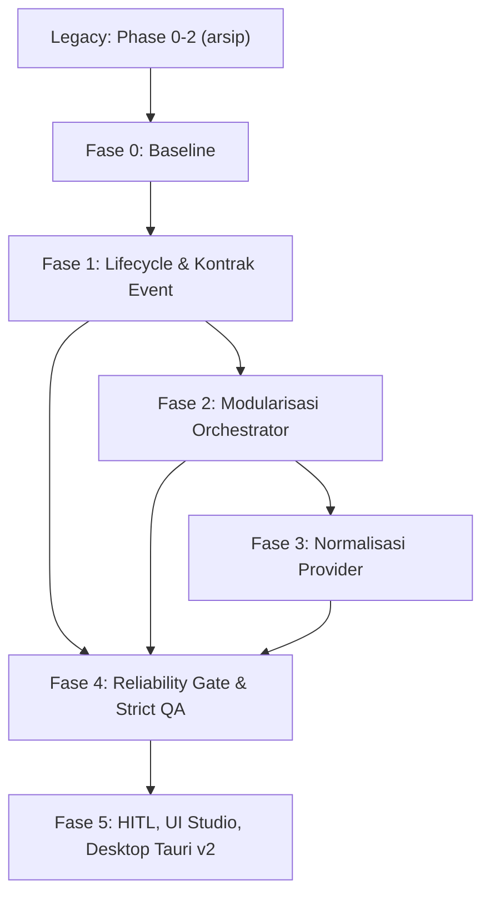

# Roadmap AegisCode: Arsitektur Stabil & Produksi

Dokumen ini adalah satu-satunya roadmap aktif AegisCode (AegisCode Studio & Aegis Agent). Pasangannya adalah arsip [docs/history/legacy-roadmap.md](file:///Users/aditwicaksono/Documents/Project-AI/AegisCode/docs/history/legacy-roadmap.md) yang memuat seluruh fase selesai (Phase 0, 1, 2.1, 2.2, dan RAG lokal). Detail layout UI ada di [docs/ui-design.md](file:///Users/aditwicaksono/Documents/Project-AI/AegisCode/docs/ui-design.md); rujukan mutu di [docs/QA/QA_PLAN.md](file:///Users/aditwicaksono/Documents/Project-AI/AegisCode/docs/QA/QA_PLAN.md) dan [docs/QA/QA_LOGS_RULES.md](file:///Users/aditwicaksono/Documents/Project-AI/AegisCode/docs/QA/QA_LOGS_RULES.md).

---

## 1. Positioning & Prioritas

AegisCode diposisikan sebagai **local-first autonomous coding workbench** untuk repositori produksi yang membutuhkan kontrol, privasi, auditability, dan provider AI fleksibel (BYOK). Bukan pengganti langsung VS Code atau Cursor.

Prinsip: (1) satu alur eksekusi yang dapat dipercaya; (2) satu sumber kebenaran untuk task, queue, history, dan event reasoning; (3) boundary provider yang konsisten; (4) orchestrator kecil dengan tanggung jawab terpisah; (5) pemasaran berdasarkan kontrol dan privasi, bukan jumlah fitur.

| Prioritas | Fokus | Fase |
|---|---|---|
| P0 | Stabilitas alur agent dan state | 0, 1 |
| P1 | Pecah orchestrator dan runtime | 2 |
| P2 | Kontrak data queue, history, reasoning, SSE | 1 |
| P3 | Stabilkan boundary provider | 3 |
| P4 | Quality gate dan regression harness | 4 |
| P5 | Polish produk, HITL, desktop native | 5 |

Aturan: tidak memulai redesain visual, provider baru, atau fitur agent tambahan sebelum P0 dan P1 selesai.

---

## 2. Status Fase

| Fase | Fokus | Status |
| :--- | :--- | :---: |
| Legacy (Phase 0-2.2) | Provider Antigravity, UI Git Facade, Hybrid RAG | Selesai (diarsipkan) |
| Fase 0 | Baseline dan freeze arsitektur | Selesai |
| Fase 1 | Lifecycle task dan kontrak event kanonik | Prioritas Utama |
| Fase 2 | Modularisasi orchestrator/runtime | Prioritas Lanjutan |
| Fase 3 | Normalisasi boundary provider | Direncanakan |
| Fase 4 | Reliability gate dan Triple-Gate QA | Direncanakan |
| Fase 5 | HITL guardrails, UI Studio, Tauri v2 | Pasca-Stabilisasi |

---

## 3. Fase 0: Baseline & Freeze Arsitektur

Output: diagram lifecycle task, daftar state dan event resmi beserta pemiliknya, reproducer bug, baseline test dan latensi.

- [x] Tetapkan tag baseline dan catat commit (`baseline-p0-phase0` di `2c09da419eaefaf303163d7d24956895242a5ffb`).
- [x] Jalankan seluruh test provider dan queue yang tersedia.
- [x] Simpan log satu task sukses, gagal, timeout, retry, dan cancel (`docs/QA/fixtures/phase0_canonical_logs/`).
- [x] Reproduksi: loop Antigravity, queue saat agent running, history saat reasoning (`scripts/reproduce_p0_defects.py`).
- [x] Tandai state yang hanya ada di frontend atau hanya di backend (`docs/architecture/task_lifecycle_contracts.md`).
- [x] Hentikan sementara penambahan fitur pada batas P0 (Freeze arsitektur aktif).

## 4. Fase 1: Lifecycle & Kontrak Event

Alur kanonik: Prompt, task preparation, context selection, agent iteration, provider request, tool call/result, permission/approval, perubahan berkas atau jawaban, session event, proyeksi queue/history/UI, hasil terminal.

Model event minimum: `event_id`, `task_id`, `session_id`, `sequence`, `type` (reasoning, tool_call, tool_result, status, error, completed), `status` (queued, running, waiting, completed, failed, cancelled), `payload`, `created_at`.

- [ ] Reducer idempotent di backend dan frontend; validasi duplicate dan gap sequence.
- [ ] Queue, Activity, History, dan Reasoning view diproyeksikan dari event yang sama; tanpa parsing JSON provider per view.
- [ ] History dibentuk dari state terminal task/session; queue tidak bergantung polling tidak konsisten.
- [ ] Task tidak masuk scheduler dua kali; pembatalan berhenti pada safe boundary; timeout, retry, malformed response, dan tool error menghasilkan status terminal jelas.
- [ ] Ketahanan SSE: exponential backoff, sinkronisasi `last_event_id`, tanpa event hilang atau ganda.
- [ ] Stabilitas PTY: penutupan socket saat ganti proyek, tanpa deadlock.
- [ ] Integritas data: `data/aegis.db` dengan fallback `data/aether.db`, idempotensi indexer SHA-256, isolasi cache multi-proyek, `FileWriteLock`.

Berkas terkait: `src/agent_ai/runtime/lifecycle.py`, `src/agent_ai/runtime/events/`, `src/agent_ai/terminal/pty_service.py`, `web/frontend/src/composables/useWorkbenchLiveEvents.js`, `web/frontend/src/services/api.js`.
Pengujian: `tests/test_milestone2_session_events.py`, `tests/test_cancel_task_disk_log.py`, `tests/test_pty_cleanup.py`, `tests/test_aegis_fallback.py`, `web/frontend/src/sseGapAndTelemetry.test.mjs`, `web/frontend/src/workspaceIsolation.test.mjs`.

## 5. Fase 2: Modularisasi Orchestrator & Runtime

`src/agent_ai/core/orchestrator.py` (sekitar 2.831 baris pada audit) menjadi facade kompatibel; tambahkan sub-paket `core/orchestration/` dengan modul: `contracts`, `context_pipeline`, `retrieval_state`, `provider_runner`, `event_reporting`, `tool_results`, `continuous_runner`, `legacy_runner`.

Aturan desain:
- Alur dependensi satu arah: facade, runner, lalu context/provider/tool/reporting; tanpa import cycle.
- Provider tidak mengatur lifecycle task; UI tidak menebak status dari teks; orchestrator tidak membuat JSON spesifik provider.
- Satu cancellation token lintas runtime, provider, executor; safety abort dipisah dari semantic completion.
- Setiap loop punya batas iterasi, batas waktu, dan kondisi terminal eksplisit.
- Perubahan perilaku (retry cancel-aware, policy) dipisah dari PR pemindahan kode.

| Tahap | Perubahan | Gate wajib |
|---|---|---|
| PR-0 | Baseline: inventaris pemanggil, fixture provider normal/error/retry/cancel, trace event | Jejak baseline terdokumentasi; test existing lulus |
| PR-1 | Kontrak data per-run dan helper reporting | Import lama jalan; urutan event dan usage sama; secret tersanitasi |
| PR-2 | Context pipeline dan retrieval state | Snapshot messages, budget, cache invalidation sama dengan baseline |
| PR-3 | Provider runner (invocation, normalisasi, retry) | Attempt count dan error retryable/permanen sama dengan baseline |
| PR-4 | Tool result dan continuous runner | Hasil per `tool_call_id`; cancel tidak memulai tool baru |
| PR-5 | Legacy runner dan penipisan facade | Continuous dan legacy lulus terpisah; learning tidak ganda |
| PR-6 | Bugfix integrasi (event Antigravity, usage, race UI, replay) | Regression ASYNC dan USR-01 lulus |

Definition of done: facade kompatibel, dependensi satu arah, state task terisolasi, tidak ada duplikasi eksekusi/usage/finalisasi. Rollback per PR melalui facade yang API-nya tidak berubah.

## 6. Fase 3: Normalisasi Boundary Provider

- [ ] Skema kanonik `ProviderRequest` (model, messages, tools, generation_options, runtime_context), `ProviderEvent` (text, reasoning, tool_call, usage, error, done), `ProviderError` (kategori, retryable, provider, raw_reference).
- [ ] Wire JSON hanya di adapter; Antigravity menjadi provider referensi pengujian, bukan satu-satunya sumber logika agent.
- [ ] Uji encoding/decoding nama tool, streaming text dan reasoning, respons kosong dan malformed.
- [ ] Retry hanya untuk error retryable; timeout tidak meninggalkan task `running`.
- [ ] Fallback provider tidak menggandakan tool call; capability provider tercatat eksplisit.

## 7. Fase 4: Reliability Gate & Strict QA

Stop-gate sebelum Fase 5:
1. Gate 1: seluruh `pytest` lulus (exit code 0).
2. Gate 2: seluruh `node --test` lulus (exit code 0).
3. Gate 3: tanpa uji flaky (ganti `time.sleep()` dengan polling berbatas waktu), diverifikasi independen oleh `thor-tester`, dicatat di `docs/QA/logs/`.

Syarat tambahan:
- [ ] Semua test P0 lulus dua kali berturut-turut.
- [ ] Zero proses zombie (SIGTERM lalu SIGKILL bertarget) dan zero task stuck `running`.
- [ ] Tidak ada duplicate terminal event; queue, history, reasoning konsisten setelah reload.
- [ ] Hygiene frontend: refCount `monacoModelRegistry`, buffer event maksimum 500 dengan deduplikasi.
- [ ] Tidak ada kredensial pada log atau payload event; workspace luar proyek tidak berubah tanpa approval.
- [ ] Dokumentasi instalasi berhasil diikuti dari mesin bersih.

## 8. Fase 5: HITL, UI Studio, Desktop Native

- **5.1 HITL**: integrasi `SupervisedModePolicy` ke permission gateway; `DiffModal.vue` untuk `write_file`, `delete_file`, dan perintah destruktif; checkpoint Git otomatis dan rollback 1-klik. Berkas: `src/agent_ai/permission/`, `src/agent_ai/runtime/policy.py`, `src/agent_ai/git/checkpoint.py`, `web/frontend/src/components/DiffModal.vue`. Tes: `tests/test_supervised_policy.py`, `tests/test_checkpoint_rollback.py`.
- **5.2 UI Studio**: onboarding provider sederhana, preset local/BYOK/safe production, task timeline teraudit, diff review jelas. Layout mengikuti [docs/ui-design.md](file:///Users/aditwicaksono/Documents/Project-AI/AegisCode/docs/ui-design.md).
- **5.3 Desktop Tauri v2**: shell `src-tauri/`, pengawas sidecar Python, tree-kill native OS, dialog dan notifikasi native, installer `.dmg` macOS pada branch `release`. Tes: `tests/test_sidecar_lifecycle.rs`, `.github/workflows/verify_packaging.yml`.

---

## 9. Definition of Done & Metrik

- Task queued berjalan tepat satu kali; running memiliki heartbeat; completed/failed/cancelled selalu terminal; cancel tidak merusak task lain.
- Queue menampilkan task saat `running`; history muncul setelah terminal; reasoning tampil tanpa menunggu selesai; refresh dan SSE ganda tidak menggandakan item UI.
- Wire JSON provider tidak bocor ke UI; tool call kanonik dan berpasangan dengan hasil; error provider berkategori.
- Permission dievaluasi sebelum tool berisiko; approval tercatat sebagai event; secret tidak masuk log; perubahan kode selalu dapat ditampilkan sebagai diff.

| Area | Target release candidate |
|---|---|
| Task completion | >= 95% pada smoke workflow |
| Stuck task, duplicate event, queue/history mismatch | 0 pada regression suite |
| Provider malformed response | Semua kasus berstatus terminal error |
| Reproducibility test | 2 run berturut-turut lulus |
| Onboarding | <= 15 menit untuk target provider |

Angka dikalibrasi ulang setelah baseline Fase 0 tersedia.

## 10. Backlog Pasca-MVP (YAGNI)

1. Fine-tuning LoRA otonom pada riwayat commit.
2. Orkestrasi multi-agent swarm terdistribusi.
3. Penyimpanan vektor cloud pihak ketiga.
4. Butir RAG yang dilepas (adapter runner lokal, dedup konteks, telemetri hardware): hanya dibuka kembali lewat keputusan baru setelah Fase 4 lulus.
