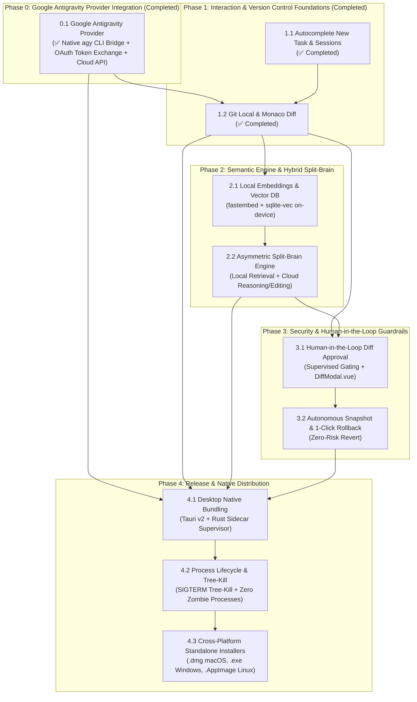
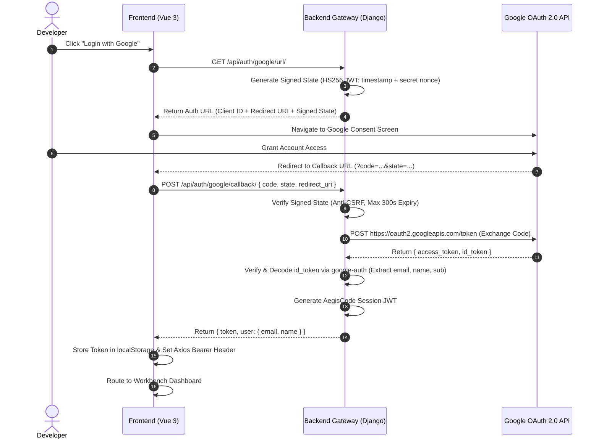

# Roadmap MVP AegisCode: The Production-Ready Engine

This document establishes the official, **dependency-driven execution roadmap** for AegisCode (AegisCode Studio & Aegis Agent). Guided by the Lean Code Policy (YAGNI) and commercial release standards, this roadmap prioritizes the core unblockers, user trust, local-first efficiency, and native desktop distribution, while maintaining a strict technical verification matrix for every phase.
---

## 1. Architectural Dependency Graph



---

## 2. Master Roadmap, Task Breakdown, and Verification Matrix

| Phase / Module | Implementation Tasks | Impacted Files & Components | Acceptance Criteria | Test Suites (*Unit & Integration*) | Status |
|---|---|---|---|---|:---:|
| **Phase 0: Google Antigravity Provider & Stateless OAuth** | • Implement `AntigravityProvider` (`src/agent_ai/providers/antigravity.py`) with native `agy` CLI bridge support.<br><br>• Implement Stateless Signed JWT Google OAuth flow with anti-CSRF validation.<br><br>• Read local Google OAuth credentials automatically from `~/.gemini/oauth_creds.json`.<br><br>• Support Antigravity Frontier Reasoning models (`gemini-3.8-flash`, `gemini-3.1-pro`, `claude-sonnet-4-6`, `gpt-oss-120b`).<br><br>• Auto-register Google Antigravity in `LLMConfigService` (`data/aegis.db` / fallback `data/aether.db`) and add provider tooltips in UI. | `src/agent_ai/providers/antigravity.py`<br><br>`src/agent_ai/config/settings.py`<br><br>`src/agent_ai/providers/factory.py`<br><br>`src/agent_ai/llm_config/provider_service.py`<br><br>`web/django_app/api/auth.py` | • Seamless Google account authentication without server session state drops.<br><br>• Successful direct and CLI bridge invocation of Antigravity provider.<br><br>• Automatic fallback handling across endpoints. | `tests/test_antigravity_provider.py`<br><br>`tests/test_oauth_state.py` | Completed |
| **Phase 1: Interaction & Version Control Foundations** | • Fuzzy mention `@file` workspace lookup with 64KB bounds.<br><br>• Slash command templates (`/fix`, `/test`, `/audit`, `/refactor`).<br><br>• Connect `GitRepositoryFacade` to REST API (`/git/status`, `/git/diff`, `/commits`, `/branches`, `/git/discard`).<br><br>• Add real-time file status badges (`M`, `U`, `D`, `A`) in `FileExplorer.vue`.<br><br>• Implement side-by-side and inline Monaco Diff Editor in AegisCode Studio. | `src/agent_ai/contextbuilder/mention.py`<br><br>`src/agent_ai/git/repository.py`<br><br>`web/django_app/api/views.py`<br><br>`web/frontend/src/components/ChangesPanel.vue`<br><br>`web/frontend/src/components/MonacoDiffEditor.vue`<br><br>`web/frontend/src/components/FileExplorer.vue`<br><br>`web/frontend/src/components/CommandPalette.vue` | • Mention lookup resolves relative file paths within 50ms.<br><br>• Git operations execute without shell escape risk.<br><br>• Monaco Diff Editor highlights line and character-level diffs correctly. | `tests/test_mention_resolver.py`<br><br>`tests/test_git_facade.py`<br><br>`web/frontend/tests/MonacoDiffEditor.test.ts` | Completed |
| **Phase 2.1: Local Embeddings & Vector DB** | • Integrate on-device `fastembed` (`bge-small-en-v1.5` or `all-MiniLM-L6-v2`).<br><br>• Configure embedded `sqlite-vec` vector database at `.aegis/vectors.db` (with fallback to `.aether/vectors.db`).<br><br>• Implement AST-based chunking for Python/JS/TS functions and classes.<br><br>• Add SHA-256 fingerprint caching to skip unchanged files during re-indexing. | `src/agent_ai/repointel/semantic/`<br><br>`src/agent_ai/repointel/indexer.py`<br><br>`src/agent_ai/tools/semantic.py`<br><br>`src/agent_ai/runtime/telemetry/hardware.py` | • Vectors stored locally in `.aegis/vectors.db` with zero external service latency.<br><br>• AST extraction preserves function signatures, docstrings, and complete class scopes.<br><br>• Unmodified files (matching SHA-256 fingerprints) bypass re-indexing. | `tests/test_fastembed_indexer.py`<br><br>`tests/test_sqlite_vec_store.py` | Planned |
| **Phase 2.2: Asymmetric Split-Brain Engine** | • Configure Local Worker for AST queries, vector similarity, and token compaction.<br><br>• Configure Cloud Orchestrator to receive compact, curated context packets (< 4,000 tokens) for *Chain of Thought* and diff generation.<br><br>• Implement Reciprocal Rank Fusion (RRF) combining lexical `atlas.json` with `sqlite-vec` similarity.<br><br>• Safely apply Cloud diff outputs to local disk via `FileWriteLock`. | `src/agent_ai/routing/`<br><br>`src/agent_ai/contextbuilder/`<br><br>`src/agent_ai/contextbudget/budget.py`<br><br>`src/agent_ai/tools/project_map.py` | • Context packets dispatched to Cloud LLMs never exceed token budget allocations (< 4,000 tokens).<br><br>• Raw workspace code is never sent indiscriminately over the network.<br><br>• RRF precision outranks pure lexical search. | `tests/test_split_brain_budget.py`<br><br>`tests/test_rrf_ranker.py` | Planned |
| **Phase 3: Security & Human-in-the-Loop Guardrails** | • Integrate `SupervisedModePolicy` into the runtime permission engine.<br><br>• Render interactive approval modal `DiffModal.vue` when agent proposes `write_file`, `delete_file`, or destructive commands.<br><br>• Implement automatic pre-task Git checkpoint stashing for 1-click snapshot rollback. | `src/agent_ai/permission/`<br><br>`src/agent_ai/runtime/policy.py`<br><br>`src/agent_ai/git/checkpoint.py`<br><br>`web/frontend/src/components/DiffModal.vue`<br><br>`web/frontend/src/components/SourceControlDrawer.vue` | • Agent execution automatically pauses before any disk-modifying tool call in supervised mode.<br><br>• User can click **Approve** (execution proceeds) or **Reject** (agent receives feedback and replans).<br><br>• Checkpoint rollback cleanly reverts workspace modifications with zero leftover artifacts. | `tests/test_supervised_policy.py`<br><br>`tests/test_checkpoint_rollback.py`<br><br>`web/frontend/tests/DiffModal.test.ts` | Planned |
| **Phase 4: Desktop Native App (Tauri v2)** | • Scaffold Tauri v2 (`src-tauri/`) application shell with Rust backend.<br><br>• Implement background Python sidecar supervisor (managing Django/Aegis Agent daemon).<br><br>• Implement native OS process tree-kill (`SIGTERM` / `taskkill /T /F`) upon window close.<br><br>• Integrate native OS file dialogs (`tauri-plugin-dialog`) and notifications (`tauri-plugin-notification`).<br><br>• Package standalone desktop installers (`.dmg`, `.exe`, `.AppImage`). | `src-tauri/src/main.rs`<br><br>`src-tauri/src/sidecar.rs`<br><br>`src-tauri/Cargo.toml`<br><br>`src-tauri/tauri.conf.json`<br><br>`.github/workflows/release.yml` | • Single-click desktop installation without requiring manual Python, Git, or Node terminal setup.<br><br>• Immediate and complete termination of child server processes on exit (zero zombies). | `tests/test_sidecar_lifecycle.rs`<br><br>`.github/workflows/verify_packaging.yml` | Planned |

---

## 3. Sprint Execution Roadmap

```
┌─────────────────────────────────────────────────────────────────────────────────┐
│ SPRINT 1: Hotfix & Bedrock (Phase 0 & Phase 1)                                  │
│ • Implement Google OAuth desktop flow with stateless JWT state (docs/Oauth-Google.md)│
│ • Enforce mandatory login gatekeeper before workbench access                     │
│ • Verify completed Git Local & Monaco Diff foundation (Pytest + Vitest)         │
└──────────────────────────────────────┬──────────────────────────────────────────┘
                                       │
                                       ▼
┌─────────────────────────────────────────────────────────────────────────────────┐
│ SPRINT 2: The Semantic Engine (Phase 2)                                         │
│ • Integrate fastembed + sqlite-vec on-device in .aegis/vectors.db (fallback .aether)│
│ • Implement AST chunking and SHA-256 fingerprint staleness filtering           │
│ • Deploy Asymmetric Split-Brain Engine (Local RRF retrieval + Cloud reasoning < 4k) │
└──────────────────────────────────────┬──────────────────────────────────────────┘
                                       │
                                       ▼
┌─────────────────────────────────────────────────────────────────────────────────┐
│ SPRINT 3: The Trust & Guardrails (Phase 3)                                      │
│ • Integrate SupervisedModePolicy with interactive DiffModal.vue                 │
│ • Implement pre-task automatic checkpoint snapshots and 1-Click Rollback        │
│ • Verify zero unapproved filesystem writes across regression tests             │
└──────────────────────────────────────┬──────────────────────────────────────────┘
                                       │
                                       ▼
┌─────────────────────────────────────────────────────────────────────────────────┐
│ SPRINT 4: The Packaging & Release (Phase 4)                                     │
│ • Wrap workbench in Tauri v2 Rust shell with Python sidecar manager             │
│ • Implement native process tree-kill and native OS dialog integration           │
│ • Build cross-platform standalone binaries (.dmg, .exe, .AppImage)               │
└─────────────────────────────────────────────────────────────────────────────────┘
```

---

## 4. Post-MVP Backlog (Deferred Features)

To maintain rapid release momentum and prevent over-engineering, the following speculative or high-research initiatives are parked in the Post-MVP Backlog:

| Feature | Original Scope | Rationale for Post-MVP Deferral | Recommended Future Trigger |
|---|:---:|---|---|
| **3D Graphify Semantic Graph & Git Blast Radius** | Three.js / WebGL 3D Canvas | **High Research / Low Day-1 ROI:** Canvas physics and 3D node rendering consume weeks of UI debugging. Developers prioritize concise textual diff lists over 3D animations while coding. | Revisit in v2.0 after vector embeddings and text-based blast radius lists are validated. |
| **Pluggable Extension Host & .jsx Runtime** | Out-of-process Web Worker Sandbox | **Premature Ecosystem:** Building an extension marketplace before establishing an active user base is premature optimization. | Revisit once third-party developer demand is demonstrated. |
| **Tab Live Server & Web Sandbox Preview** | Supervisor + Sandboxed Iframe | **Redundant Utility:** Web developers prefer external browser windows (Chrome/Brave) with full DevTools over constrained embedded iframes. | Revisit if template live preview becomes an essential user requirement. |

---

## 5. Technical Specifications for Phase 0 (Google OAuth Implementation)

Per [docs/Oauth-Google.md](file:///Users/aditwicaksono/Documents/Project-AI/Aether-Agent/docs/Oauth-Google.md), the Google OAuth implementation resolves session drops and cross-origin cookie restrictions via a **Stateless Signed State Architecture**:



### Core Backend Implementation Blueprint (`web/django_app/api/auth.py`)

```python
import time
import jwt
import requests
from django.conf import settings
from google.oauth2 import id_token
from google.auth.transport import requests as google_requests

STATE_EXPIRY_SECONDS = 300

def generate_signed_state() -> str:
    """Generate tamper-proof signed JWT state to prevent CSRF without server session."""
    payload = {
        "timestamp": int(time.time()),
        "nonce": settings.SECRET_KEY[:8]
    }
    return jwt.encode(payload, settings.SECRET_KEY, algorithm="HS256")

def verify_signed_state(state: str) -> bool:
    """Validate signed state token signature and expiration."""
    try:
        decoded = jwt.decode(state, settings.SECRET_KEY, algorithms=["HS256"])
        if int(time.time()) - decoded.get("timestamp", 0) > STATE_EXPIRY_SECONDS:
            return False
        return True
    except Exception:
        return False

def exchange_google_code(code: str, redirect_uri: str) -> dict:
    """Exchange authorization code for access_token and id_token."""
    token_url = "https://oauth2.googleapis.com/token"
    payload = {
        "code": code,
        "client_id": settings.GOOGLE_OAUTH_CLIENT_ID,
        "client_secret": settings.GOOGLE_OAUTH_CLIENT_SECRET,
        "redirect_uri": redirect_uri,
        "grant_type": "authorization_code",
    }
    response = requests.post(token_url, data=payload, timeout=10)
    if not response.ok:
        raise ValueError(f"Google Token Exchange Failed: {response.text}")
    return response.json()

def verify_google_id_token(token_str: str) -> dict:
    """Verify cryptographic signature and extract authenticated user identity."""
    return id_token.verify_oauth2_token(
        token_str,
        google_requests.Request(),
        settings.GOOGLE_OAUTH_CLIENT_ID
    )
```

---

## 6. Completed Capabilities Summary

The following core modules are implemented and verified in the repository:

1. **Markdown Report Renderer:** Fully deterministic GFM parser with tables, syntax tagging, and checklist controls (`markdown.js`).
2. **Task History Cleanup API:** Complete REST endpoint and frontend confirmation workflow for `.aegis/log/` (fallback `.aether/log/`).
3. **Interactive ANSI Terminal:** `TerminalView.vue` with real-time ANSI streaming, history buffer, and interrupt handling.
4. **Modern 3-Column IDE Layout:** 48px Activity Bar, collapsible drawers, center Monaco editor, AI drawer, and bottom dock.
5. **Dynamic Theme Engine:** Isolated CSS token themes (Dark/Light) and custom wallpaper persistence.
6. **Global Command Palette:** `Ctrl+K` fuzzy modal for navigation and IDE commands.
7. **Multi-Tab Monaco Workspace:** `EditorTabsService` with dirty guards and unsaved change handling.
8. **Integrated Settings Workspace:** Dedicated `aegis://settings` tab with real-time configuration persistence.
9. **Source Control Drawer & Commit Graph:** Real-time Git status, diff navigation, and SVG railway commit visualization.
10. **OpenCode Zen Provider:** Native support for Claude, GPT-4o, Gemini, and DeepSeek via OpenAI-compatible endpoints.
11. **Deterministic Task Planning & Replanning:** `TaskPlanner` and `Replanner` handling runtime errors without excessive LLM calls.
12. **Reliability & Retry Manager:** Bounded exponential backoff for network and rate-limit faults.
13. **Task Resume Architecture:** Idempotent task continuation using SHA-256 state fingerprints.
14. **Deterministic Model Routing:** Automatic model tier allocation based on task complexity.
15. **Model Context Protocol (MCP):** Native client support for stdio, http, and sse transport protocols.
16. **Autocomplete & Mentions:** `@file` mentions, slash command shortcuts, and task history recall.
17. **Source Code Git Local & Monaco Diff:** Git status, split/inline Monaco Diff Editor, and in-place discard support.
