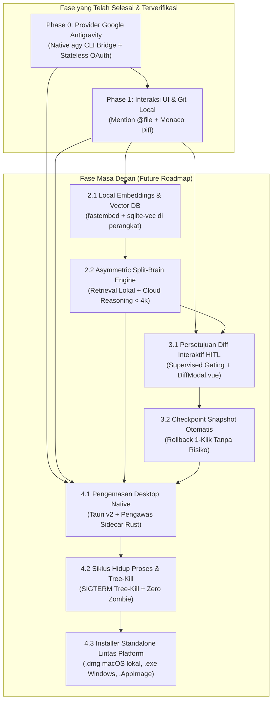

# Roadmap MVP AegisCode: The Production-Ready Engine

Dokumen ini memuat peta jalan eksekusi resmi berbasis dependensi untuk pengembangan **AegisCode** (AegisCode Studio & Aegis Agent). Seluruh detail pencapaian fitur yang telah diselesaikan (Phase 0 dan Phase 1) kini telah diarsipkan secara permanen di [docs/history/completed-features.md](file:///Users/aditwicaksono/Documents/Project-AI/AegisCode/docs/history/completed-features.md), sedangkan rincian teknis mendalam untuk fase mendatang dapat ditinjau pada [docs/future-roadmap/future_roadmap.md](file:///Users/aditwicaksono/Documents/Project-AI/AegisCode/docs/future-roadmap/future_roadmap.md).

---

## 1. Status Milestone Terkini

| Fase | Nama Modul | Status | Lokasi Dokumentasi |
| :--- | :--- | :---: | :--- |
| **Phase 0** | Integrasi Provider Google Antigravity & Stateless OAuth | Selesai | [docs/history/completed-features.md](file:///Users/aditwicaksono/Documents/Project-AI/AegisCode/docs/history/completed-features.md#1-phase-0-google-antigravity-provider--stateless-oauth) |
| **Phase 1** | Fondasi Interaksi UI & Git Facade Monaco Diff | Selesai | [docs/history/completed-features.md](file:///Users/aditwicaksono/Documents/Project-AI/AegisCode/docs/history/completed-features.md#2-phase-1-interaksi-ui--fondasi-version-control) |
| **Phase 2** | Mesin Semantik & Hybrid Split-Brain Engine | Direncanakan | [docs/future-roadmap/future_roadmap.md](file:///Users/aditwicaksono/Documents/Project-AI/AegisCode/docs/future-roadmap/future_roadmap.md#2-matriks-rincian-tugas--verifikasi-masa-depan) |
| **Phase 3** | Keamanan & Human-in-the-Loop Guardrails | Direncanakan | [docs/future-roadmap/future_roadmap.md](file:///Users/aditwicaksono/Documents/Project-AI/AegisCode/docs/future-roadmap/future_roadmap.md#2-matriks-rincian-tugas--verifikasi-masa-depan) |
| **Phase 4** | Rilis Desktop Native (Tauri v2 macOS Bundle) | Direncanakan | [docs/future-roadmap/future_roadmap.md](file:///Users/aditwicaksono/Documents/Project-AI/AegisCode/docs/future-roadmap/future_roadmap.md#2-matriks-rincian-tugas--verifikasi-masa-depan) |

---

## 2. Grafik Dependensi Arsitektur



---

## 3. Rencana Eksekusi Sprint Mendatang

```
┌─────────────────────────────────────────────────────────────────────────────────┐
│ SPRINT 2: The Semantic Engine (Phase 2)                                         │
│ • Integrasikan fastembed + sqlite-vec on-device di .aegis/vectors.db            │
│ • Terapkan chunking berbasis AST dan filtering sidik jari SHA-256               │
│ • Luncurkan Asymmetric Split-Brain (Retrieval lokal RRF + Reasoning Cloud < 4k) │
└──────────────────────────────────────┬──────────────────────────────────────────┘
                                       │
                                       ▼
┌─────────────────────────────────────────────────────────────────────────────────┐
│ SPRINT 3: The Trust & Guardrails (Phase 3)                                      │
│ • Integrasikan SupervisedModePolicy dengan komponen interaktif DiffModal.vue    │
│ • Terapkan pembuatan checkpoint otomatis pra-tugas dan 1-Click Rollback         │
│ • Pastikan tidak ada penulisan filesystem yang tidak disetujui pengguna         │
└──────────────────────────────────────┬──────────────────────────────────────────┘
                                       │
                                       ▼
┌─────────────────────────────────────────────────────────────────────────────────┐
│ SPRINT 4: The Packaging & Release (Phase 4)                                     │
│ • Bungkus aplikasi dalam kerangka Tauri v2 Rust dengan sidecar Python manager   │
│ • Terapkan terminasi tree-kill proses native OS dan dialog native               │
│ • Bangun biner mandiri (.dmg untuk macOS secara lokal pada branch release)       │
└─────────────────────────────────────────────────────────────────────────────────┘
```
