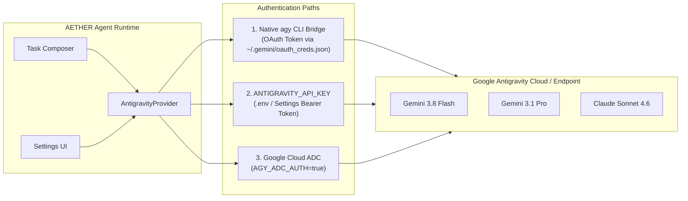

# Google Antigravity Provider Guide

Panduan resmi integrasi **Google Antigravity** sebagai AI Model Provider di **AETHER**.

---

## 1. Ringkasan & Arsitektur

**Google Antigravity** adalah *standalone agentic provider* dari Google yang menyediakan akses ke model *frontier reasoning*:
- **Gemini Family**: `gemini-3.8-flash-high`, `gemini-3.8-flash-medium`, `gemini-3.8-flash-low`, `gemini-3.7-flash-high`, `gemini-3.1-pro-high`, `gemini-3.1-pro-low`.
- **Reasoning / Thinking Models**: `claude-sonnet-4-6`, `claude-opus-4-6-thinking`.
- **Open Weights**: `gpt-oss-120b-medium`.

Di AETHER, Antigravity **BUKAN** gerbang login web (*auth gatekeeper*) yang memblokir workbench, melainkan **penyedia model AI** (seperti halnya Ollama, DeepSeek, OpenCode Zen, dan OpenAI-compatible).



---

## 2. Cara Login & Otentikasi

### Jalur 1: CLI Token Exchange (Paling Direkomendasikan & Zero-Config)

CLI Antigravity (`agy`) mengelola otentikasi akun Google Anda di tingkat sistem operasi:

1. **Jalankan `agy` di Terminal**:
   Buka terminal di komputer Anda (di luar AETHER) dan jalankan:
   ```bash
   agy
   ```
2. **Buka Tautan Otorisasi Google**:
   Terminal akan menampilkan tautan otentikasi Google:
   ```text
   Please visit this URL to authenticate:
   https://accounts.google.com/o/oauth2/v2/auth?...
   ```
3. **Pilih Akun Google di Browser**:
   Buka tautan tersebut di browser (Chrome / Safari), pilih akun Google Anda, dan berikan persetujuan akses.
4. **Salin (*Copy*) Token**:
   Halaman browser akan menampilkan **OAuth Authorization Token**. Salin token tersebut.
5. **Tempel (*Paste*) ke Terminal**:
   Kembali ke terminal tempat perintah `agy` berjalan, tempel token, lalu tekan **Enter**.
6. **Otomatis Terhubung**:
   Kredensial disimpan dengan aman di `~/.gemini/oauth_creds.json`. AETHER akan **otomatis mendeteksi** sesi aktif ini tanpa konfigurasi tambahan!

---

### Jalur 2: Konfigurasi API Key / Token Manual (`.env` / Settings)

Jika Anda memiliki API Key atau Bearer Token dari Google Cloud / Gemini Enterprise:

1. Tambahkan ke file `.env` di direktori root `Aether-Agent`:
   ```env
   ANTIGRAVITY_API_KEY=token_atau_api_key_anda
   ANTIGRAVITY_BASE_URL=https://antigravity.google/api/v1
   ANTIGRAVITY_MODEL=gemini-3.8-flash-medium
   ```
2. Atau konfigurasi via menu **Settings &rarr; Providers & Models &rarr; Google Antigravity** di AETHER Workbench.

---

### Jalur 3: Mode Enterprise (Headless / Application Default Credentials)

Berdasarkan [Dokumentasi Enterprise Google Antigravity](https://antigravity.google/docs/enterprise), Anda dapat menghubungkan Antigravity ke akun Google Cloud organisasi:

1. **Inisialisasi ADC**:
   ```bash
   gcloud auth application-default login --project NAMA_PROJECT_GCP_ANDA
   ```
2. **Aktifkan Variabel Lingkungan**:
   ```bash
   export AGY_ADC_AUTH=true
   export GOOGLE_CLOUD_PROJECT=nama-project-anda
   export GOOGLE_CLOUD_LOCATION=global  # Opsi: global, us, eu
   ```
3. AETHER akan otomatis meneruskan variabel lingkungan ini saat memanggil model.

---

## 3. Matriks Model yang Didukung

| Model ID | Nama Tampilan | Deskripsi / Karakteristik |
|---|---|---|
| `gemini-3.8-flash-high` | Gemini 3.8 Flash (High) | Kecepatan tinggi dengan alokasi reasoning mendalam. |
| `gemini-3.8-flash-medium` | Gemini 3.8 Flash (Medium) | **(Default)** Keseimbangan optimal antara kecepatan dan ketepatan kode. |
| `gemini-3.8-flash-low` | Gemini 3.8 Flash (Low) | Latensi terendah untuk tugas autocomplete cepat. |
| `gemini-3.1-pro-high` | Gemini 3.1 Pro (High) | Penalaran arsitektur kompleks dan analisis dependensi. |
| `claude-sonnet-4-6` | Claude Sonnet 4.6 (Thinking) | Model penalaran reasoning frontier. |
| `gpt-oss-120b-medium` | GPT-OSS 120B | Model open-weights efisien. |

---

## 4. Penggunaan di AETHER Workbench

1. Buka AETHER Workbench di browser (`http://localhost:8478`).
2. Buka dialog **New Task** (tombol *New Task* atau shortcut `Cmd+K` / `Ctrl+K`).
3. Pada dropdown **Provider**, pilih **Google Antigravity**.
4. Pilih model (misal `gemini-3.8-flash-medium`).
5. Ketik instruksi dan kirim task. AETHER akan langsung mengeksekusi instruksi melalui model Antigravity!
