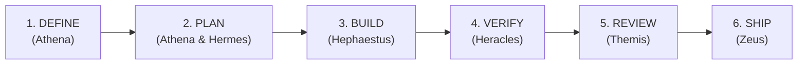

# Panduan Pengguna & Operasional AegisCode Studio

Dokumentasi resmi ini memandu Anda dalam mengoperasikan **AegisCode Studio** mulai dari persiapan awal, autentikasi lokal berdaulat (*Sovereign Authentication*), pengaturan pendamping jarak jauh (*Telegram Remote Companion*), hingga orkestrasi tim multi-agent berbasis **Olympus Framework**.

---

## Daftar Isi
1. [Prasyarat & Menjalankan Aplikasi](#1-prasyarat--menjalankan-aplikasi)
2. [Panduan Login & Autentikasi IDE](#2-panduan-login--autentikasi-ide)
   - [Konsep Sovereign Local Authentication](#21-konsep-sovereign-local-authentication)
   - [Setup Kata Sandi Pertama Kali (First-Run)](#22-setup-kata-sandi-pertama-kali-first-run)
   - [Melakukan Login Harian](#23-melakukan-login-harian)
   - [Override Kata Sandi via Environment Variable](#24-override-kata-sandi-via-environment-variable)
3. [Panduan Telegram Remote Companion](#3-panduan-telegram-remote-companion)
   - [Arsitektur Keamanan Zero-Trust Outbound](#31-arsitektur-keamanan-zero-trust-outbound)
   - [Langkah Membuat Bot di @BotFather](#32-langkah-membuat-bot-di-botfather)
   - [Konfigurasi Token di File .env](#33-konfigurasi-token-di-file-env)
   - [Proses Pairing Cepat (QR Code & Deep Link)](#34-proses-pairing-cepat-qr-code--deep-link)
   - [Fitur Remote Steering & HITL Approval](#35-fitur-remote-steering--hitl-approval)
   - [Memutuskan Hubungan Akun (Unlink)](#36-memutuskan-hubungan-akun-unlink)
4. [Menggunakan Agents Aegis (Olympus Framework)](#4-menggunakan-agents-aegis-olympus-framework)
   - [Mengenal Olympus Framework](#41-mengenal-olympus-framework)
   - [Roster Persona & Peran Spesialis](#42-roster-persona--peran-spesialis)
   - [Siklus 6-Fase Kanonikal (The 6-Phase Lifecycle)](#43-siklus-6-fase-kanonikal-the-6-phase-lifecycle)
   - [Navigasi Panel Assistant di Workbench IDE](#44-navigasi-panel-assistant-di-workbench-ide)
   - [Panduan Memberikan Perintah & Alur Persetujuan](#45-panduan-memberikan-perintah--alur-persetujuan)
5. [Troubleshooting & FAQ](#5-troubleshooting--faq)
   - [Reset Kata Sandi IDE Lokal](#51-reset-kata-sandi-ide-lokal)
   - [Bot Telegram Tidak Merespons / Offline](#52-bot-telegram-tidak-merespons--offline)
   - [QR Code Pairing Kadaluwarsa atau Gagal Membuka Bot](#53-qr-code-pairing-kadaluwarsa-atau-gagal-membuka-bot)
   - [Agent Terhenti Menunggu Konfirmasi (HITL Timeout)](#54-agent-terhenti-menunggu-konfirmasi-hitl-timeout)

---

## 1. Prasyarat & Menjalankan Aplikasi

Pastikan lingkungan lokal Anda telah memenuhi spesifikasi berikut:
- **Node.js**: v18.0.0 atau lebih baru (npm v9+)
- **Python**: v3.10 atau lebih baru dengan `pip` dan `virtualenv`
- **Rust Token Killer (`rtk`)**: Terpasang di `~/.local/bin/rtk` untuk optimasi eksekusi terminal.

### Menjalankan Layanan Lokal

1. **Jalankan Backend (Django API & Agent Runtime):**
   ```bash
   cd apps/django_app
   python -m venv .venv
   source .venv/bin/activate
   pip install -r requirements.txt
   python manage.py runserver 0.0.0.0:8000
   ```

2. **Jalankan Frontend (AegisCode Studio Vite):**
   ```bash
   cd apps/frontend
   npm install
   npm run dev
   ```

Buka peramban Anda di `http://localhost:5173` untuk mengakses antarmuka AegisCode Studio.

---

## 2. Panduan Login & Autentikasi IDE

### 2.1 Konsep Sovereign Local Authentication
AegisCode menggunakan arsitektur **Sovereign Local Authentication**. Sistem ini bersifat *single-tenant local operator* yang tidak bergantung pada server autentikasi pihak ketiga di internet:
- Kredensial diamankan menggunakan algoritma **PBKDF2-HMAC-SHA256** dengan 100.000 iterasi.
- Hash kredensial disimpan secara terenkripsi lokal di `.aegis/auth.json`.
- Sesi aktif menggunakan stateless **JSON Web Token (JWT)** yang tersimpan aman di peramban Anda.

### 2.2 Setup Kata Sandi Pertama Kali (First-Run)
Saat pertama kali membuka AegisCode Studio pada instalasi baru:
1. Dialog **"Inisialisasi Kata Sandi Pengembang"** akan muncul secara otomatis.
2. Masukkan kata sandi pilihan Anda (minimal 6 karakter, maksimal 128 karakter).
3. Masukkan kembali kata sandi pada kolom konfirmasi.
4. Klik **"Simpan & Masuk ke Studio"**.
5. Kredensial akan disimpan ke file `.aegis/auth.json` dan sesi kerja Anda langsung aktif.

### 2.3 Melakukan Login Harian
Pada kunjungan berikutnya atau saat sesi berakhir:
1. Layar **LoginOverlay** akan meminta kata sandi pengembang lokal.
2. Masukkan kata sandi yang telah Anda daftarkan, lalu tekan `Enter` atau klik tombol **"Masuk ke Studio"**.
3. Jika kata sandi sesuai, token sesi JWT diterbitkan dan seluruh fitur Workbench akan terbuka seketika.

### 2.4 Override Kata Sandi via Environment Variable
Jika Anda bekerja dalam container atau ingin menetapkan kata sandi secara deklaratif tanpa interaksi UI, tambahkan variabel lingkungan berikut ke file konfigurasi atau terminal:
```bash
export AEGIS_PASSWORD="KataSandiKuatAnda123"
# atau alias alternatif:
export AEGIS_PIN="123456"
```
Nilai ini akan secara otomatis diutamakan oleh backend tanpa perlu mengisi form inisialisasi awal.

---

## 3. Panduan Telegram Remote Companion

AegisCode dilengkapi dengan **Remote Telegram Companion**, memungkinkan Anda memantau pekerjaan agent dan memberikan persetujuan perubahan kode (*Human-in-the-Loop*) langsung dari ponsel cerdas Anda saat sedang tidak di depan komputer.

### 3.1 Arsitektur Keamanan Zero-Trust Outbound
- **Tanpa Port Publik / Tanpa Port Forwarding**: Komputer lokal Anda menggunakan metode *outbound long-polling* langsung ke server Telegram API. Anda **tidak** memerlukan IP publik, domain, ataupun tunneling pihak ketiga seperti ngrok.
- **Zero-Trust Whitelist**: Bot hanya menerima dan mengeksekusi instruksi dari Telegram User ID yang telah dipasangkan secara sah melalui proses pairing. Pesan dari pengguna Telegram tak dikenal akan langsung ditolak.

### 3.2 Langkah Membuat Bot di @BotFather
1. Buka aplikasi Telegram di ponsel atau desktop Anda.
2. Cari akun resmi **`@BotFather`** (bertanda centang biru).
3. Ketik perintah `/newbot`.
4. Berikan nama tampilan untuk bot Anda (contoh: `Aegis Studio Companion`).
5. Tentukan username bot yang berakhiran `bot` (contoh: `my_aegiscode_bot`).
6. BotFather akan mengirimkan token HTTP API. Salin token tersebut:
   ```text
   7123456789:AAFlkjhsdf89234jklnvsd98f723kj
   ```
7. *(Opsional tapi Disarankan)* Daftarkan menu perintah cepat di BotFather dengan mengirimkan `/setcommands` lalu masukkan:
   ```text
   status - Periksa status aktifitas workspace dan agent
   approve - Setujui perubahan kode yang sedang menunggu
   reject - Tolak perubahan kode
   cancel - Batalkan tugas agent yang sedang berjalan
   help - Tampilkan panduan penggunaan perintah
   ```

### 3.3 Konfigurasi Token di File `.env`
Buka file `.env` di direktori utama repository AegisCode (atau buat jika belum ada), lalu tambahkan baris berikut:
```env
TELEGRAM_BOT_TOKEN="7123456789:AAFlkjhsdf89234jklnvsd98f723kj"
```
Setelah menambahkan token, restart backend Django agar poller runtime Telegram aktif.

### 3.4 Proses Pairing Cepat (QR Code & Deep Link)
1. Buka AegisCode Studio di browser.
2. Buka menu **Settings** (`Ctrl+,` atau `Cmd+,`) lalu pilih tab **Remote Companion**, atau klik indikator Telegram pada **AppStatusBar** di sudut kanan bawah.
3. Klik tombol **"Pindai QR Code Pairing"**. Popover pairing akan menampilkan QR code interaktif dan tautan direct link.
4. **Metode Scan**: Buka kamera ponsel Anda dan pindai QR code yang tampil di layar.
5. **Metode Tautan**: Atau klik tombol **"Buka di Telegram"** (`t.me/<nama_bot>?start=<token>`).
6. Tekan tombol **Start** di obrolan Telegram.
7. Dalam hitungan 1–3 detik, popover di IDE akan otomatis menutup dan indikator status bar berubah menjadi badge hijau: `Telegram: Paired (@username)`.

### 3.5 Fitur Remote Steering & HITL Approval
Saat agent melakukan perubahan berkas atau menjalankan tindakan yang memerlukan otorisasi (*Human-in-the-Loop*):
- **Notifikasi Getar & Suara**: Ponsel Anda akan menerima pesan instan berisi ringkasan perubahan file (*unified diff snippet*).
- **Tombol Persetujuan Inline**: Pesan Telegram menyertakan dua tombol aksi:
  - `[✅ Approve]`: Mengizinkan agent menulis kode ke disk atau menjalankan perintah.
  - `[❌ Reject]`: Menolak usulan perubahan dan meminta agent merevisi strateginya.
- **Chat Steering**: Anda dapat membalas (*reply*) pesan bot Telegram dengan instruksi tambahan, misalnya: *"Jangan ubah skema database, gunakan relasi foreign key yang sudah ada."* Instruksi Anda langsung masuk ke konteks agent di komputer lokal.

### 3.6 Memutuskan Hubungan Akun (Unlink)
Jika Anda ingin berganti perangkat atau memutuskan integrasi:
1. Buka **Settings** -> **Remote Companion**.
2. Klik tombol merah **"Putuskan Hubungan Akun"**.
3. Status pairing seketika dihapus dari berkas lokal `.aegis/telegram_paired.json`.

---

## 4. Menggunakan Agents Aegis (Olympus Framework)

AegisCode ditenagai oleh **Olympus Framework**—arsitektur multi-agent otonom yang memecah rekayasa perangkat lunak ke dalam peran-peran spesialis yang bekerja secara hierarkis dan terkoordinasi.

### 4.1 Mengenal Olympus Framework
Berbeda dengan sistem LLM monolitik, Olympus Framework mendistribusikan siklus pengembangan ke dalam 6 fase kanonikal dengan gerbang kualitas (*quality stop-gates*) yang ketat. Tidak ada kode yang ditulis sebelum spesifikasi disepakati, dan tidak ada kode yang dianggap selesai sebelum diverifikasi oleh pengujian otomatis.



### 4.2 Roster Persona & Peran Spesialis
Daftar agen kanonikal yang siap membantu di direktori `agents/`:

| Nama Persona | File Profil | Peran & Tanggung Jawab Utama |
|---|---|---|
| **Zeus Orchestrator** | [`agents/zeus-orchestrator.md`](file:///Users/aditwicaksono/Documents/Project-AI/AegisCode/agents/zeus-orchestrator.md) | **Pemimpin Utama & Koordinator Alur.** Mengawal 6 fase kanonikal, menegakkan *phase stop-gates*, dan mengorkestrasi rilis paralel (*parallel fan-out*) pada fase SHIP. |
| **Athena Planner** | [`agents/athena-planner.md`](file:///Users/aditwicaksono/Documents/Project-AI/AegisCode/agents/athena-planner.md) | **Arsitek Strategis & Analis Kebutuhan.** Memimpin fase DEFINE & PLAN via wawancara terarah (`/interview-me`), menyusun spesifikasi teknis (`/spec`), dan memecah tugas menjadi irisan atomik (`/plan`). |
| **Hermes Scout** | [`agents/hermes-scout.md`](file:///Users/aditwicaksono/Documents/Project-AI/AegisCode/agents/hermes-scout.md) | **Navigator Kode Kilat & Analis Dependensi.** Menjelajahi AST CodeGraph, memetakan struktur simbol, relasi pemanggil/terpanggil, dan menghitung radius dampak (*impact analysis*). |
| **Hephaestus Coder** | [`agents/hephaestus-coder.md`](file:///Users/aditwicaksono/Documents/Project-AI/AegisCode/agents/hephaestus-coder.md) | **Pembangun Perangkat Lunak Presisi.** Menerapkan perubahan secara bertahap dalam irisan tipis (*thin verifiable slices* via `/build`), membersihkan abstraksi berlebih (`/code-simplify`), dan menjaga integritas berkas terlindungi. |
| **Heracles Tester** | [`agents/heracles-tester.md`](file:///Users/aditwicaksono/Documents/Project-AI/AegisCode/agents/heracles-tester.md) | **Penguji Kualitas Tanpa Kompromi.** Menegakkan prinsip *Prove-It* melalui siklus TDD (Red -> Green -> Refactor via `/test`), menjalankan pengujian ganda (Pytest/Vitest), dan memblokir kemajuan jika ada tes yang gagal. |
| **Themis Reviewer** | [`agents/themis-reviewer.md`](file:///Users/aditwicaksono/Documents/Project-AI/AegisCode/agents/themis-reviewer.md) | **Hakim Review 5-Axis.** Menilai kode secara objektif pada 5 sumbu (`/review`): Kebenaran (*Correctness*), Keterbacaan (*Readability*), Arsitektur (*Architecture*), Keamanan (*Security*), dan Kinerja (*Performance*), serta memverifikasi kode tak terpakai (*zero-orphan code*). |

#### Auditor Pendukung (Spesialis Khusus)
- **`security-auditor`**: Audit kerentanan injeksi, izin sandbox, dan kebocoran credential.
- **`test-engineer`**: Perancangan skenario matriks uji dan analisis cakupan (*coverage analysis*).
- **`web-performance-auditor`**: Optimasi Core Web Vitals (LCP, INP, CLS), efisiensi rendering, dan bundling.

### 4.3 Siklus 6-Fase Kanonikal (The 6-Phase Lifecycle)

1. **Fase 1: DEFINE**
   - *Tujuan*: Menggali niat pengguna hingga 95% kepastian dan mendokumentasikan spesifikasi kebutuhan.
   - *Perintah*: `/interview-me`, `/spec`
   - *Pelaksana*: `athena-planner`
2. **Fase 2: PLAN**
   - *Tujuan*: Membedah struktur basis kode dan membagi pekerjaan menjadi langkah-langkah implementasi terurut.
   - *Perintah*: `/plan`
   - *Pelaksana*: `athena-planner` dibantu `hermes-scout`
3. **Fase 3: BUILD**
   - *Tujuan*: Menulis implementasi kode secara inkremental tanpa manipulasi file besar yang spekulatif.
   - *Perintah*: `/build`, `/code-simplify`
   - *Pelaksana*: `hephaestus-coder`
4. **Fase 4: VERIFY**
   - *Tujuan*: Membuktikan bahwa kode bekerja dengan bukti nyata melalui pengujian unit, integrasi, dan e2e.
   - *Perintah*: `/test`
   - *Pelaksana*: `heracles-tester`
5. **Fase 5: REVIEW**
   - *Tujuan*: Peninjauan kualitas komprehensif pada 5 dimensi dan pemeriksaan kontrak standar proyek.
   - *Perintah*: `/review`, `/constraints`
   - *Pelaksana*: `themis-reviewer`
6. **Fase 6: SHIP**
   - *Tujuan*: Fan-out verifikasi paralel ke seluruh auditor dan penerbitan laporan kesiapan rilis.
   - *Perintah*: `/ship`
   - *Pelaksana*: `zeus-orchestrator`

### 4.4 Navigasi Panel Assistant di Workbench IDE
Di sisi kanan layar AegisCode Studio terdapat **Assistant Drawer** (`AppRightDrawer.vue`):
- **Tab `Agents`**: Mode eksekusi tugas otonom penuh. Agent membaca codebase, merancang rencana, dan meminta persetujuan saat akan mengubah file.
- **Tab `Ask`**: Mode konsultatif cepat / tanya-jawab. Cocok untuk menanyakan letak fungsi, memahami alur kode, atau meminta penjelasan sintaks tanpa agent membuat perubahan pada disk.
- **Tab `Activity`**: Menampilkan riwayat langkah kerja agen secara terperinci, termasuk panggilan perkakas (*tool invocations*), output terminal, dan penggunaan token.

### 4.5 Panduan Memberikan Perintah & Alur Persetujuan
1. Pilih tab **Agents** pada panel kanan.
2. Tuliskan deskripsi tugas yang jelas dan terarah pada input chat, misalnya:
   ```text
   /build Buat endpoint API baru di apps/django_app/api/views.py untuk mengekspor log audit ke format CSV.
   ```
3. Agent akan memetakan konteks dan menyajikan rencana modifikasi.
4. Ketika agent siap menulis berkas, antarmuka IDE akan menampilkan diff visual (sebelum vs sesudah).
5. Klik **Approve** di IDE (atau tekan `[Approve]` di ponsel via Telegram) untuk menerapkan perubahan.

---

## 5. Troubleshooting & FAQ

### 5.1 Reset Kata Sandi IDE Lokal
**Gejala:** Lupa kata sandi lokal pengembang dan tidak dapat melewati layar `LoginOverlay`.  
**Solusi:**
1. Hentikan server backend jika sedang berjalan.
2. Hapus berkas konfigurasi autentikasi lokal:
   ```bash
   rm .aegis/auth.json
   ```
3. Buka kembali browser di `http://localhost:5173`. Dialog setup awal kata sandi akan muncul kembali sehingga Anda dapat mengatur sandi baru.
4. *Atau*, atur variabel lingkungan sementara: `export AEGIS_PASSWORD="sandi_baru_anda"` lalu jalankan kembali backend.

### 5.2 Bot Telegram Tidak Merespons / Offline
**Gejala:** Status di IDE menunjukkan `Nonaktif (Token Kosong)` atau bot di Telegram tidak membalas pesan `/start`.  
**Solusi:**
1. Pastikan variabel `TELEGRAM_BOT_TOKEN` di file `.env` sudah terisi dengan token valid dari `@BotFather` tanpa spasi atau tanda kutip ganda yang salah.
2. Pastikan komputer Anda terhubung ke internet untuk menjangkau `https://api.telegram.org`.
3. Periksa log backend Django di terminal untuk memastikan tidak ada pesan error `Telegram API error: Unauthorized`.

### 5.3 QR Code Pairing Kadaluwarsa atau Gagal Membuka Bot
**Gejala:** Kamera ponsel tidak dapat memindai QR code atau link tidak membuka bot yang tepat.  
**Solusi:**
1. Pada popover Telegram Pairing di IDE, klik tombol **"Segarkan QR"** untuk memperbarui token pairing sekali pakai (*nonce*).
2. Jika pemindaian kamera terkendala, klik tautan langsung bertuliskan **"Buka di Telegram"** atau salin URL deep link yang tertera.
3. Untuk menghapus data pairing sebelumnya secara paksa, hapus berkas cache:
   ```bash
   rm .aegis/telegram_paired.json
   ```

### 5.4 Agent Terhenti Menunggu Konfirmasi (HITL Timeout)
**Gejala:** Indikator di status bar menunjukkan agen sedang menunggu (*Awaiting User Approval*), namun tidak ada notifikasi yang tampak.  
**Solusi:**
1. Periksa tab **Activity** atau periksa apakah modal *Diff Review* terbuka di area editor workbench.
2. Jika terhubung ke Telegram, buka aplikasi Telegram Anda dan cari pesan terakhir dari bot AegisCode. Tombol `[Approve]` dan `[Reject]` dapat ditekan langsung dari chat.
3. Jika Anda ingin membatalkan perintah yang sedang berjalan, kirimkan `/cancel` di chat Telegram atau klik tombol batalkan pada header drawer Assistant di IDE.

---

*Dokumentasi ini dikelola di bawah standar arsitektur AegisCode. Untuk referensi teknis antarmuka API, silakan merujuk ke [`docs/api.md`](file:///Users/aditwicaksono/Documents/Project-AI/AegisCode/docs/api.md).*
