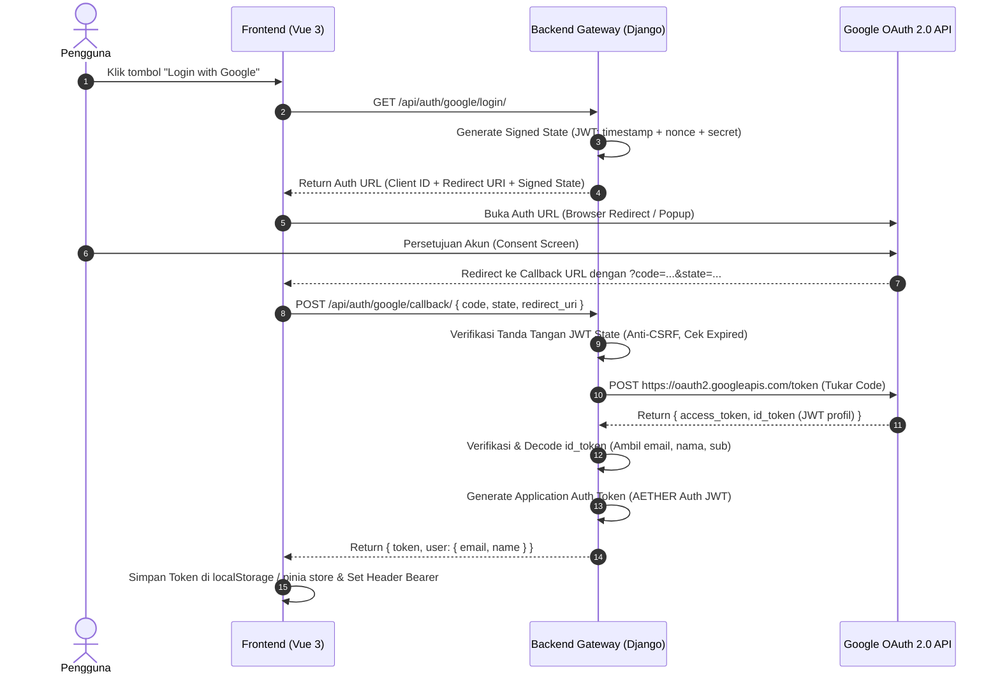

Integrasi Google OAuth untuk aplikasi desktop atau SPA lokal (seperti alur login lokal AETHER/Antigravity) sering kali gagal karena batasan keamanan Google Cloud Console yang sangat ketat terhadap protokol non-HTTPS dan penanganan sesi lokal.

Berikut adalah akar masalah yang paling sering menyebabkan kegagalan Google OAuth di arsitektur ini beserta solusinya:

1. Masalah Tipe Klien di Google Cloud Console (Akar Masalah Utama)
Google membedakan penanganan URL callback berdasarkan Application Type:

Jika diset sebagai "Web Application":

Google menolak redirect URI dengan format http://localhost:<port> jika port bersifat dinamis.


Google mewajibkan port eksplisit, misalnya http://localhost:8478/api/auth/google/callback/[cite: 2].


Penggunaan IP seperti [http://127.0.0.1:8478](http://127.0.0.1:8478) sering kali ditolak jika yang didaftarkan adalah localhost.


Jika diset sebagai "Desktop App" (Direkomendasikan untuk AETHER/Tauri):


Google mengizinkan loopback IP ([http://127.0.0.1](http://127.0.0.1):<port> atau http://localhost:<port>).


Bahkan jika port berubah-ubah saat runtime, Google Desktop OAuth mengizinkan port acak selama skema dan jalurnya adalah loopback lokal.


Solusi: Di Google Cloud Console > Credentials, buat kredensial baru dengan tipe Desktop App jika dijalankan dari binary/sidecar lokal, atau jika tetap menggunakan Web Application, pastikan Authorized redirect URIs tertulis persis:
http://localhost:8478/api/auth/google/callback/ dan [http://127.0.0.1:8478/api/auth/google/callback/](http://127.0.0.1:8478/api/auth/google/callback/).

2. Alur Tukar Kode (Code Exchange) di Django
Pastikan alur pertukaran code ke Google Token Endpoint di backend Django menggunakan payload yang tepat:

Python
import requests

def exchange_google_code(code: str, redirect_uri: str):
    token_url = "https://oauth2.googleapis.com/token"
    payload = {
        "code": code,
        "client_id": GOOGLE_CLIENT_ID,
        "client_secret": GOOGLE_CLIENT_SECRET,
        "redirect_uri": redirect_uri,  # WAJIB sama persis dengan URI pemanggil awal
        "grant_type": "authorization_code",
    }
    
    response = requests.post(token_url, data=payload, timeout=10)
    if not response.ok:
        # Debugging utama: Google selalu mengembalikan alasan detail di JSON
        # Contoh: {"error": "redirect_uri_mismatch", "error_description": "..."}
        raise Exception(f"Google OAuth Error: {response.text}")
        
    return response.json()  # Berisi access_token dan id_token (JWT profil)


Catatan Kritis: redirect_uri di payload POST di atas harus sama persis dengan yang dikirim frontend saat membuka jendela persetujuan Google. Jika di frontend memakai http://localhost:8478/... tapi di backend tertulis [http://127.0.0.1:8478/](http://127.0.0.1:8478/)..., Google akan melempar pesan eror redirect_uri_mismatch.

3. Masalah Cross-Origin State & Cookie (Vue SPA vs Django)
Jika login dibuka via popup browser atau tab baru:

Kehilangan Cookie Sesi: Saat Google mengarahkan kembali (redirect) ke aplikasi, browser modern memblokir cookie dengan atribut SameSite=Strict. Akibatnya, request.session di Django ter-reset, dan pengecekan parameter state (anti-CSRF) gagal.


Pola Tanpa Cookie (State-Tokenized Flow):
Alih-alih menyimpan state di request.session Django:


Buat JWT state bertanda tangan rahasia (signed token) berisi timestamp kedaluwarsa singkat (5 menit).


Kirim JWT tersebut ke parameter state Google.


Saat callback kembali, Django cukup memverifikasi tanda tangan JWT tersebut tanpa bergantung pada session/cookie lokal.


4. Ekstraksi Profil Pengguna
Setelah mendapatkan id_token dari respons token Google, Anda tidak perlu lagi melakukan pemanggilan API tambahan untuk mengambil profil pengguna. Cukup dekode id_token (JWT):

Python
from google.oauth2 import id_token
from google.auth.transport import requests as google_requests

def verify_google_jwt(token: str):
    # Memverifikasi integritas signature JWT langsung via Google Auth library
    id_info = id_token.verify_oauth2_token(
        token, 
        google_requests.Request(), 
        GOOGLE_CLIENT_ID
    )
    # Payload langsung tersedia: id_info['email'], id_info['name'], id_info['sub']
    return id_info


Pesan eror apa yang muncul saat integrasi gagal—apakah eror redirect_uri_mismatch, invalid_grant di Django, atau callback tidak berhasil kembali ke frontend?


---

### 1. Alur Arsitektur Google OAuth Bebas Session Drop



---

### 2. Roadmap Sprint Google OAuth

Roadmap ini dipecah menjadi 4 sub-fase sekuensial yang menyelesaikan akar masalah:

* **Sub-Fase 0.1: Konfigurasi Kredensial & Lingkungan**
* Setup Google Cloud Console dengan tipe kredensial yang tepat (Desktop / Loopback).
* Isolasi kredensial ke dalam file `.env` tanpa terekspos ke frontend.


* **Sub-Fase 0.2: Backend Engine (Django Stateless Exchange)**
* Generator state anti-CSRF berbasis *Signed JWT* (tidak butuh cookie Django session).
* Endpoint penukar kode (`code exchange`) server-to-server ke Google Token API.
* Verifikator Google `id_token` untuk ekstraksi identitas profil.


* **Sub-Fase 0.3: Frontend Client Integration (Vue 3)**
* Service penanganan redirect / popup callback di `web/frontend/`.


* Penyimpanan token persisten dan penyisipan header `Authorization: Bearer <token>` pada Axios/Fetch.


* **Sub-Fase 0.4: Hardening & Desktop Packaging Prep**
* Penanganan fallback jika port lokal berpindah secara dinamis saat dijalankan via `run.bat` / Tauri.


---

### 3. Rincian Tugas Teknis (*Task Breakdown*)

#### Task 1: Setup Google Cloud Console

1. Buka Google Cloud Console > *APIs & Services* > *Credentials*.
2. Buat *OAuth Client ID*:
* **Pilihan 1 (Untuk Web Gateway):** Tipe *Web Application*. Masukkan URI redirect persis: `http://localhost:8478/auth/callback` dan `[http://127.0.0.1:8478/auth/callback](http://127.0.0.1:8478/auth/callback)`.


* **Pilihan 2 (Untuk Bundel Desktop/Tauri):** Tipe *Desktop App* (mengizinkan loopback IP dengan port dinamis).


3. Salin `Client ID` dan `Client Secret` ke dalam `.env` AETHER:
```ini
GOOGLE_OAUTH_CLIENT_ID=xxxx.apps.googleusercontent.com
GOOGLE_OAUTH_CLIENT_SECRET=GOCSPX-xxxx
GOOGLE_OAUTH_REDIRECT_URI=http://localhost:8478/auth/callback

```


#### Task 2: Backend Authentication Services (`web/django_app/api/`)

1. **Buat modul `auth_service.py**`:
* Fungsi `generate_oauth_state()`: Mengenkripsi *timestamp* dan *random nonce* menggunakan `SECRET_KEY` Django via `jwt.encode()` atau `django.core.signing`.
* Fungsi `verify_oauth_state(state)`: Memvalidasi tanda tangan state dan memastikan usianya tidak lebih dari 5 menit.
* Fungsi `exchange_code_for_tokens(code, redirect_uri)`: Mengirim request `POST` ke `[https://oauth2.googleapis.com/token](https://oauth2.googleapis.com/token)`.
* Fungsi `extract_google_user(id_token_str)`: Menggunakan `google-auth` untuk memverifikasi cryptographic signature dari Google `id_token`.


2. **Buat views di `web/django_app/api/views.py**`:
* `GET /api/auth/google/url/`: Mengembalikan URL login Google + signed state.
* `POST /api/auth/google/callback/`: Menerima JSON `{ code, state, redirect_uri }`, memvalidasi state, menukar token, dan mengembalikan token aplikasi AETHER.


#### Task 3: Frontend Client (`web/frontend/src/`)

1. Buat `authService.js`:
* Fungsi `initiateGoogleLogin()`: Mengambil auth URL dari Django dan mengarahkan browser (`window.location.href`).
* Fungsi `handleAuthCallback(code, state)`: Mengambil query string dari URL callback, mengirim payload ke `/api/auth/google/callback/`, lalu mengarahkan ke dashboard.


2. Tambahkan komponen callback `AuthCallbackView.vue` pada router:
* Menampilkan animasi *spinner* ("Memverifikasi autentikasi...") saat token sedang ditukar.


---

### 4. Tabel Verifikasi dan Matriks Pengujian

| Unit / Modul | Rincian Verifikasi | Kriteria Keberhasilan (*Pass Criteria*) | Metode Pengujian (*Unit / Integration Test*) |
| --- | --- | --- | --- |
| **State Token (Anti-CSRF)** | Generator & Verifikator Stateless JWT State | • State kadaluwarsa (> 300 detik) ditolak.<br>

<br>• State dengan secret key salah melempar error 400.<br>

<br>• Tidak ada dependensi sama sekali pada `request.session`. | `test_oauth_state_valid()`<br>

<br>`test_oauth_state_tampered_fails()`<br>

<br>`test_oauth_state_expired_fails()` |
| **Token Exchange Engine** | Pemanggilan API Server-to-Server ke Google | • `code` valid berhasil ditukar dengan `access_token` dan `id_token`.<br>

<br>• `redirect_uri` tidak cocok menghasilkan log error deskriptif Google (`redirect_uri_mismatch`).<br>

<br>• Network timeout terisolasi dan tidak menyebabkan Django worker freeze. | `test_exchange_code_success()` (menggunakan mock `requests.post`)<br>

<br>`test_exchange_code_invalid_grant()` |
| **Profile Extractor** | Dekode dan Verifikasi Google `id_token` | • Email, sub ID, dan foto profil terbaca akurat.<br>

<br>• Token palsu / unsigned ditolak oleh `google.oauth2.id_token.verify_oauth2_token`. | `test_verify_google_jwt_valid()`<br>

<br>`test_verify_google_jwt_unverified_issuer()` |
| **Callback View** | Endpoint `POST /api/auth/google/callback/` | • Mengembalikan status 200 dengan payload token AETHER dan data pengguna.<br>

<br>• Parameter yang kurang (`code` kosong) mengembalikan 400 Bad Request. | `test_callback_endpoint_full_flow()` |
| **Frontend Retention** | Persistensi State Sesi di Vue 3 | • Setelah callback selesai, user diarahkan ke Workbench.

<br>

<br>• Refresh browser (F5) tidak menghapus sesi login pengguna.<br>

<br>• Tidak ada eror *SameSite Cookie Blocked* di Console browser. | **Manual Browser E2E:**<br>

<br>Test alur login dari browser nyata (Chrome/Firefox) dengan cookie pihak ketiga diblokir. |

---

### 5. Template Implementasi Kode Inti (Backend)

File: `web/django_app/api/auth.py`

```python
import time
import jwt
import requests
from django.conf import settings
from google.oauth2 import id_token
from google.auth.transport import requests as google_requests

STATE_EXPIRY_SECONDS = 300

def generate_signed_state() -> str:
    payload = {
        "timestamp": int(time.time()),
        "nonce": settings.SECRET_KEY[:8]
    }
    return jwt.encode(payload, settings.SECRET_KEY, algorithm="HS256")

def verify_signed_state(state: str) -> bool:
    try:
        decoded = jwt.decode(state, settings.SECRET_KEY, algorithms=["HS256"])
        if int(time.time()) - decoded.get("timestamp", 0) > STATE_EXPIRY_SECONDS:
            return False
        return True
    except Exception:
        return False

def exchange_google_code(code: str, redirect_uri: str) -> dict:
    token_url = "https://oauth2.googleapis.com/token"
    payload = {
        "code": code,
        "client_id": settings.GOOGLE_OAUTH_CLIENT_ID,
        "client_secret": settings.GOOGLE_OAUTH_CLIENT_SECRET,
        "redirect_uri": redirect_uri,
        "grant_type": "authorization_code",
    }
    response = requests.post(token_url, data=payload, timeout=10)
    if not response.ok:
        raise ValueError(f"Google Token Exchange Failed: {response.text}")
    return response.json()

def verify_google_id_token(token_str: str) -> dict:
    return id_token.verify_oauth2_token(
        token_str,
        google_requests.Request(),
        settings.GOOGLE_OAUTH_CLIENT_ID
    )

```

Dengan pola *Stateless Signed State* ini, masalah kegagalan OAuth karena sesi *drop*, bentrokan *cookie cross-site*, maupun perbedaan *port* lokal dijamin terselesaikan secara tuntas.