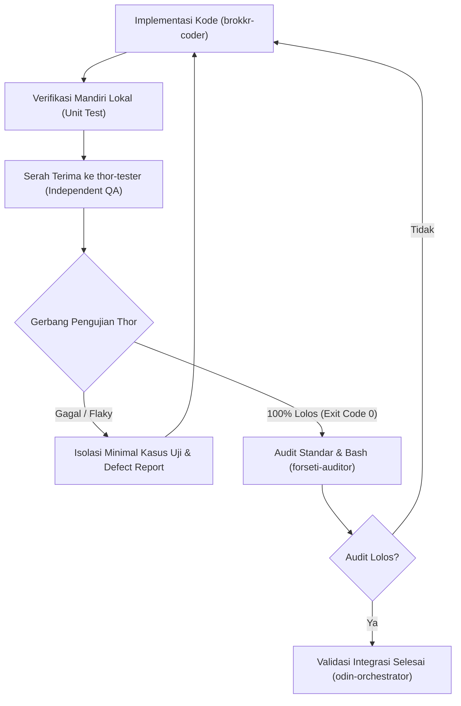

# Rencana Strategis QA AegisCode: Arsitektur Pengujian & Tata Kelola Produksi

Dokumen ini mendefinisikan strategi pengujian mutu (Quality Assurance), mitigasi kerapuhan uji (*test flakiness*), roadmap jangka menengah dan jangka panjang, serta alur penegakan stop-gate independen untuk menjamin stabilitas rilis produksi AegisCode.

---

## 1. Visi dan Prinsip Utama QA

Sistem QA AegisCode beroperasi di bawah 4 prinsip inti:
1. **Deterministik & Bebas Flakiness**: Setiap pengujian harus memberikan hasil yang sama di semua lingkungan tanpa bergantung pada kecepatan CPU atau waktu tunda tidur (*sleep*).
2. **Pengujian Berbasis Kontrak (Contract-Driven)**: Integrasi antara Django API Gateway (Python) dan AegisCode Studio Workbench (Vue 3) wajib divalidasi oleh skema kontrak bersama.
3. **Isolasi State Total**: Dilarang ada residu file, database, atau objek memori yang bocor antar-eksekusi uji.
4. **Independensi Stop-Gate**: Pengujian dijalankan sebagai gerbang mutlak tanpa kompromi (*strict stop-gate*) dengan kode keluar 0 sebelum perubahan dapat digabungkan.

---

## 2. Analisis & Mitigasi Kerapuhan Sistem Uji Saat Ini

| Titik Kerapuhan | Penyebab Utama | Solusi & Mitigasi Standar |
| :--- | :--- | :--- |
| **Flakiness Asynchronous & Waktu** | Penggunaan `time.sleep()` untuk menunggu proses PTY, task background, atau streaming SSE. | Ganti dengan fungsi utilitas *polling assertion* dengan batas waktu (*deadline timeout*) dan interval adaptif. |
| **Kesenjangan Kontrak Backend-Frontend** | Pengujian backend (`pytest`) dan frontend (`node:test`) terpisah tanpa validasi skema payload bersama. | Buat repositori skema JSON kanonikal untuk seluruh event SSE dan endpoint REST yang divalidasi oleh kedua sisi. |
| **Kekosongan Pengujian Komponen `.vue`** | Pengujian frontend hanya menyentuh fungsi logika murni (`.mjs`/`.js`), komponen visual tidak teruji. | Implementasi Vitest + `@vue/test-utils` + *happy-dom* untuk menguji siklus hidup dan interaksi komponen kritis. |
| **Kontaminasi Status Antar-Uji (*State Leakage*)** | Residu berkas di `.aegis/`, workspace temporary, atau singleton memori yang tidak dibersihkan. | Gunakan fixture `tmp_path` pytest secara menyeluruh dan daftarkan pembersihan status singleton pada blok `teardown`. |

---

## 3. Rencana Jangka Menengah (Fase 1: 1 - 2 Bulan)

Fase ini berfokus pada stabilisasi fondasi pengujian yang ada dan menutup celah integrasi backend-frontend.

### 3.1. Stabilisasi Suite Backend (`tests/`)
- **Pembersihan Waktu Tunggu**: Menelusuri seluruh berkas pengujian backend dan mengeliminasi `time.sleep()`.
  ```python
  # Pola Standar Polling Assertion
  def wait_for_condition(predicate, timeout=5.0, interval=0.1, error_msg="Timeout"):
      deadline = time.time() + timeout
      while time.time() < deadline:
          if predicate():
              return True
          time.sleep(interval)
      raise AssertionError(f"{error_msg} setelah {timeout}s")
  ```
- **Isolasi Database & File**: Memastikan seluruh tes yang mengakses `.aegis/`, cache, atau database SQLite menggunakan direktori temporer unik per sesi uji.
- **Eksekusi Acak Berkala**: Mengaktifkan `pytest-random-order` pada pengujian harian untuk mendeteksi dependensi implisit antar-tes.

### 3.2. Pengujian Kontrak Terpadu (Contract Testing)
- Membuat berkas skema kanonikal untuk semua event SSE:
  - `task_submitted`
  - `task_started`
  - `activity_chunk`
  - `tool_call`
  - `task_completed` / `task_failed`
- **Backend**: Menambahkan uji validasi serializer yang memastikan setiap event SSE sesuai dengan skema.
- **Frontend**: Menggunakan fixture JSON yang dihasilkan dari skema tersebut untuk menguji `taskStateReducer` dan parser streaming.

### 3.3. Pengujian Komponen Antarmuka Vue 3
- Memasang dependensi pengujian antarmuka ringan di `web/frontend/`:
  - `vitest`
  - `@vue/test-utils`
  - `happy-dom`
- Cakupan pengujian awal untuk komponen kritis:
  1. `ChangesPanel.vue`: Pemilihan berkas diff, persetujuan/penolakan patch.
  2. `AgentActivity.vue`: Render linimasa eksekusi, penanganan chunk streaming.
  3. `CodeEditor.vue`: Mounting editor, perpindahan tab, isolasi instance Monaco.

---

## 4. Rencana Jangka Panjang (Fase 2: 3 - 6 Bulan)

Fase ini membangun pertahanan kualitas tingkat tinggi untuk menjamin stabilitas produksi dan distribusi native.

### 4.1. Automated Headless E2E Smoke Suite (Playwright)
- Mengonfigurasi suite Playwright independen untuk menguji 3 skenario inti pengguna (*critical user journeys*):
  1. **Alur Ruang Kerja**: Pembukaan folder proyek -> pemindaian file tree -> pembukaan berkas kode di Monaco Editor.
  2. **Alur Eksekusi Agen**: Input prompt pada panel agen -> inisiasi task -> streaming event SSE -> status terminal tercapai.
  3. **Alur Peninjauan Diff**: Pembuatan revisi kode oleh agen -> verifikasi perbandingan pada Monaco Diff Editor -> penyimpanan hasil.

### 4.2. Pengujian Ketahanan Runtime & Deteksi Kebocoran (Zero-Zombie)
- **Stress-Test Streaming**: Simulasi pengiriman 20.000 token SSE secara berkesinambungan untuk memverifikasi performa render UI dan ketiadaan kebocoran memori (*memory leak*).
- **Verifikasi Tree-Kill Subproses**: Menguji penghentian aplikasi secara mendadak dan memverifikasi tidak ada proses PTY atau daemon Python yang tertinggal sebagai *zombie*.

### 4.3. Mutation Testing
- Menerapkan pustaka pengujian mutasi (`mutmut`) pada modul logika kritis (`src/agent_ai/task/`, `src/agent_ai/routing/`) guna mengevaluasi efektivitas assertion pengujian dalam menangkap cacat tersembunyi.

### 4.4. Matriks Penegakan CI/CD Tri-Branch
Setiap cabang memiliki gerbang pengujian otomatis yang disesuaikan dengan tujuan operasionalnya:

```
[PR / Perubahan Kode]
          │
          ├── Branch master (Development Hub)
          │     ├── Fast Lint & Typecheck (ruff, pyright, tsc)
          │     ├── Backend Pytest Suite (Exit Code 0)
          │     ├── Frontend Unit & Component Tests (Exit Code 0)
          │     └── Contract Validation Suite
          │
          ├── Branch main (Community Edition)
          │     ├── Seluruh pengujian master
          │     └── Verifikasi isolasi docs/ & AGENTS.md (Filter export-ignore)
          │
          └── Branch release (Enterprise MVP Native)
                ├── Seluruh pengujian master
                ├── E2E Playwright Smoke Tests
                └── Tauri v2 Desktop Bundle Build Verification
```

---

## 5. Alur Kerja QA & Tata Kelola Multi-Agent

Dalam kerangka orkestrasi multi-agent Asgard Multi-Agent Framework (OMA), tanggung jawab pengujian dan verifikasi diatur secara tegas:



### 5.1 Mekanisme QA Agen Independen (Zero Self-Grading)
1. **Isolasi Penuh Eksekutor**: Verifikasi stop-gate wajib didelegasikan ke sub-agent independen `thor-tester` melalui `invoke_subagent`. Agen pengembang (`brokkr-coder`) dilarang keras mengesahkan kodenya sendiri (*zero self-grading*).
2. **Pemisahan Hak Akses**: `thor-tester` hanya beroperasi dengan hak akses `independent-qa` (`run_command`, `view_file`) dan dilarang memiliki akses manipulasi berkas kode (`write_to_file`, `replace_file_content`).
3. **Pemisahan Tanggung Jawab Remediasi**: Jika terjadi kegagalan atau galat uji, `thor-tester` dilarang menyunting kode untuk memperbaiki masalah; penguji wajib mencatat log kegagalan di `docs/QA/logs/` dan menolak stop-gate hingga perbaikan dieksekusi oleh `brokkr-coder`.
4. **Kemandirian Keputusan**: Gerbang pengujian memiliki hak veto mutlak terhadap integrasi commit; tidak ada bypass tanpa hasil eksekusi 100% hijau.

### 4 Aturan Baku Stop-Gate Thor (Independent QA)
1. **Aturan 1 (Zero Failure Tolerance)**: Seluruh pengujian wajib lulus dengan kode keluar 0 (*exit code 0*).
2. **Aturan 2 (Larangan Mematikan Uji)**: Dilarang mematikan *assertion*, menambahkan `@pytest.mark.skip`, atau mengabaikan galat tanpa persetujuan arsitek.
3. **Aturan 3 (Kemampuan Acak / Random Execution)**: Pengujian harus lulus secara konsisten meskipun urutan eksekusinya diacak.
4. **Aturan 4 (Kebersihan Sumber Daya)**: Wajib memastikan tidak ada berkas residu atau subproses zombie yang tertinggal setelah pengujian selesai.
