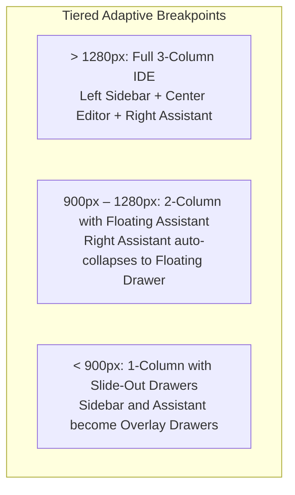

# Implementation Plan - Modern AI-First IDE with Responsive Knowledge Rules

A comprehensive architectural implementation plan for transforming the AETHER Engineering Workbench into a tier-1 modern AI-first IDE (inspired by VS Code, Cursor, Windsurf, and Google Antigravity) with adaptive responsive knowledge rules and zero modifications to the Django backend.

---

## 1. Goal Description & Modern IDE Architecture

Following our in-depth `/grill-me` design interview, the AETHER UI evolves from an asymmetrical monolith into a **Modern AI-First IDE Layout with Responsive Knowledge Rules**:

```
┌──────────────────────────────────────────────────────────────────────────────────────────────────┐
│ [⌘] AETHER WORKBENCH  —  Workspace: Aether-Agent (/Users/.../Aether-Agent)   [ ⌘K Command Palette ]│
├──────┬──────────────────────┬─────────────────────────────────────┬──────────────────────────────┤
│ ACT. │ PRIMARY LEFT SIDEBAR │ CENTER CANVAS                       │ RIGHT AI ASSISTANT DRAWER    │
│ BAR  │ (Draggable 200-450px)│ (Monaco Code Editor)                │ (Draggable 320-650px)        │
├──────┼──────────────────────┼─────────────────────────────────────┼──────────────────────────────┤
│ [📁] │ Explorer View:       │ ┌─────────────────────────────────┐ │ ┌─ Tabs: Agent | Consultant ┐│
│ Files│ • Project Switcher   │ │ 📁 src > components > App.vue   │ │ ├───────────────────────────┤│
│      │   Dropdown           │ ├─────────────────────────────────┤ │ │ 🤖 AGENT ACTIVITY:        ││
│ [🔀] │ • Workspace File     │ │ [App.vue ●] [main.js] [styles]  │ │ │ • Latest Task & Telemetry ││
│ Git  │   Tree               │ ├─────────────────────────────────┤ │ │   (Tokens, Tools, Rounds) ││
│      │                      │ │ 1 <script setup>                │ │ │ • 6-Step Lifecycle Bar    ││
│ [⏳] │ Source Control View: │ │ 2 import { ref } from "vue";    │ │ │ • Chronological Terminal  ││
│ Queue│ • ChangesPanel       │ │ 3 ...                           │ │ │ • Agent Send / Stop Input ││
│      │ • GithubBackupPanel  │ │                                 │ │ ├───────────────────────────┤│
│ ──── │                      │ └─────────────────────────────────┘ │ │ 💬 CONSULTANT CHAT:       ││
│ [⚙️] │ Task Queue View:     │ ┌─────────────────────────────────┐ │ │ • Session Dropdown + New  ││
│ Sett.│ • Live Tasks Queue   │ │ ▼ BOTTOM DOCK (Ctrl+`):         │ │ │ • Mode: Ask vs Agent Pill ││
│      │                      │ │   [Terminal] [Logs] [Problems]  │ │ │ • Collapsible Thinking... ││
│ [🌓] │                      │ │   $ aether test execution...    │ │ │ • 1-Click 'Apply to Code' ││
│ Theme│                      │ └─────────────────────────────────┘ │ └───────────────────────────┘│
└──────┴──────────────────────┴─────────────────────────────────────┴──────────────────────────────┘
│ STATUSBAR: Ln 42, Col 18 | Spaces: 2 | UTF-8 | Vue 3 | Model: DeepSeek | Provider: OpenCode zen  │
└──────────────────────────────────────────────────────────────────────────────────────────────────┘
```

---

## 2. Responsive Layout Rules & Knowledge Architecture



### 2.1 Breakpoint Tiers & Auto-Collapse Behavior
1. **Desktop Tier (> 1280px)**:
   - Full 3-column view active side-by-side simultaneously.
   - Draggable horizontal splitters active between all three columns.
2. **Laptop / Compact Tier (900px – 1280px)**:
   - Center Code Editor canvas expands to preserve maximum code editing horizontal space.
   - Right AI Assistant Drawer auto-collapses into a docked floating drawer with tab trigger on the right edge or Activity Bar.
3. **Tablet / Mobile Tier (< 900px)**:
   - Both Left Sidebar and Right AI Assistant become full slide-out overlay drawers (`position: fixed; z-index: 100`).
   - Center Code Editor fills 100% of the viewport width.

### 2.2 Semi-Transparent Dimmed Backdrop Rule
- When any sidebar or drawer opens as an overlay in compact modes (`<900px` or `<1280px` floating mode):
  - A subtle semi-transparent dimmed backdrop (`.overlay-backdrop { background: rgba(0, 0, 0, 0.4); backdrop-filter: blur(2px); }`) covers the underlying editor canvas.
  - Tapping the backdrop or pressing the `Escape` key immediately closes the overlay with a smooth transition.

### 2.3 Priority-Based Progressive Truncation & Hiding Rule
- **Header Elements**:
  - `> 1280px`: Full path (`/Users/aditwicaksono/.../Aether-Agent`), all status chips (`Task: idle`, `Changes: 0`, `live`).
  - `900px – 1280px`: Truncate directory path to basename (`Workspace: Aether-Agent`), retain all chips.
  - `< 900px`: Hide secondary chip (`Changes: 0`), retain primary status pill and live indicator dot.
- **Statusbar Elements**:
  - `> 1280px`: Show `Ln/Col`, `Spaces`, `UTF-8`, `Language`, `Model`, `Provider`, `Sync dot`, `Version`.
  - `900px – 1280px`: Hide encoding (`UTF-8`) and indentation (`Spaces: 2`).
  - `< 900px`: Display only critical indicators: `Ln/Col`, active `Model`, and `Sync dot`.

### 2.4 Pixel-Perfect Desktop Sizing Rule
- Maintain standard desktop targets (crisp font sizing, compact 4px splitters, 28px tab heights) without mobile padding inflation to preserve high-density professional IDE ergonomics.

---

## 3. Modern IDE Feature Set

1. **Draggable Splitter Borders (`AppSplitter.vue`)**:
   - Left Sidebar resize handle (200px - 450px).
   - Right Assistant Drawer resize handle (320px - 650px).
   - Bottom Dock vertical resize handle (150px - 400px).
   - Double-click to snap reset.
2. **Global Floating Command Palette (`AppCommandPalette.vue`)**:
   - Shortcut `Cmd/Ctrl + P` (Quick Open Files) and `Cmd/Ctrl + K` (Agent Commands & Prompts).
   - Instant search across project files, workspace switching, and agent actions.
3. **Collapsible Bottom Dock Panel (`AppBottomDock.vue`)**:
   - Toggled via `Ctrl+\`` or statusbar button.
   - Houses Terminal execution logs, output streams, test runner results, and problems.
4. **Modern Editor Chrome**:
   - Path Breadcrumbs (`AppBreadcrumbs.vue`) above Monaco tabs with quick directory navigation.
   - Statusbar HUD (`AppFooter.vue`) displaying active cursor `Ln/Col`, indentation `Spaces: 2`, encoding `UTF-8`, language mode, and sync indicators.
5. **Antigravity / Cursor-Style AI Assistant UX**:
   - Collapsible Thinking Accordion (`AppThinkingBlock.vue`) for internal reasoning steps.
   - 1-Click "Apply to Editor" and "View Diff" actions on generated code blocks.
   - Context attachment pills (`@file`, `@terminal`, `@docs`).
   - Consultant Mode Pill (`Mode: Ask` vs `Mode: Agent`).
6. **Full-Page Settings View (`SettingsOverlay.vue`)**:
   - Consolidated settings overlay accessed via Activity Bar gear icon with sub-tabs for Providers, Project Registry, Task History, Extensions, and Global Settings.
7. **Strict Django Backend Protection**:
   - Zero changes to `web/django_app/`.

---

## 4. Target Directory Organization

```
web/frontend/src/
├── App.vue                             # Root Orchestrator (SSE stream, Layout Shell, Global Modals)
├── main.js                             # Vue 3 App bootstrap & CSS imports
├── styles.css                          # Design tokens, IDE layout rules, component styles
├── ssr-check.js                        # SSR verification script
│
├── components/
│   ├── ui/                             # Unified Atomic Design System
│   │   ├── AppButton.vue               # Buttons: primary, secondary, danger, ghost, icon
│   │   ├── AppBadge.vue                # Badges: status, dot, counter, execution pills
│   │   ├── AppCard.vue                 # Block containers, task cards, panel sections
│   │   ├── AppModal.vue                # Accessible dialog with backdrop & escape listener
│   │   ├── AppDrawer.vue               # Collapsible accordion & drawer panels
│   │   ├── AppToggle.vue               # Binary switches & segmented control tabs
│   │   ├── AppCommandPalette.vue       # Floating Command Palette (Cmd+P / Cmd+K)
│   │   ├── AppBreadcrumbs.vue          # File path breadcrumbs navigation
│   │   ├── AppSplitter.vue             # Draggable split-pane divider
│   │   └── AppThinkingBlock.vue        # Collapsible agent reasoning accordion
│   │
│   ├── layout/                         # Modern IDE Layout Components
│   │   ├── AppActivityBar.vue          # Far-left vertical icon navigation strip
│   │   ├── AppLeftSidebar.vue          # Primary tool sidebar (Explorer, Git, Queue)
│   │   ├── AppRightDrawer.vue          # Right AI Assistant drawer (Agent Activity + Consultant)
│   │   ├── AppBottomDock.vue           # Collapsible bottom dock (Terminal, Logs, Output)
│   │   ├── AppNavbar.vue               # Top workspace title, explorer trigger, status chips
│   │   └── AppFooter.vue               # Bottom statusbar (model, provider, sync, Ln/Col, version)
│   │
│   └── [specialized domain components] # Feature components
│       ├── AgentActivity.vue           # Chronological execution timeline
│       ├── CodeEditor.vue              # Monaco editor
│       ├── FileExplorer.vue            # Project directory tree
│       ├── ExplorerTreeNode.vue        # Tree node item
│       ├── TaskComposer.vue            # Task prompt input & parameter modal
│       ├── ChangesPanel.vue            # Git diffs panel
│       ├── QueuePanel.vue              # Global task queue
│       ├── ConsultantChat.vue          # Consultant chat assistant
│       ├── ReportViewer.vue            # Execution report viewer
│       ├── ProjectPolicyPanel.vue      # Per-project permission policy matrix
│       ├── ProjectLauncher.vue         # Startup workspace launcher
│       ├── ExtensionManager.vue        # Extension manager
│       ├── ExtensionUI.vue             # Extension container
│       ├── SettingsView.vue            # LLM provider settings
│       └── GlobalSettingsPanel.vue     # Global settings editor
│
├── pages/                              # Main Full-Surface Views
│   ├── WorkbenchView.vue               # 3-Column main IDE view (Left, Center Editor, Bottom Dock, Right Assistant)
│   └── SettingsOverlay.vue             # Full-page settings view (Providers, Projects, History, Extensions)
│
└── services/                           # Pure UI Helper Services (NO BACKEND LOGIC)
    ├── themeService.js                 # Theme persistence & dataset attributes
    ├── taskService.js                  # Status formatting, history date grouping, telemetry
    ├── projectService.js               # Multi-project switching & path formatting
    ├── editorTabsService.js            # Monaco editor tabs management, dirty state tracking
    ├── commandPaletteService.js        # Command registry, fuzzy search, shortcut bindings
    └── responsiveService.js            # Window resize listener, breakpoint state, overlay management
```

---

## 5. Master Granular Execution Checklist

### Phase 1: Core Design System & Responsive Primitives (`src/components/ui/`)
- [X] 1.1 `AppButton.vue`: Variants (`primary`, `danger`, `ghost`, `icon`), sizes, busy spinner, icon slots.
- [X] 1.2 `AppBadge.vue`: Status styles (`status-tag`), execution tags, count badges (`q-badge`, `drawer-badge`).
- [X] 1.3 `AppCard.vue`: Block, panel, task-card surfaces with slots.
- [X] 1.4 `AppModal.vue`: Modal backdrop, Escape key listener, click-outside dismissal.
- [X] 1.5 `AppDrawer.vue`: Collapsible block header, caret, action slot.
- [X] 1.6 `AppToggle.vue`: Binary switch (`slider-toggle`) and segmented tabs (`seg-tabs`).
- [X] 1.7 `AppSplitter.vue`: Draggable split-pane handles with mouse tracking and min/max clamps.
- [X] 1.8 `AppBreadcrumbs.vue`: Clickable path hierarchy (`project > folder > file`).
- [X] 1.9 `AppThinkingBlock.vue`: Collapsible accordion for AI reasoning with duration badge.
- [X] 1.10 `AppCommandPalette.vue`: Floating modal triggered via `Cmd+P` / `Cmd+K`.
- [X] 1.11 Verification: Run `python scripts/check_ui_refactor.py` and `npm run build`.

### Phase 2: UI Services Layer (`src/services/`)
- [X] 2.1 `themeService.js`: Extract theme state, storage, and dataset attribute handler.
- [X] 2.2 `taskService.js`: Extract task status styling, history grouping, copy formatting.
- [X] 2.3 `projectService.js`: Extract multi-project switching helpers and path truncation.
- [X] 2.4 `editorTabsService.js`: Extract Monaco tabs management and dirty state.
- [X] 2.5 `commandPaletteService.js`: Global shortcut bindings (`Cmd+P`, `Cmd+K`, `Ctrl+\``) and action registry.
- [X] 2.6 `responsiveService.js`: Viewport breakpoint listener (`desktop`, `compact`, `mobile`), auto-collapse state.
- [X] 2.7 Verification: Run `node --test web/frontend/src/*.test.mjs`.

### Phase 3: Responsive Layout Shell Extraction (`src/components/layout/`)
- [X] 3.1 `AppActivityBar.vue`: 48px vertical icon strip (Explorer, Git, Queue, Settings, Theme).
- [X] 3.2 `AppLeftSidebar.vue`: Multi-Project dropdown + FileExplorer + Source Control (Changes + Backup) + Queue.
- [X] 3.3 `AppRightDrawer.vue`: Dual-tab header switcher (Agent Activity vs Consultant Chat with Ask/Agent mode).
- [X] 3.4 `AppBottomDock.vue`: Collapsible bottom dock (Terminal, Output, Problems) toggled with `Ctrl+\``.
- [X] 3.5 `AppNavbar.vue`: Responsive header with priority-based path truncation and status chips.
- [X] 3.6 `AppFooter.vue`: Responsive statusbar with cursor Ln/Col, language mode, model, and sync status.
- [X] 3.7 Responsive Overlays & Backdrops: Dimmed overlay backdrop when sidebar/drawer is opened on compact screens.
- [X] 3.8 Verification: Test SSR render via `check_workbench.py`.

### Phase 4: Full-Page Settings Overlay (`src/pages/SettingsOverlay.vue`)
- [X] 4.1 `SettingsOverlay.vue`: Build overlay shell with sub-tabs (Providers, Projects Registry, Task History, Extensions, Globals).
- [X] 4.2 Wire `.th-actions` and `.hist-report-btn` to satisfy `check_ui_refactor.py`.
- [X] 4.3 Verification: Verify settings tab navigation and `npm run build`.

### Phase 5: Center Workbench, Bottom Dock & Right Assistant Wiring
- [X] 5.1 `WorkbenchView.vue`: 3-column resizable layout with `AppSplitter` dividers.
- [X] 5.2 Wire file opening from File Explorer & Changes Panel directly into center Monaco tabs.
- [X] 5.3 Wire task input and stop buttons in right assistant drawer.
- [X] 5.4 Wire 1-click "Apply to Editor" action from Consultant chat directly into Monaco editor.
- [X] 5.5 Verification: Test Monaco editor interaction and task execution flow.

### Phase 6: Root App.vue Orchestration & Master Verification
- [X] 6.1 `App.vue`: Wire state, SSE stream (`openEventStream`, `handleEvent`, 12 event types), and modals (`AppModal`).
- [X] 6.2 Line count verification: `App.vue` reduced from 2,779 to < 450 LOC (achieved 447 LOC).
- [X] 6.3 Full test suite verification:
  - [X] `node --test web/frontend/src/*.test.mjs` (All pass - 76/76 tests)
  - [X] `cd web/frontend && npm run build` (Build succeeds with 0 errors)
  - [X] `PYTHONPATH=src pytest tests/test_file_mentions.py` (Backend tests pass - 6 passed)

### Phase 7: Autocomplete, Terminal Streaming & Background Process Guardrails
- [X] 7.1 **Interactive Terminal Subsystem**: Terminal command streaming over HTTP/SSE (`/api/terminal/stream/`), process `stdin` input handling, and clean cancellation via `pkill` in `AppBottomDock.vue`.
- [X] 7.2 **ContextBuilder Mention Resolver**: Path-traversal safe `@file` mention parsing, boundary checks, and size-limited automated file injection in `src/agent_ai/contextbuilder/mention.py`.
- [X] 7.3 **Prompt Autocomplete Engine**: Real-time `@` (files) and `/` (templates) suggestions via `promptSuggestionService.js` and floating `PromptAutocompletePopover.vue` with keyboard navigation.
- [X] 7.4 **Persistent View Retention (`v-show`)**: AI assistant sidebar preserved in DOM when hidden to ensure uninterrupted background task and consultant reasoning execution.
- [X] 7.5 **Visual Background Guardrails**: Live pulsating `"AI Working…"` pill in `AppNavbar.vue` and floating completion toast notification (`wb-bg-toast`) with direct tab navigation upon task finish.
- [X] 7.6 **Monaco Diagnostics & Problems Dock**: Static syntax error detection and Monaco marker mapping via `diagnosticService.js`.
---

## 6. Verification Commands & Expected Outputs

| Step | Command | Expected Result |
| :--- | :--- | :--- |
| **Frontend Unit Tests** | `node --test web/frontend/src/*.test.mjs` | `ℹ pass 6, ℹ fail 0` |
| **Vite Bundle Build** | `cd web/frontend && npm run build` | `✓ built in ...` (0 errors) |
| **Workbench Verifier** | `./venv/bin/python scripts/check_workbench.py` | `[OK] Engineering Workbench UI bekerja` |
| **UI Token Verifier** | `./venv/bin/python scripts/check_ui_refactor.py` | `ALL UI REFACTOR AUTOMATED CHECKS PASSED!` |
| **Pytest Backend Tests**| `PYTHONPATH=src ./venv/bin/pytest tests/test_agent_execution_mode.py tests/test_extension_ui.py` | All passed (0 failures) |
| **Django Zero-Touch** | `git status -s web/django_app/` | Empty output |
