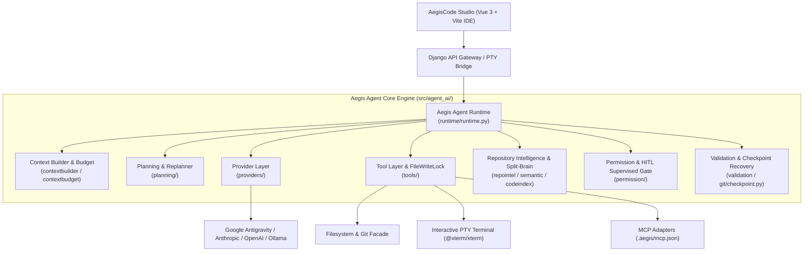
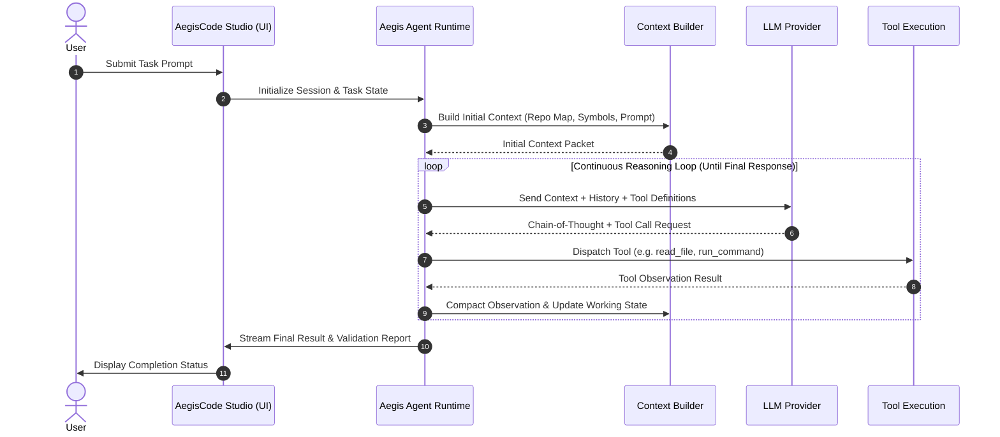
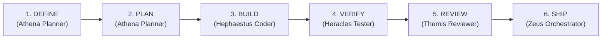
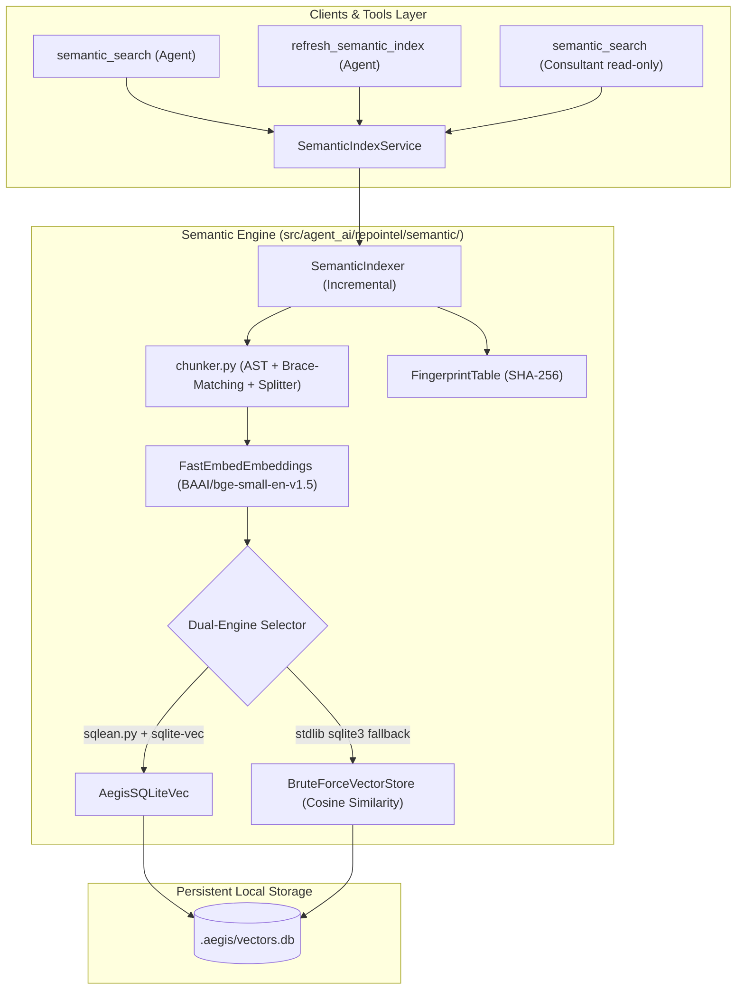

# AegisCode Architecture Overview

This document details the architectural design, core subsystems, and runtime lifecycles of **AegisCode** (AegisCode Studio & Aegis Agent).

---

## 1. System Philosophy
AegisCode decouples decision-making (LLM) from physical action execution (runtime engine) and enforces a **Hybrid Asymmetric Split-Brain** model:

```
┌────────────────────────────────────────────────────────┐
│                      LLM (Brain)                       │
│    • Cloud Orchestrator (Reasoning & Diff Synthesis)   │
│    • Tool Selection & Argument Construction            │
│    • Budgeted Context Window (< 4,000 tokens)          │
└───────────────────────────▲────────────────────────────┘
                            │ JSON-RPC / API
┌───────────────────────────▼────────────────────────────┐
│                   Aegis Agent (Hands)                  │
│    • Local Worker: CodeGraph AST, rtk proxy, SQLite    │
│    • Interactive PTY Terminal (zero-zombie lifecycle)  │
│    • Autonomous Single-Mode Execution ("Agents")       │
│    • Dynamic 6-Phase Olympus Lifecycle (DEFINE..SHIP)  │
└────────────────────────────────────────────────────────┘
```

The LLM remains the autonomous decision-maker. Aegis Agent provides a safe, reproducible, observable execution environment that allows the model to explore codebases, navigate AST call graphs, apply multi-file refactors without artificial throttling, execute test suites, and self-correct over iterative cycles.

Storage specification: For workspace state and intelligence discovery, AegisCode uses canonical `.aegis/` (`.aegis/codegraph.db`, `.aegis/lifecycle_state.json`) and `data/settings.json`, with specifications and task breakdowns stored in the active project root (`<active_project_root>/specs/`).

## 2. High-Level Subsystems

Aegis Agent is organized into clean, decoupled Python modules under `src/agent_ai/`:



### Module Directory Breakdown

| Subsystem Path | Description | Key Modules |
| :--- | :--- | :--- |
| `src/agent_ai/runtime/` | Core execution loop and turn controller | `runtime.py`, `working_state.py`, `policy.py` |
| `src/agent_ai/planning/` | Task decomposition, milestone tracking, replanning | `planner.py`, `replanner.py`, `models.py` |
| `src/agent_ai/contextbuilder/` | Compiles repository context, prompts, system states, and `@file` mentions | `builder.py`, `mention.py`, `models.py` |
| `src/agent_ai/contextbudget/` | Sliding window compaction, deduplication, tool pruning | `budget.py`, `tool_compaction.py`, `dedup.py` |
| `src/agent_ai/tools/` | Tool registry, filesystem, terminal, symbols, vision | `filesystem.py`, `terminal.py`, `source_symbols.py`, `project_map.py` |
| `src/agent_ai/providers/` | Unified LLM abstraction layer supporting multiple backends | `factory.py`, `base.py`, `deepseek.py`, `ollama.py`, `openrouter.py` |
| `src/agent_ai/repointel/` | AST parsing, symbol indexing, repository graph | `indexer.py`, `symbols.py` |
| `src/agent_ai/permission/` | Policy gateway, path whitelists, command safety | `gateway.py`, `policy.py` |
| `src/agent_ai/validation/` | Verification guards and sanity checks | `validator.py`, `syntax.py` |
| `src/agent_ai/recovery/` | Loop detection, backoff, and runtime self-healing | `loop_breaker.py`, `fallback.py` |

---

## 3. End-to-End Execution Lifecycle
The lifecycle of an AegisCode task progresses through four primary phases:


### 1. Task Preparation
- Incoming user prompt is sanitized.
- `repointel` queries symbol maps and relevant directory trees to build an initial repository summary.
- Permissions and sandbox parameters are initialized for the target workspace.

### 2. Context Construction & Budget Allocation
- System prompt, user goals, and active file contexts are assembled by `contextbuilder`.
- Token consumption is measured against provider constraints by `contextbudget`. If history overflows, tool compaction and token deduplication are applied.

### 3. Continuous Agent Execution Loop
The loop runs without heuristic "done" detectors:
- The LLM streams internal reasoning (Chain of Thought).
- The LLM emits structured tool calls (JSON-RPC or provider-native schema).
- Tools execute deterministically in the workspace.
- Outputs (observations) are formatted, sanitized, and fed back into context.
- If an observation indicates error or plan diversion, `replanner.py` updates the execution plan.

### 4. Termination & Validation
- The loop terminates strictly when the model returns a final text response without requesting any further tool calls.
- Validation checks run automated unit tests and lint verifications before reporting completion.

### 3.1 Unified Autonomous Engine & Olympus Framework (Refine AI Aegis)

AegisCode operates in a 100% autonomous, single-mode **Agents** architecture powered by the **Olympus Framework**:



Key principles of the Refine AI Aegis architecture:
1. **Single-Mode "Agents" Consolidation**: The legacy dual-mode dichotomy ("Ask" / ConsultantChat) and mode throttling (Fast / Balanced / Deep / Quick / Investigate) are permanently retired. Aegis Assistant operates as a unified autonomous engineering partner.
2. **Interactive Agent Question Dialogues**: When clarification or user input is needed during execution, the agent asks directly via interactive question cards (`AgentActivity.vue`) with instant single-click option replies and input submission, keeping the turn execution fully contextual without mode switching.
3. **Active Project Root Specifications (`<active_project_root>/specs/`)**: All specifications and task checklists generated by Olympus skills are version-controlled inside the active project repository (`specs/SPEC.md` and `specs/TODO.md`), accessible directly inside Monaco Editor via 1-click quick action buttons.
4. **Unthrottled Runner & Resilient Execution**: The runner layer (`AntigravityProvider`) eliminates artificial circuit-breaker interruptions (`proc.kill()`), permits deep multi-file exploration and refactoring, and features automatic transparent HTTP retry with exponential backoff on transient connection drops.
5. **Rust Token Killer (`rtk`) Integration**: All shell commands and tool executions are proxied through `rtk` (`~/.local/bin/rtk`), filtering verbosity while preserving error stacks, minimizing token consumption, and optimizing the agent context window.
6. **CodeGraph AST & Structural Intelligence**: Replaces legacy vector search with deterministic SQLite relational indexing (`.aegis/codegraph.db`), enabling fast caller, callee, reference, and impact analysis queries.
7. **Telegram Companion**: Default operational mode permanently locked to autonomous **Agents Mode ⚡** with real-time audit event streaming.

---

## 4. AegisCode Studio Workbench & System Integration

AegisCode features a developer-first IDE workbench (**AegisCode Studio**) engineered with a high-performance, reactive front-end architecture:
- **Backend Gateway:** Django application (`apps/django_app/`) serving WebSocket/SSE and REST APIs for session lifecycle, PTY interactive terminal bridge, token metrics, and real-time streaming.

### 4.1 Frontend Architecture & Layout Facades
The frontend is a Vue 3 + Vite single-page application (`apps/frontend/`) featuring a VS Code-style 3-column layout governed by a **Thin Layout Coordinator Pattern** and domain-driven **Facade Subsystems**:
- **Thin Layout Coordinator (`WorkbenchView.vue` < 450 lines):** Acts strictly as the root orchestrator connecting layout splitters, keyboard shortcuts, and lifecycle events, delegating all domain state and business logic to dedicated facades.
- **Layout & Editor Facades (`src/composables/workbench/`):**
  - `useWorkbenchEditorFacade.js`: Manages Monaco editor lifecycle, single & multi-pane split editors (horizontal/vertical), model registry synchronization, external modification conflict resolution (Keep Mine / Accept Agent / Review Diff), diagnostic marker tracking, and workspace context serialization (`localStorage`).
  - `useWorkbenchAssistantFacade.js`: Coordinates the single-mode Aegis Assistant panel, autonomous turn dispatching, interactive question card replies, and Monaco 1-click spec file opening.
  - `useWorkbenchDockFacade.js`: Manages bottom dock tabs (Terminal, Output, Problems), consumes rolling SSE event buffers (`useWorkbenchLiveEvents`), and automatically reveals dock upon problem detection.
  - `useWorkbenchLayout.js`: Handles column sizing, responsive breakpoint constraints, and visibility toggles for sidebar, assistant, and bottom dock.
- **Extracted Presentational Components (`src/components/editor/`):**
  - `EditorTabBar.vue`: Reusable tab strip supporting single and dual split panes, dirty indicators (`●`), conflict popovers, and inline save/split/orientation controls (eliminating template duplication and DOM bloat).
  - `EditorBreadcrumbs.vue`: Context-aware interactive breadcrumb navigation supporting standard paths, diff tabs, settings, and welcome views.
  - `EditorConfirmCloseModal.vue`: Modal dialog safeguarding against accidental loss of unsaved changes when closing dirty files or collapsing split panes.
- **Async DOM Guard & Monaco Integrity:** Monaco editor `layout()` invocations are shielded with `requestAnimationFrame` guards to prevent layout crashes during rapid split-pane resizing and unmounted DOM transitions.

### 4.2 Unified Token & Theming Architecture
AegisCode Studio implements a strict, centralized CSS custom property theming pipeline:
- **Single Source of Truth (`apps/frontend/src/styles/themes/theme-presets.css`):**
  - All color tokens are defined exclusively in this stylesheet across a catalog of 10 curated presets:
    - **Dark Presets:** `default-dark` (Midnight Obsidian), `tokyo-night` (Cyberpunk Storm), `nordic-frost` (Sub-zero Aurora), `dracula-neo` (Vampire Neon), `gruvbox-dark` (Warm Retro), `catppuccin-mocha` (Soothing Pastel).
    - **Light Presets:** `default-light` (Alabaster Paper), `orbit-light` (Electric High-Contrast), `nordic-light` (Ice High-Contrast), `gruvbox-light` (Parchment Retro).
  - **Pure HEX Specification:** Colors are strictly specified in 6-digit `#RRGGBB` or 8-digit `#RRGGBBAA` formats. Nested CSS color functions (`rgba()`, `color-mix()`, `hsl()`) are completely eliminated from the preset definitions.
- **Zero-Override & Zero-Hex Policy:**
  - Outside `theme-presets.css`, zero hardcoded HEX values are permitted in any CSS stylesheet or Vue component.
  - All Vue component `<style>` blocks are strictly decoupled from color token definitions and theme overrides (0 `[data-theme="light"]` selectors in Vue).
  - Light mode structural variations are centralized in reusable stylesheet `apps/frontend/src/styles/themes/theme-light.css`.
  - Inline style bindings for color (`:style="{ color: ... }"`) are prohibited; components rely on semantic data attributes such as `[data-file-type="..."]` in `apps/frontend/src/styles/components/explorer.css`.
- **Reactive Engine & Monaco/Terminal Synchronization:**
  - `themeService.js` manages active preset resolution and persists user configuration in `localStorage`.
  - DOM MutationObservers watch `document.documentElement` for `attributeFilter: ["data-theme", "data-theme-preset"]`, dynamically updating Monaco Editor syntax highlighting rules and xterm.js terminal color palettes without full page reloads.

---

## 5. Local Semantic Index & Vector Database (Phase 2.1)

Phase 2.1 establishes an independent, entirely on-device semantic search and vector database pipeline located in `src/agent_ai/repointel/semantic/`.

### 5.1 Architecture Diagram


### 5.2 Storage & Schema Specifications
The vector database is housed inside `<project_root>/.aegis/vectors.db`:
- **`aegis_chunks`**: Stores code chunk text, structured metadata JSON (file path, symbol name, symbol kind, line span), and raw float32 embedding BLOBs.
- **`file_fingerprints`**: Tracks `path`, `sha256`, `chunk_count`, and `indexed_at` timestamps for sub-second incremental indexing bypassing unchanged files.
- **`index_meta`**: Tracks `schema_version` (2.1), active `model_name`, and active `backend` engine. Changing model configuration triggers an automatic full index rebuild.

### 5.3 Deterministic AST Chunking
Code chunking operates on semantic unit boundaries:
- **Python:** Standard library `ast.parse` isolates top-level functions and class methods with decorators, signatures, docstrings, and bodies preserved. Classes generate dedicated header chunks (signatures + docstrings + class attributes).
- **JavaScript & TypeScript:** Regex symbol boundary detection paired with lexical brace-matching (`_match_braces`) ignoring string literals, template strings, and comments.
- **Size Bounds:** Chunks exceeding ~450 tokens (~1,800 characters) are partitioned using LangChain's `RecursiveCharacterTextSplitter.from_language` while preserving line number mapping.
- **Context Header:** Every chunk prepends a structured symbol header (`# path: <path> | symbol: <symbol> | kind: <kind>\n<code>`) to maximize embedding retrieval precision.

### 5.4 Transisi & Deprekasi Vektor Menuju CodeGraph Deterministik (Fase 2.5)
Sebagai bagian dari evolusi arsitektur menuju *zero-bloat* dan pemenuhan batas *Asymmetric Split-Brain* (< 4.000 token), pipeline semantic vector (`fastembed`, `onnxruntime`, `sqlite-vec`, `chunker.py`) dideprekasi dan digantikan oleh CodeGraph deterministik berbasis SQLite standard library (`.aegis/codegraph.db`).

Spesifikasi lengkap, skema relasi B-Tree, traversal recursive CTE, kebijakan auto-migrasi transparan, dan spesifikasi 4 tools kanonik (`codegraph_find_callers`, `codegraph_find_callees`, `codegraph_find_references`, `codegraph_impact_analysis`) diatur secara penuh dalam dokumen [docs/architecture/codegraph_migration_plan.md](file:///Users/aditwicaksono/Documents/Project-AI/AegisCode/docs/architecture/codegraph_migration_plan.md).

---

## 6. Quality Assurance & Independent Testing Subsystem

To ensure deterministic stability and independent verification across development and production releases, AegisCode implements a dedicated multi-tiered QA architecture:

```mermaid
graph TD
    subgraph TestPyramid ["Testing Architecture Pyramid"]
        E2E["E2E Smoke Tests (Playwright)<br/>Critical IDE User Journeys"]
        Comp["Component Tests (Vue Test Utils & Vitest)<br/>Reactive UI, Monaco & Panel States"]
        Contract["Contract Validation Layer<br/>JSON Schema for Django Gateway SSE & REST"]
        Unit["Unit Tests (Python pytest & Node:test)<br/>Isolated Pure Reducers, Parsers, & Logic"]
        E2E --> Comp
        Comp --> Contract
        Contract --> Unit
    end

    subgraph Governance ["Independent Stop-Gate Governance (Olympus Framework)"]
        Athena["athena-planner (DEFINE & PLAN)"] --> Hephaestus["hephaestus-coder (BUILD / Incremental)"]
        Hephaestus --> Heracles["heracles-tester (VERIFY / Prove-It Stop-Gate)"]
        Heracles -->|"Pass (Exit Code 0)"| Themis["themis-reviewer (REVIEW / 5-Axis Audit)"]
        Themis -->|"Approved"| Zeus["zeus-orchestrator (SHIP / Release Gate)"]
    end
```



### 6.1 Testing Architecture Principles
1. **Zero-Flakiness Polling**: Elimination of static `time.sleep` calls across subprocesses and PTY tests in favor of deadline-driven polling assertions.
2. **Complete State Isolation**: Dynamic filesystem isolation via `tmp_path` fixtures for `.aegis/`, workspace directories, and SQLite databases to prevent cross-test contamination.
3. **Contract-First Synchronization**: Canonical JSON Schemas governing Server-Sent Events (SSE) and REST payloads to prevent breaking changes between Django Gateway and the Vue frontend.
4. **Audit Log Persistence**: Mandatory test run tracking recorded in `docs/QA/logs/` adhering to [docs/QA/QA_LOGS_RULES.md](file:///Users/aditwicaksono/Documents/Project-AI/AegisCode/docs/QA/QA_LOGS_RULES.md).


---

## Catatan Tambahan: Discovery State, Eksekusi Task, dan Loop Agent

- **Discovery pengetahuan proyek (2 tingkat)**: Tier 1 `.brain/` (pengetahuan native Antigravity), Tier 2 `.aegis/bible/` (standar Aegis). State workspace memakai `.aegis/` dan `data/aegis.db`, dengan auto-migrasi transparan untuk aset legacy.
- **Mode eksekusi task**: `Queue` menunggu slot serial (FIFO), cocok untuk edit di area yang sama; `Parallel` berjalan langsung berdampingan dengan task lain, cocok untuk area independen. Keduanya tampil di Task Queue global; History adalah arsip log persisten `.aegis/`.
- **Loop agent**: prompt, task preparation (konteks dan rencana advisory), continuous loop (LLM memutuskan, tool call, observasi), lalu validasi dan laporan. Tidak ada detektor "selesai" heuristik; loop berakhir hanya saat LLM memberi jawaban final tanpa tool call.
- **Port server**: dibaca dari `data/settings.json` (`port`), fallback `8000`, dan otomatis memakai port bebas berikutnya jika terpakai; dapat ditimpa via `AEGIS_PORT` (atau `AETHER_PORT` lama).
