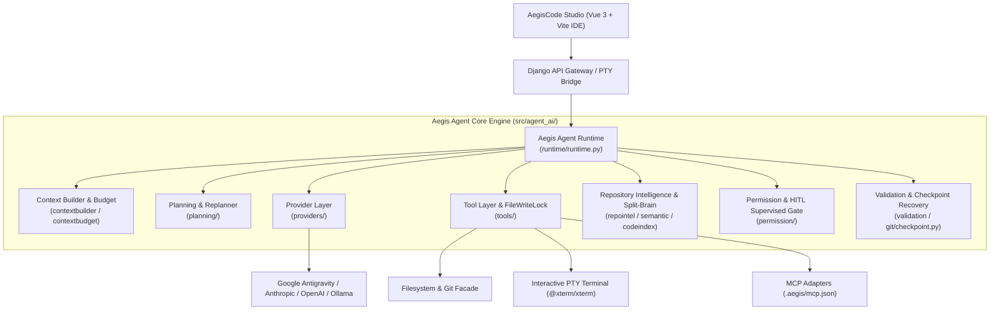
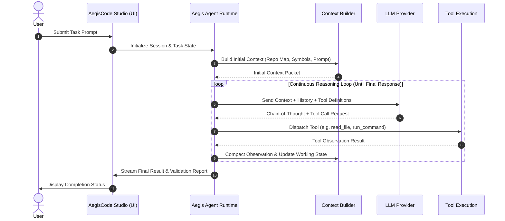
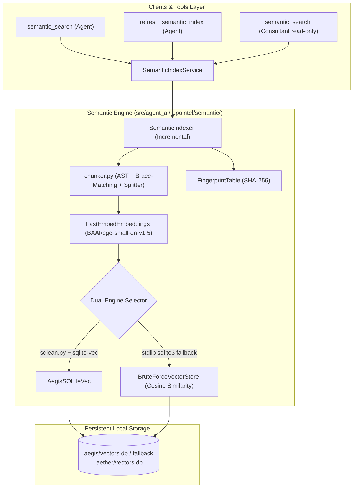
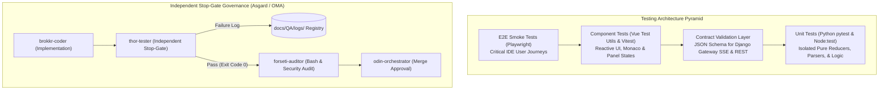

# AegisCode Architecture Overview

This document details the architectural design, core subsystems, and runtime lifecycles of **AegisCode** (AegisCode Studio & Aegis Agent).

---

## 1. System Philosophy
AegisCode decouples decision-making (LLM) from physical action execution (runtime engine) and enforces a **Hybrid Asymmetric Split-Brain** model:

```
┌────────────────────────────────────────────────────────┐
│                      LLM (Brain)                       │
│    • Cloud Orchestrator (Reasoning & Diff Synthesis)   │
│    • Tool Selection & Argument Construction            │
│    • Budgeted Context Window (< 4,000 tokens)          │
└───────────────────────────▲────────────────────────────┘
                            │ JSON-RPC / API
┌───────────────────────────▼────────────────────────────┐
│                   Aegis Agent (Hands)                  │
│    • Local Worker: AST parsing, fastembed, sqlite-vec  │
│    • Interactive PTY Terminal (zero-zombie lifecycle)  │
│    • FileWriteLock & HITL Diff Approval (Supervised)   │
│    • Context budgeting, RRF ranking, & rollback stash  │
└────────────────────────────────────────────────────────┘
```

The LLM remains the autonomous decision-maker. Aegis Agent provides a safe, reproducible, observable execution environment that allows the model to explore codebases, apply edits under strict deterministic guardrails, execute test suites, and self-correct over iterative cycles.

Backward-compatibility notice: For workspace state and intelligence discovery, AegisCode prioritizes `.aegis/` (`.aegis/vectors.db`, `.aegis/bible/`, `.aegis/map/`) and `data/aegis.db`, with automatic fallback to legacy `.aether/` and `data/aether.db`.

## 2. High-Level Subsystems

Aegis Agent is organized into clean, decoupled Python modules under `src/agent_ai/`:



### Module Directory Breakdown

| Subsystem Path | Description | Key Modules |
| :--- | :--- | :--- |
| `src/agent_ai/runtime/` | Core execution loop and turn controller | `runtime.py`, `working_state.py`, `policy.py` |
| `src/agent_ai/planning/` | Task decomposition, milestone tracking, replanning | `planner.py`, `replanner.py`, `models.py` |
| `src/agent_ai/contextbuilder/` | Compiles repository context, prompts, system states, and `@file` mentions | `builder.py`, `mention.py`, `models.py` |
| `src/agent_ai/contextbudget/` | Sliding window compaction, deduplication, tool pruning | `budget.py`, `tool_compaction.py`, `dedup.py` |
| `src/agent_ai/tools/` | Tool registry, filesystem, terminal, symbols, vision | `filesystem.py`, `terminal.py`, `source_symbols.py`, `project_map.py` |
| `src/agent_ai/providers/` | Unified LLM abstraction layer supporting multiple backends | `factory.py`, `base.py`, `deepseek.py`, `ollama.py`, `openrouter.py` |
| `src/agent_ai/repointel/` | AST parsing, symbol indexing, repository graph | `indexer.py`, `symbols.py` |
| `src/agent_ai/permission/` | Policy gateway, path whitelists, command safety | `gateway.py`, `policy.py` |
| `src/agent_ai/validation/` | Verification guards and sanity checks | `validator.py`, `syntax.py` |
| `src/agent_ai/recovery/` | Loop detection, backoff, and runtime self-healing | `loop_breaker.py`, `fallback.py` |

---

## 3. End-to-End Execution Lifecycle
The lifecycle of an AegisCode task progresses through four primary phases:


### 1. Task Preparation
- Incoming user prompt is sanitized.
- `repointel` queries symbol maps and relevant directory trees to build an initial repository summary.
- Permissions and sandbox parameters are initialized for the target workspace.

### 2. Context Construction & Budget Allocation
- System prompt, user goals, and active file contexts are assembled by `contextbuilder`.
- Token consumption is measured against provider constraints by `contextbudget`. If history overflows, tool compaction and token deduplication are applied.

### 3. Continuous Agent Execution Loop
The loop runs without heuristic "done" detectors:
- The LLM streams internal reasoning (Chain of Thought).
- The LLM emits structured tool calls (JSON-RPC or provider-native schema).
- Tools execute deterministically in the workspace.
- Outputs (observations) are formatted, sanitized, and fed back into context.
- If an observation indicates error or plan diversion, `replanner.py` updates the execution plan.

### 4. Termination & Validation
- The loop terminates strictly when the model returns a final text response without requesting any further tool calls.
- Validation checks run automated unit tests and lint verifications before reporting completion.

---

## 4. AegisCode Studio Workbench & System Integration

AegisCode features a developer-first IDE workbench (**AegisCode Studio**):
- **Backend Gateway:** Django application (`web/django_app/`) serving WebSocket/SSE and REST APIs for session lifecycle, PTY interactive terminal bridge, token metrics, and real-time streaming.
- **Frontend:** Modern Vue 3 + Vite single-page application (`web/frontend/`) featuring a VS Code-style 3-column layout (Monaco Editor, Monaco Diff Editor, interactive PTY terminal via `@xterm/xterm`, HITL DiffModal, and Git Source Control drawer).

---

## 5. Local Semantic Index & Vector Database (Phase 2.1)

Phase 2.1 establishes an independent, entirely on-device semantic search and vector database pipeline located in `src/agent_ai/repointel/semantic/`.

### 5.1 Architecture Diagram


### 5.2 Storage & Schema Specifications
The vector database is housed inside `<project_root>/.aegis/vectors.db` (with transparent fallback to `.aether/vectors.db`):
- **`aegis_chunks`**: Stores code chunk text, structured metadata JSON (file path, symbol name, symbol kind, line span), and raw float32 embedding BLOBs.
- **`file_fingerprints`**: Tracks `path`, `sha256`, `chunk_count`, and `indexed_at` timestamps for sub-second incremental indexing bypassing unchanged files.
- **`index_meta`**: Tracks `schema_version` (2.1), active `model_name`, and active `backend` engine. Changing model configuration triggers an automatic full index rebuild.

### 5.3 Deterministic AST Chunking
Code chunking operates on semantic unit boundaries:
- **Python:** Standard library `ast.parse` isolates top-level functions and class methods with decorators, signatures, docstrings, and bodies preserved. Classes generate dedicated header chunks (signatures + docstrings + class attributes).
- **JavaScript & TypeScript:** Regex symbol boundary detection paired with lexical brace-matching (`_match_braces`) ignoring string literals, template strings, and comments.
- **Size Bounds:** Chunks exceeding ~450 tokens (~1,800 characters) are partitioned using LangChain's `RecursiveCharacterTextSplitter.from_language` while preserving line number mapping.
- **Context Header:** Every chunk prepends a structured symbol header (`# path: <path> | symbol: <symbol> | kind: <kind>\n<code>`) to maximize embedding retrieval precision.

---

## 6. Quality Assurance & Independent Testing Subsystem

To ensure deterministic stability and independent verification across development and production releases, AegisCode implements a dedicated multi-tiered QA architecture:



### 6.1 Testing Architecture Principles
1. **Zero-Flakiness Polling**: Elimination of static `time.sleep` calls across subprocesses and PTY tests in favor of deadline-driven polling assertions.
2. **Complete State Isolation**: Dynamic filesystem isolation via `tmp_path` fixtures for `.aegis/`, workspace directories, and SQLite databases to prevent cross-test contamination.
3. **Contract-First Synchronization**: Canonical JSON Schemas governing Server-Sent Events (SSE) and REST payloads to prevent breaking changes between Django Gateway and the Vue frontend.
4. **Audit Log Persistence**: Mandatory test run tracking recorded in `docs/QA/logs/` adhering to [docs/QA/QA_LOGS_RULES.md](file:///Users/aditwicaksono/Documents/Project-AI/AegisCode/docs/QA/QA_LOGS_RULES.md).

