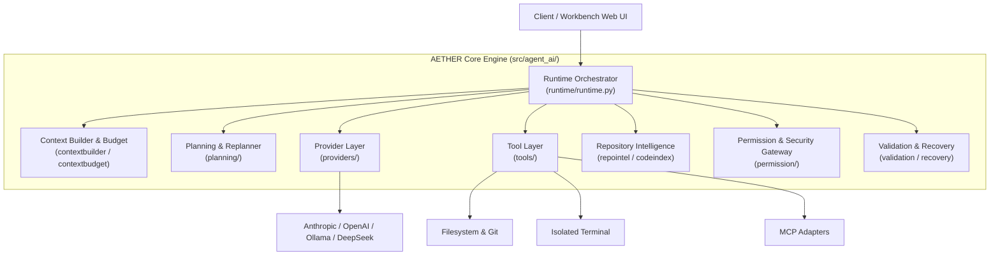
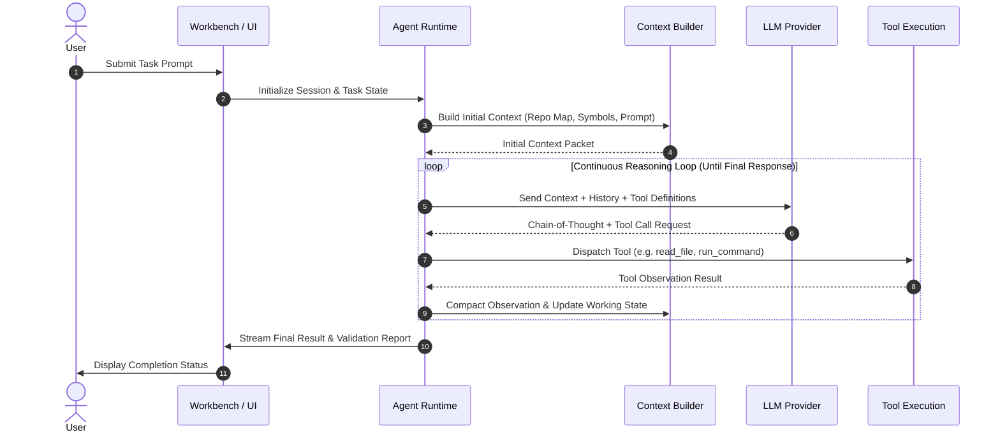

# AETHER Architecture Overview

This document details the architectural design, core subsystems, and runtime lifecycles of **AETHER** (Autonomous AI Coding Agent).

---

## 1. System Philosophy

AETHER decouples decision-making (LLM) from physical action execution (runtime engine):

```
┌────────────────────────────────────────────────────────┐
│                      LLM (Brain)                       │
│    • Reasoning & Planning                              │
│    • Tool Selection & Argument Construction            │
│    • Observation Synthesis & Reflection                │
└───────────────────────────▲────────────────────────────┘
                            │ JSON-RPC / API
┌───────────────────────────▼────────────────────────────┐
│                    AETHER (Hands)                      │
│    • Filesystem manipulation & Diff validation         │
│    • Terminal command execution & Process isolation    │
│    • Repository intelligence (AST, symbols, git)       │
│    • Context budgeting & token compaction              │
└────────────────────────────────────────────────────────┘
```

The LLM remains the autonomous decision-maker. AETHER provides a safe, reproducible, observable execution environment that allows the model to explore codebases, apply edits, execute test suites, and self-correct over iterative cycles.

---

## 2. High-Level Subsystems

AETHER is organized into clean, decoupled Python modules under `src/agent_ai/`:



### Module Directory Breakdown

| Subsystem Path | Description | Key Modules |
| :--- | :--- | :--- |
| `src/agent_ai/runtime/` | Core execution loop and turn controller | `runtime.py`, `working_state.py`, `policy.py` |
| `src/agent_ai/planning/` | Task decomposition, milestone tracking, replanning | `planner.py`, `replanner.py`, `models.py` |
| `src/agent_ai/contextbuilder/` | Compiles repository context, prompts, system states, and `@file` mentions | `builder.py`, `mention.py`, `models.py` |
| `src/agent_ai/contextbudget/` | Sliding window compaction, deduplication, tool pruning | `budget.py`, `tool_compaction.py`, `dedup.py` |
| `src/agent_ai/tools/` | Tool registry, filesystem, terminal, symbols, vision | `filesystem.py`, `terminal.py`, `source_symbols.py`, `project_map.py` |
| `src/agent_ai/providers/` | Unified LLM abstraction layer supporting multiple backends | `factory.py`, `base.py`, `deepseek.py`, `ollama.py`, `openrouter.py` |
| `src/agent_ai/repointel/` | AST parsing, symbol indexing, repository graph | `indexer.py`, `symbols.py` |
| `src/agent_ai/permission/` | Policy gateway, path whitelists, command safety | `gateway.py`, `policy.py` |
| `src/agent_ai/validation/` | Verification guards and sanity checks | `validator.py`, `syntax.py` |
| `src/agent_ai/recovery/` | Loop detection, backoff, and runtime self-healing | `loop_breaker.py`, `fallback.py` |

---

## 3. End-to-End Execution Lifecycle

The lifecycle of an AETHER task progresses through four primary phases:



### 1. Task Preparation
- Incoming user prompt is sanitized.
- `repointel` queries symbol maps and relevant directory trees to build an initial repository summary.
- Permissions and sandbox parameters are initialized for the target workspace.

### 2. Context Construction & Budget Allocation
- System prompt, user goals, and active file contexts are assembled by `contextbuilder`.
- Token consumption is measured against provider constraints by `contextbudget`. If history overflows, tool compaction and token deduplication are applied.

### 3. Continuous Agent Execution Loop
The loop runs without heuristic "done" detectors:
- The LLM streams internal reasoning (Chain of Thought).
- The LLM emits structured tool calls (JSON-RPC or provider-native schema).
- Tools execute deterministically in the workspace.
- Outputs (observations) are formatted, sanitized, and fed back into context.
- If an observation indicates error or plan diversion, `replanner.py` updates the execution plan.

### 4. Termination & Validation
- The loop terminates strictly when the model returns a final text response without requesting any further tool calls.
- Validation checks run automated unit tests and lint verifications before reporting completion.

---

## 4. Web Workbench & Multi-Agent Integration

AETHER includes an integrated workbench UI:
- **Backend:** Django application (`web/django_app/`) serving WebSocket and REST APIs for session lifecycle, token metrics, and real-time streaming.
- **Frontend:** Modern Vite + React single-page application (`web/frontend/`) rendering agent activity, file diff trees, terminal streaming, and interactive consultant chats.
