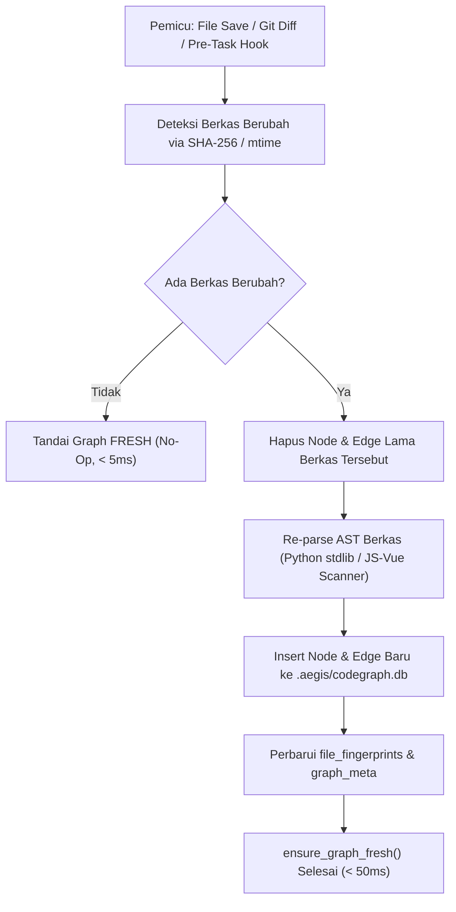

# Spesifikasi Arsitektur: CodeGraph sebagai Source of Structure AegisCode

Dokumen ini menetapkan spesifikasi arsitektur komprehensif, skema penyimpanan, alur sinkronisasi inkremental, dan antarmuka query API untuk **CodeGraph sebagai Sumber Struktur Utama (*Source of Structure*)** di AegisCode (AegisCode Studio & Aegis Agent).

Rujukan: [docs/PRD.md](file:///Users/aditwicaksono/Documents/Project-AI/AegisCode/docs/PRD.md), [docs/architecture.md](file:///Users/aditwicaksono/Documents/Project-AI/AegisCode/docs/architecture.md), [Roadmap.md](file:///Users/aditwicaksono/Documents/Project-AI/AegisCode/Roadmap.md) (Fase 2.5), [docs/architecture/phase2_mvp_modularization_plan.md](file:///Users/aditwicaksono/Documents/Project-AI/AegisCode/docs/architecture/phase2_mvp_modularization_plan.md).  
Rujukan Praktik Industri: *CodeGraph Guide 2026* (Colby McHenry / Tosea.ai).

---

## 1. Visi & Prinsip Inti

CodeGraph dibangun sebagai representasi deterministik berbasis graf terarah (*Directed Graph*) dari seluruh struktur kode di repositori, menggantikan siklus eksplorasi boros token `grep` -> `glob` -> `read_file` (*Discovery Tax*).

### Pilar Utama:
1. **Source of Structure**: Pusat kebenaran struktural (relasi berkas, import, simbol kelas/fungsi, hierarki panggilan, pemetaan rute API frontend-to-backend, dan rantai provider).
2. **Incremental Sync Sejak Awal**: Pembaruan graf berbasis diff seketika (< 100 ms) tanpa perlu re-index penuh setiap kali berkas dimodifikasi.
3. **Pemisahan 3 Lapis (Decoupled Layering)**:
   ```
   Agent (LLM Decision / Prompt Turn)
     │
     ▼
   Context Service (Advisory Context / Token Budgeting / Facade)
     │
     ▼
   CodeGraph Engine (SQLite + AST)  [+ SemanticIndex opsional di masa depan]
   ```
4. **Metadata Kompatibel Masa Depan**: Node menyimpan metadata lengkap (signature, docstring, body_hash, git_commit) yang siap menjadi landasan jika pencarian semantik dibutuhkan di masa depan.
5. **Zero-Hardcoding & Workspace-Agnostic**:
   - Dilarang keras meng-hardcode nama direktori seperti `frontend/` atau `backend/`.
   - Deteksi pemanggilan API dan routing dilakukan secara **generik berbasis pola bahasa dan protokol** (misalnya pendeteksi rute router/decorator dan pemanggil HTTP client `fetch`/`axios`/`requests`), sehingga CodeGraph dapat memetakan repositori eksternal apa pun yang dibuka di AegisCode Studio (monorepo, polyglot, microservices, dsb.).
6. **Prinsip YAGNI Ketat**:
   - TIDAK ada model embedding ONNX berat / pustaka vektor biner eksternal.
   - TIDAK ada auto-refactor skala besar yang tidak terawasi.
   - TIDAK ada multi-repo graph yang berlebihan.

---

## 2. Ruang Lingkup Struktur Relasi (MVP Graph Scope)

Graf memetakan 7 jenis relasi struktural terarah secara generik:

```
┌────────────────────────────────────────────────────────────────────────┐
│                     Relasi Struktural CodeGraph                        │
├─────────────────────────┬──────────────────────────────────────────────┤
│ Jenis Graf              │ Deskripsi & Cakupan Generik                  │
├─────────────────────────┼──────────────────────────────────────────────┤
│ 1. File Graph           │ Struktur hierarki berkas & folder workspace  │
│ 2. Import Graph         │ Modul/berkas yang diimpor (`imports`/`from`) │
│ 3. Class/Function Graph │ Definisi simbol, signature, & docstring      │
│ 4. Call Graph           │ Pemanggilan fungsi (`calls` & `called_by`)   │
│ 5. Symbol Reference     │ Lokasi penggunaan simbol di repositori       │
│ 6. Client ➔ Endpoint    │ Pemetaan pemanggil client (HTTP/RPC/fetch)    │
│    API Relation         │ ➔ Route / URL Handler (pattern-based)        │
│ 7. Provider/Service     │ Hubungan pipeline layanan (mis. adapter      │
│    Relation             │ ➔ base service ➔ orchestrator ➔ execution)   │
└─────────────────────────┴──────────────────────────────────────────────┘
```

---

## 3. Skema Database SQLite (`.aegis/codegraph.db`)

Penyimpanan dilakukan secara lokal dan deterministik per-workspace di `.aegis/codegraph.db`:

```sql
-- 1. Metadata Repositori & Freshness
CREATE TABLE IF NOT EXISTS graph_meta (
    key TEXT PRIMARY KEY,
    value TEXT NOT NULL,
    updated_at TIMESTAMP DEFAULT CURRENT_TIMESTAMP
);

-- 2. Pelacakan Sidik Jari Berkas (Incremental Sync)
CREATE TABLE IF NOT EXISTS file_fingerprints (
    file_path TEXT PRIMARY KEY,
    sha256 TEXT NOT NULL,
    mtime REAL NOT NULL,
    symbol_count INTEGER DEFAULT 0,
    indexed_at TIMESTAMP DEFAULT CURRENT_TIMESTAMP
);

-- 3. Node Simbol Kode (Kaya Metadata)
CREATE TABLE IF NOT EXISTS symbols (
    id TEXT PRIMARY KEY,           -- format kanonik: path::symbol_name
    name TEXT NOT NULL,
    type TEXT NOT NULL,           -- 'function', 'class', 'method', 'endpoint', 'variable'
    file_path TEXT NOT NULL,
    language TEXT NOT NULL,       -- 'python', 'javascript', 'vue', 'json'
    start_line INTEGER NOT NULL,
    end_line INTEGER NOT NULL,
    signature TEXT,
    docstring TEXT,
    body_hash TEXT NOT NULL,      -- hash konten body simbol
    git_commit TEXT,
    last_indexed_at TIMESTAMP DEFAULT CURRENT_TIMESTAMP
);

CREATE INDEX IF NOT EXISTS idx_symbols_name ON symbols(name);
CREATE INDEX IF NOT EXISTS idx_symbols_file ON symbols(file_path);
CREATE INDEX IF NOT EXISTS idx_symbols_type ON symbols(type);

-- 4. Pencarian Teks Simbol Instan via SQLite FTS5
CREATE VIRTUAL TABLE IF NOT EXISTS symbols_fts USING fts5(
    name,
    signature,
    docstring,
    content='symbols',
    content_rowid='rowid'
);

-- 5. Edge Relasi Struktural (Edges)
CREATE TABLE IF NOT EXISTS symbol_relations (
    id INTEGER PRIMARY KEY AUTOINCREMENT,
    source_id TEXT NOT NULL,      -- ID simbol pemanggil/pengimpor
    target_id TEXT,              -- ID simbol sasaran (bisa NULL jika simbol external/stdlib)
    target_name TEXT NOT NULL,   -- Nama mentah simbol sasaran
    relation_type TEXT NOT NULL, -- 'imports', 'calls', 'called_by', 'inherits', 'api_route', 'references'
    file_path TEXT NOT NULL,
    line_number INTEGER NOT NULL,
    FOREIGN KEY(source_id) REFERENCES symbols(id) ON DELETE CASCADE
);

CREATE INDEX IF NOT EXISTS idx_relations_source ON symbol_relations(source_id);
CREATE INDEX IF NOT EXISTS idx_relations_target ON symbol_relations(target_id);
CREATE INDEX IF NOT EXISTS idx_relations_target_name ON symbol_relations(target_name);
CREATE INDEX IF NOT EXISTS idx_relations_type ON symbol_relations(relation_type);
```

---

## 4. Mekanisme Sinkronisasi Inkremental (Incremental Sync Engine)

Sinkronisasi dirancang cepat tanpa perlu re-parse repo penuh:



### Tiga Mode Sinkronisasi:

1. **Full Resync (Initial & Recovery)**:
   - **Pemicu**: Inisialisasi awal repositori (`aegis codegraph init`), checkout/switch branch Git besar, recovery pasca-crash, atau pembersihan cache database manual.
   - **Operasi**: Truncate/re-create tabel `symbols`, `symbol_relations`, dan `symbols_fts`; pemindaian seluruh berkas proyek; ekstraksi AST modular dalam satu transaksi SQLite (`BEGIN TRANSACTION ... COMMIT`); dan pembentukan ulang tabel `file_fingerprints`.
   - **Karakteristik & SLA**: Bersifat komprehensif, deterministik, dan zero-orphan. Waktu eksekusi < 1.000 ms untuk skala repositori standar (< 100.000 baris kode).

2. **Incremental Sync (Event-Driven & Pre-Task Hook)**:
   - **Pemicu**: Event simpan berkas di editor (`on_file_save`), hook pre-tool execution Brokkr/Heimdall, atau perubahan berkas terdeteksi via git diff lokal.
   - **Operasi**: Membandingkan `mtime` dan hash SHA-256 berkas terhadap tabel `file_fingerprints`. Berkas yang tidak berubah diabaikan seketika (*no-op*, < 5 ms). Untuk berkas yang berubah (*dirty*):
     1. Hapus simbol dan relasi lama berkas tersebut secara cascading (`DELETE FROM symbols WHERE file_path = ?`).
     2. Ekstrak ulang AST berkas menggunakan AST scanner stdlib.
     3. Sisipkan node dan relasi baru ke tabel `symbols` dan `symbol_relations`.
     4. Perbarui data `sha256`, `mtime`, dan `symbol_count` pada `file_fingerprints`.
   - **Karakteristik & SLA**: Non-blocking, atomik, dengan latensi ultra-rendah (< 50 ms per berkas).

3. **On-Demand Refresh (Scoped Area & Query-Time)**:
   - **Pemicu**: Pemanggilan eksplisit oleh agen (`ensure_graph_fresh(area="src/agent_ai/core/")`) sebelum menyusun rencana arsitektur Mimir atau sebelum eksekusi patch multi-berkas Brokkr.
   - **Operasi**: Evaluasi selektif hanya pada sub-pohon path direktori yang diminta, memutakhirkan berkas-berkas terkait tanpa menyentuh modul yang tidak relevan.
   - **Karakteristik & SLA**: Efisiensi token dan I/O tinggi, membatasi blast radius pemindaian.

---

### Guardrail `ensure_graph_fresh()` Sebelum Eksekusi Agent

Untuk menjamin ketiadaan halusinasi struktural (*zero-blindspot*) dan menjaga Asymmetric Split-Brain (< 4.000 token), runtime AegisCode memberlakukan guardrail wajib sebelum agen mengambil keputusan.

#### Titik Integrasi:
1. **Agent Task Preparation**: Dipanggil pada `AgentRuntime.execute_task` sebelum instruksi pertama dikirim ke provider LLM.
2. **Context Compilation**: Dipanggil pada `ContextPipeline.compile_context_messages` saat sub-sistem konteks merakit ringkasan relasi simbol.
3. **Scout & Tool Boundary**: Dipanggil sebelum eksekusi tool penjelajahan `codegraph_*` oleh `heimdall-scout`.

#### Kontrak dan Algoritma Guardrail:

```python
def ensure_graph_fresh(
    self,
    area: Optional[str] = None,
    max_stale_seconds: float = 2.0,
) -> bool:
    """Guardrail deterministik penjamin kesegaran CodeGraph sebelum eksekusi agent.

    Algoritma:
    1. Evaluasi Stale Cache:
       - Periksa graph_meta('last_sync_timestamp').
       - Jika waktu saat ini - last_sync < max_stale_seconds dan tidak ada
         perubahan status pada buffer disk, return True (No-op cepat, < 2 ms).
    2. Deteksi Berkas Berubah (Dirty Detection):
       - Pindai mtime berkas di workspace (atau sub-tree `area` jika ditentukan).
       - Bandingkan dengan mtime di tabel file_fingerprints.
       - Jika mtime berbeda, hitung SHA-256 untuk memvalidasi perubahan nyata.
    3. Sinkronisasi Inkremental Atomik:
       - Jika ditemukan berkas dirty, jalankan re-index parsial dalam transaksi
         SQLite WAL (Write-Ahead Logging).
       - Perbarui graph_meta('last_sync_timestamp').
    4. Resiliensi Terhadap Galat Sintaks:
       - Jika berkas yang sedang disinkronkan mengandung kesalahan sintaks (mis.
         SyntaxError saat pengguna mengetik kode), log peringatan defensif.
       - Pertahankan node simbol terakhir yang valid atau tandai status
         'syntax_error' tanpa menghentikan alur kerja agent.
    5. Return True jika graf berhasil diverifikasi mutakhir (fresh).
    """
```

---

## 5. Antarmuka Query API Sederhana (Context Service Facade)

Agent tidak mengakses SQL secara langsung, melainkan melalui antarmuka bersih pada `ContextService`:

```python
class CodeGraphService:
    """Service facade penghubung Agent dengan database CodeGraph."""

    def find_symbol(self, name: str) -> List[SymbolNode]:
        """Cari lokasi definisi dan signature simbol berdasarkan nama."""
        ...

    def get_callers(self, symbol: str, depth: int = 1) -> List[RelationResult]:
        """Dapatkan seluruh fungsi/komponen yang memanggil simbol sasaran."""
        ...

    def get_callees(self, symbol: str) -> List[RelationResult]:
        """Dapatkan seluruh fungsi yang dipanggil di dalam tubuh simbol sasaran."""
        ...

    def get_related_files(self, file_path: str) -> List[str]:
        """Dapatkan berkas-berkas yang terikat impor/dependensi langsung."""
        ...

    def trace_frontend_to_backend(self, component: str) -> List[APIMapping]:
        """Lacak rute pemanggilan dari komponen Vue (api.js) ke endpoint Django REST/SSE."""
        ...

    def find_orphans(self) -> List[SymbolNode]:
        """Temukan simbol mati yang didefinisikan namun tidak pernah dipanggil/diimpor."""
        ...

    def impact_analysis(self, file_or_symbol: str, depth: int = 2) -> ImpactReport:
        """Hitung blast radius (rantai dampak) sebelum agen melakukan modifikasi patch."""
        ...

    def ensure_graph_fresh(self) -> bool:
        """Pastikan graf mutakhir terhadap perubahan workspace terbaru."""
        ...
```

---

## 6. Prioritas Area Krusial AegisCode (Fase Implementasi Awal)

Implementasi pengindeksan difokuskan secara presisi pada alur terpenting AegisCode:

1. **AI Agent Execution**:
   - `src/agent_ai/runtime/runtime.py`
   - `src/agent_ai/core/orchestrator.py`
   - `src/agent_ai/core/orchestration/` (`continuous_runner.py`, `provider_runner.py`)
2. **Antigravity Provider & Multi-Provider Layer**:
   - `src/agent_ai/providers/antigravity.py`
   - `src/agent_ai/providers/factory.py`
   - `src/agent_ai/core/provider_contract.py`
3. **Consultant & Ask Mode**:
   - `src/agent_ai/consultant/service.py`
   - `src/agent_ai/contextbuilder/`
4. **Queue Sidebar, Session, & Task State**:
   - Backend: `web/django_app/api/execution.py`, `views.py`
   - Frontend: `web/frontend/src/services/api.js`, `taskStateReducer.js`, `useWorkbenchLiveEvents.js`

---

## 7. Kebijakan Auto-Migrasi & Zero-Orphan

1. **Eliminasi Vektor Warisan**:
   - Berkas `.aegis/vectors.db` otomatis dibersihkan secara aman saat `.aegis/codegraph.db` diaktifkan (*zero-orphan*).
   - Dependensi `fastembed`, `onnxruntime`, dan `sqlite-vec` didekomisi penuh dari paket runtime inti.
2. **Kesiapan RAG Masa Depan**:
   - Skema tabel `symbols` telah memuat `docstring`, `signature`, dan `body_hash`. Jika fitur semantic search diaktifkan kembali di masa depan, embedding dapat dibangkitkan langsung dari tabel `symbols` tanpa perlu memecah ulang berkas secara manual.
