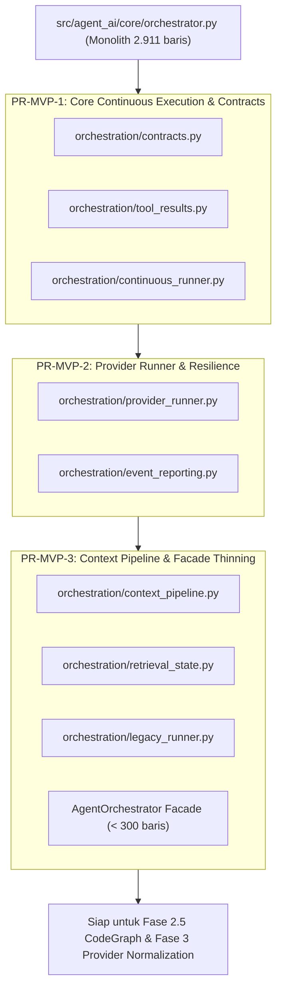

# Implementation Plan: Restrukturisasi MVP Fase 2 (Modularisasi Orchestrator & Runtime)

Dokumen ini menyajikan rencana implementasi teknis untuk merestrukturisasi **Fase 2 pada [Roadmap.md](file:///Users/aditwicaksono/Documents/Project-AI/AegisCode/Roadmap.md)** dari model 7-PR waterfall kaku (PR-0 s/d PR-6) menjadi **3 PR MVP Mandiri (Non-Linear & Zero-Redo-Cycle)**. Pendekatan ini memisahkan monolith [`src/agent_ai/core/orchestrator.py`](file:///Users/aditwicaksono/Documents/Project-AI/AegisCode/src/agent_ai/core/orchestrator.py) (~2.911 baris) secara modular tanpa memicu regresi atau siklus kerja berulang.

Rujukan: [docs/PRD.md](file:///Users/aditwicaksono/Documents/Project-AI/AegisCode/docs/PRD.md), [docs/architecture.md](file:///Users/aditwicaksono/Documents/Project-AI/AegisCode/docs/architecture.md), [Roadmap.md](file:///Users/aditwicaksono/Documents/Project-AI/AegisCode/Roadmap.md), [docs/architecture/codegraph_migration_plan.md](file:///Users/aditwicaksono/Documents/Project-AI/AegisCode/docs/architecture/codegraph_migration_plan.md).

---

## 1. Goal Description

### Masalah Saat Ini
1. **Monolith 2.911 Baris**: [`src/agent_ai/core/orchestrator.py`](file:///Users/aditwicaksono/Documents/Project-AI/AegisCode/src/agent_ai/core/orchestrator.py) memadukan 6 domain tanggung jawab yang berbeda:
   - Data contracts & state tracking
   - Provider invocation, retry backoff, dan error classification
   - Modern continuous turn-by-turn execution loop (`run_continuous_loop`)
   - Context compilation, history sliding window compaction, dan cache invalidation
   - Tool execution result formatting & observability emission
   - Legacy plan-based execution loop (`run`, deprecated)
2. **Waterfall 7-PR yang Rawan Siklus Ulang (Redo Cycle)**:
   Model rencana 7 PR sebelumnya (PR-0 s/d PR-6) terlalu granular:
   - PR-1 hanya mendefinisikan kontrak tanpa runner aktif.
   - PR-3 mengekstrak provider runner sementara continuous runner baru disentuh di PR-4, memicu *context thrashing* dan adaptasi kode ganda.
3. **Kebutuhan MVP Non-Linear**:
   Diperlukan pengelompokan menjadi **3 PR MVP atomik** yang memprioritaskan alur produksi modern (`run_continuous_loop`), menjamin kompatibilitas publik 100%, serta langsung selaras dengan **Fase 2.5 CodeGraph**.

---

## 2. User Review Required

> [!IMPORTANT]
> **Kompatibilitas Facade Penuh**: Seluruh signature publik `AgentOrchestrator` (`__init__`, `run_continuous_loop`, `run`, `_generate_with_retry`, `bible_context_state`, dll.) dipertahankan 100% kompatibel di [`orchestrator.py`](file:///Users/aditwicaksono/Documents/Project-AI/AegisCode/src/agent_ai/core/orchestrator.py) sebagai facade delegasi. Tes eksisting (seperti `test_provider_retry_lifecycle.py`, `test_context_compaction.py`, dll.) tidak akan diubah atau rusak.

> [!TIP]
> **Pemisahan Modern vs Legacy**: Alur produksi aktif AegisCode Studio 100% menggunakan `run_continuous_loop`. Loop lama (`run`) diisolasi ke modul terpisah (`legacy_runner.py`) sehingga kode produksi bebas dari heuristik usang tanpa memutus kompatibilitas backward.

---

## 3. Strategi Restrukturisasi 3 PR MVP



---

## 4. Proposed Changes

### Komponen: Roadmap & Dokumentasi

#### [MODIFY] `Roadmap.md`
Memperbarui seksi 5 (Fase 2) dari tabel 7-PR waterfall menjadi 3 PR MVP yang mandiri:

```markdown
| Tahap | Perubahan | Gate wajib |
|---|---|---|
| PR-MVP-1 | Core Continuous Execution & Contracts: sub-paket `core/orchestration/`, kontrak `contracts.py`, `tool_results.py`, dan modern `continuous_runner.py` | Continuous loop berjalan via runner baru; seluruh unit test continuous & compaction lulus 100% |
| PR-MVP-2 | Provider Runner & Resilience: ekstraksi `provider_runner.py` (retry backoff, sanitasi, error handling) dan `event_reporting.py` | 43 unit test retry/error lulus; event sequence dan usage telemetri identik dengan baseline |
| PR-MVP-3 | Context Pipeline, Retrieval State & Facade Thinning: ekstraksi `context_pipeline.py`, `retrieval_state.py`, isolasi `legacy_runner.py`, dan penipisan `orchestrator.py` (< 300 baris) | Seluruh 65+ pengujian regresi lulus; dependensi satu arah tanpa import cycle; siap menyambut Fase 2.5 CodeGraph |
```

---

### Komponen: Sub-Paket `src/agent_ai/core/orchestration/`

#### [NEW] `src/agent_ai/core/orchestration/__init__.py`
Ekspor simbol-simbol utama runner dan kontrak.

#### [NEW] `src/agent_ai/core/orchestration/contracts.py`
Mendefinisikan kontrak data murni per-run tanpa ketergantungan melingkar:
- `OrchestrationConfig`: batas iterasi, mode, budget token, policy, dan timeout.
- `TurnExecutionState`: status per-turn LLM dan tool dispatch.
- `RunResult`: payload penyelesaian task terminal.

#### [NEW] `src/agent_ai/core/orchestration/tool_results.py`
Ekstraksi penanganan hasil tool dari orchestrator monolith:
- `format_observation_message`: konversi `AgentObservation` ke format `role: tool`.
- `record_tool_result_payload`: pencatatan `ToolResultPayload`, sanitasi vision payload, dan dedup hash.

#### [NEW] `src/agent_ai/core/orchestration/continuous_runner.py`
Ekstraksi loop turn-by-turn modern `run_continuous_loop` (baris 2325–2767):
- Eksekusi turn LLM -> Dispatch tool calls -> Observation feedback loop -> Terminal completion detection.
- Mendukung pemantauan `CancellationToken`, evaluasi `ReliabilityManager`, dan `ExecutionPolicyState`.

#### [NEW] `src/agent_ai/core/orchestration/provider_runner.py`
Ekstraksi logika pemanggilan LLM dan resilience layer (baris 1550–2000):
- `generate_with_retry`: retry backoff dengan jitter terkonfigurasi via `data/settings.json`.
- `handle_provider_error`: klasifikasi error retryable vs non-retryable.
- Sanitasi respons model dan pembatasan usage token.

#### [NEW] `src/agent_ai/core/orchestration/event_reporting.py`
Helper emisi event terpadu untuk SSE gateway dan UI:
- Format payload event `reasoning`, `tool_call`, `observation`, `status`, dan `token_usage`.

#### [NEW] `src/agent_ai/core/orchestration/context_pipeline.py` & `retrieval_state.py`
Ekstraksi perakitan konteks (baris 600–1080):
- `compile_context_messages`: system prompt, mention files, bible context, dan working state.
- `sync_retrieval_cache`: sinkronisasi `ToolReadCache` dengan compaction state.
- Kesiapan integrasi langsung dengan `.aegis/codegraph.db` (Fase 2.5).

#### [NEW] `src/agent_ai/core/orchestration/legacy_runner.py`
Isolasi loop lama berbasis plan (baris 2003–2324):
- Step-based plan execution untuk pengujian backward-compatibility lama.

#### [MODIFY] `src/agent_ai/core/orchestrator.py`
Menjadi **Thin Facade Kompatibel** (< 300 baris):
- Mengimpor dan mendelegasikan panggilan `run_continuous_loop` ke `ContinuousRunner`.
- Mendelegasikan `_generate_with_retry` ke `ProviderRunner`.
- Mempertahankan backward compatibility 100% untuk semua unit test tanpa mengubah `__all__` atau signature publik.

---

## 5. Rencana Eksekusi PR (Non-Linear & Bertahap)

| Tahap | Fokus Eksekusi | Deliverables | Risiko & Mitigasi |
|:---|:---|:---|:---|
| **Langkah 1** | Pembaruan [Roadmap.md](file:///Users/aditwicaksono/Documents/Project-AI/AegisCode/Roadmap.md) | Sinkronisasi deskripsi Fase 2 dengan struktur 3 PR MVP. | Risiko: 0. Murni dokumentasi. |
| **Langkah 2 (PR-MVP-1)** | Core Continuous Runner & Contracts | `contracts.py`, `tool_results.py`, `continuous_runner.py`, facade delegasi di `orchestrator.py`. | Mitigasi: Jalankan suite continuous test (`test_context_compaction.py`, `test_agent_execution_policy.py`). |
| **Langkah 3 (PR-MVP-2)** | Provider Runner & Resilience | `provider_runner.py`, `event_reporting.py`, ekstraksi retry logic. | Mitigasi: Jalankan `test_provider_retry_lifecycle.py`, `test_api_retry_config.py`. |
| **Langkah 4 (PR-MVP-3)** | Context Pipeline & Thin Facade | `context_pipeline.py`, `retrieval_state.py`, `legacy_runner.py`, pemurnian akhir `orchestrator.py`. | Mitigasi: Jalankan seluruh 65+ unit test backend dan verifikasi stop-gate independen Thor. |

---

## 6. Verification Plan

### Automated Tests
1. **Unit Test Suite Provider & Retry**:
   ```bash
   ./venv/bin/pytest tests/test_milestone1_core_integrity.py tests/test_provider_retry_lifecycle.py tests/test_api_retry_config.py
   ```
2. **Unit Test Suite Context & Policy**:
   ```bash
   ./venv/bin/pytest tests/test_scheduler_lifecycle_boundaries.py tests/test_context_aware_retrieval_cache.py tests/test_agent_execution_policy.py tests/test_context_compaction.py
   ```
3. **Full Regression Suite**:
   ```bash
   ./venv/bin/pytest tests/
   ```
4. **Audit Impor Sirkular**:
   ```bash
   python3 -c "from agent_ai.core.orchestrator import AgentOrchestrator; from agent_ai.core.orchestration import *; print('Import clean')"
   ```

### Manual Verification
1. Uji inisialisasi task tunggal di workbench AegisCode Studio untuk memastikan streaming CoT, eksekusi tool, dan event completion tetap berjalan normal.
2. Verifikasi log Stop-Gate independen dicatat di `docs/QA/logs/` oleh `thor-tester`.
