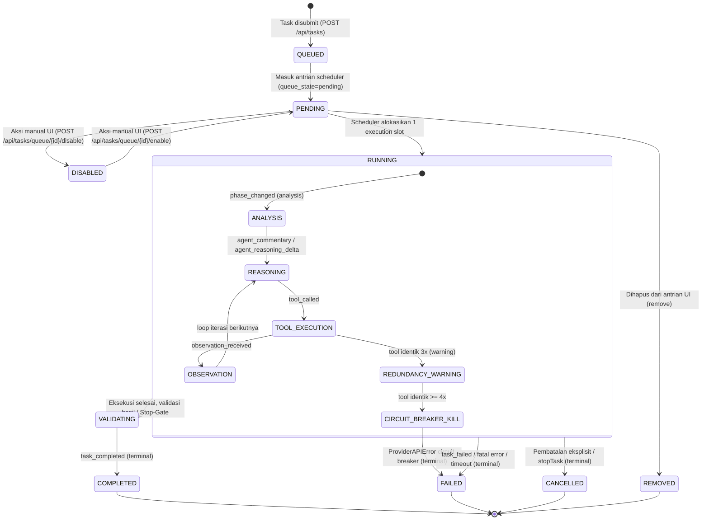

# Kontrak Resmi Lifecycle Task & Event Stream (Prioritas 0 - Fase 0)

Dokumen ini adalah spesifikasi arsitektur resmi yang membekukan status siklus hidup (lifecycle) task, alur event Server-Sent Events (SSE), serta pemisahan batas kepemilikan state (frontend vs backend) pada ekosistem AegisCode.

---

## 1. Diagram State Transition Lifecycle Task



---

## 2. Matriks Kepemilikan State (Frontend vs Backend)

Untuk mencegah race condition dan inkonsistensi UI, kepemilikan setiap variabel state dipisahkan secara tegas:

| Nama Variabel State | Pemilik Tunggal (Source of Truth) | Lokasi Implementasi | Deskripsi & Batas Kewenangan |
|---|---|---|---|
| `queue_state` | **Backend** | `ProjectStore` / `GatewayService` (SQLite & in-memory) | Status antrian (`pending`, `running`, `disabled`). Frontend hanya menerima via polling/SSE, dilarang memutasi langsung. |
| `runningTaskId` | **Frontend** | `useTaskLifecycle.js` (`ref`) | ID task yang sedang aktif menempati slot eksekusi di UI saat ini. Digunakan untuk guard view. |
| `status` (Task) | **Backend** | `TaskLogReader` (`.aegis/log/<id>.log`) & SQLite | Status lifecycle sebenarnya (`pending`, `running`, `completed`, `failed`, `cancelled`). |
| `monitoredTaskId` | **Frontend** | `useTaskLifecycle.js` / `taskStateReducer.js` | ID task yang layarnya sedang dibuka/dipantau oleh pengguna di workbench. |
| `isSubmittingTask` | **Frontend** | `useTaskLifecycle.js` / `TaskComposer.vue` | State transient saat tombol submit ditekan hingga HTTP response 201/200 kembali. |
| `FileWriteLock` | **Backend** | `src/agent_ai/tools/file_lock.py` | OS thread/process lock untuk mencegah write race condition antar tool/thread. |
| `deferredTaskIds` | **Frontend** | `useTaskLifecycle.js` (`Set<string>`) | Daftar ID task yang di-submit saat task lain sedang berjalan; UI menunggu task ini running sebelum berpindah. |

---

## 3. Format Kanonik Event Stream (SSE & Disk JSONL)

Setiap baris log pada `.aegis/log/<task_id>.log` dan setiap payload Server-Sent Event (SSE) wajib mematuhi skema kanonik berikut:

### 3.1 Skema Data Event
```json
{
  "event_id": "evt_01j7... (opsional pada log disk, wajib pada SSE)",
  "task_id": "task_abc123",
  "session_id": "sess_xyz789",
  "sequence": 1,
  "event": "tool_called",
  "timestamp": 1775560003.125,
  "data": {
    "tool": "read_file",
    "parameters": {
      "path": "src/utils.py"
    }
  }
}
```

### 3.2 Kamus Tipe Event Resmi
1. `task_requested`: Task diterima sistem dengan teks prompt awal.
2. `task_started`: Worker atau runtime mulai mengeksekusi task.
3. `phase_changed`: Perubahan fase agen (`analysis`, `planning`, `execution`, `verification`).
4. `agent_commentary`: Cuplikan pemikiran reasoning agen.
5. `agent_reasoning_delta`: Delta teks streaming reasoning (CoT).
6. `tool_called`: Pemanggilan tool beserta argumennya.
7. `observation_received`: Hasil balikan dari eksekusi tool.
8. `warning`: Peringatan non-fatal (misal: redundansi loop atau peringatan kuota).
9. `provider_retry`: Percobaan ulang panggilan LLM akibat transient failure (HTTP 429/503).
10. `task_completed`: Task selesai sukses (Terminal).
11. `task_failed`: Task berhenti akibat galat atau timeout (Terminal).
12. `task_cancelled`: Task dihentikan atas permintaan pengguna (Terminal).

---

## 4. Invarian Sistem & Aturan Integritas
1. **Terminal adalah Final**: Sekali task mencapai status terminal (`completed`, `failed`, `cancelled`), state tidak boleh bertransisi ke state lain.
2. **Serial Concurrency = 1**: Scheduler hanya mengeksekusi tepat 1 task aktif dalam satu waktu. Submission baru saat task aktif berjalan wajib berstatus `pending` di antrian.
3. **Guard Isolasi Tampilan**: Event stream frontend wajib memvalidasi `isEventForMonitoredTask`. Event milik task B dilarang merusak buffer reasoning milik task A yang sedang ditinjau.
4. **Sanitasi Kredensial**: Seluruh data payload event yang dikirimkan via SSE atau disimpan ke berkas log wajib melalui sanitasi regex untuk menyaring API key, password, dan token rahasia.
