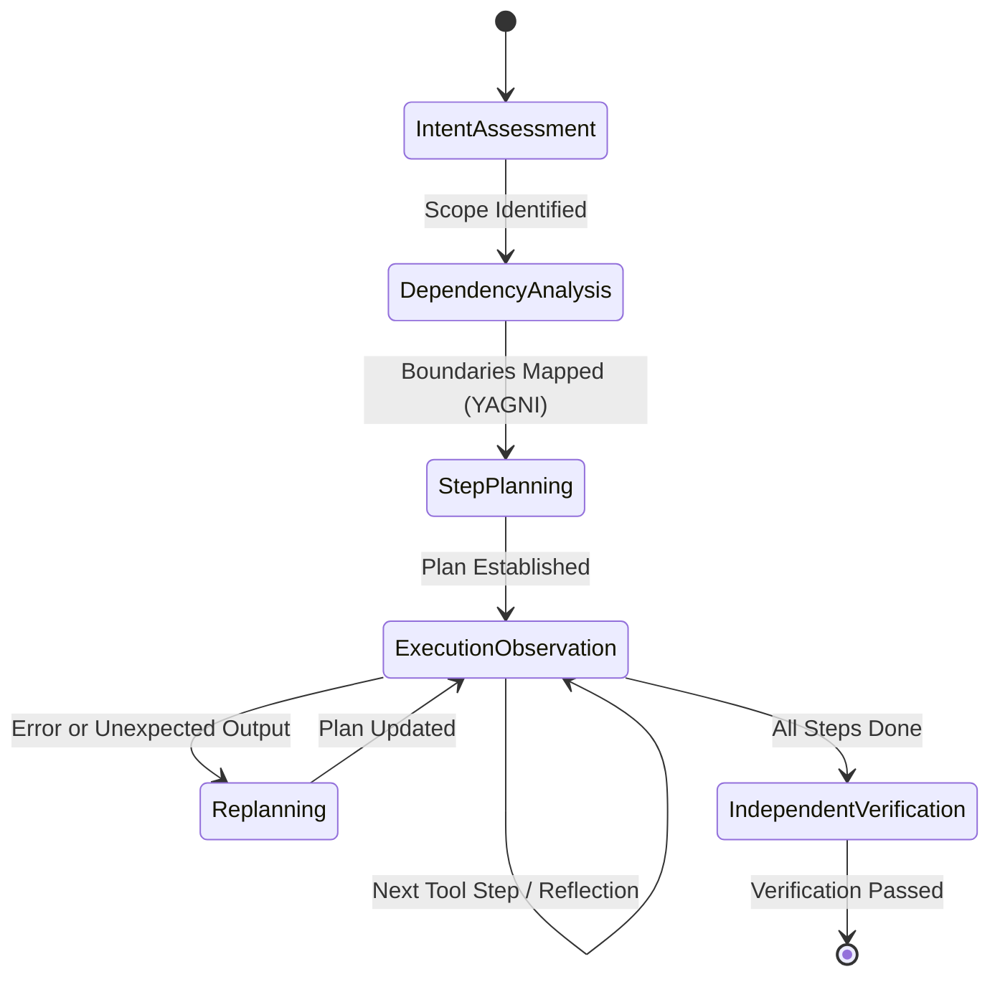

# Aegis Agent Chain of Thought (CoT) Reasoning & Runtime Adaptation

This guide explores the design, prompting mechanisms, and dynamic adaptation of Chain of Thought (CoT) reasoning within the **AegisCode** runtime (**Aegis Agent**).
---

## 1. What is Chain of Thought (CoT) in Aegis Agent?

In traditional script-based automation, decisions are statically hardcoded. In Aegis Agent, complex problem-solving requires **emergent deliberation**:
- Reasoning is not a static one-off prompt; it is an **iterative feedback loop** where every tool output acts as sensory input that updates subsequent thoughts.

```
┌────────────────────────────────────────────────────────────┐
│                    Turn N Reasoning Loop                   │
│                                                            │
│   [Thought] -> "I need to inspect test_runtime.py"         │
│   [Action]  -> view_file("tests/test_runtime.py")          │
│   [Observe] -> SyntaxError on line 42                      │
│   [Reflect] -> "The error was caused by missing import X." │
│   [Adapt]   -> "I will patch the import in runtime.py"     │
│                                                            │
└────────────────────────────────────────────────────────────┘
```

---

## 2. The 5-Stage CoT Cognitive Architecture

When the agent runs, the runtime encourages the following 5-stage cognitive structure:



### Stage 1: Intent & Context Assessment
Before reading or editing files, the agent isolates:
- Core user goal vs secondary assumptions.
- Environmental constraints (operating system, runtime dependencies, available tools).
- Initial search paths (entry point files, test files, configs).

### Stage 2: Architectural & Dependency Analysis (YAGNI Check)
Before altering any code:
- Identify symbol dependencies across modules (`src/agent_ai/repointel`).
- Apply the **Lean Code Policy**: strictly eliminate speculative abstractions, unnecessary intermediate helper functions, and premature configuration knobs.
- Determine blast radius: will changing this function break downstream tests or API contracts?

### Stage 3: Step-by-Step Action Planning
- The planning subsystem (`src/agent_ai/planning/planner.py`) structures work into discrete milestones:
  ```json
  {
    "goal": "Implement rate limiting in provider gateway",
    "steps": [
      {"id": 1, "action": "Inspect gateway.py signature", "status": "pending"},
      {"id": 2, "action": "Add token bucket algorithm with unit test", "status": "pending"},
      {"id": 3, "action": "Run pytest tests/test_gateway.py", "status": "pending"}
    ]
  }
  ```

### Stage 4: Execution & Observation Reflection Loop
During tool calls:
- Each tool returns an `Observation` payload.
- The agent actively analyzes the observation against expected results.
- If an unexpected error occurs (e.g., test fails, file not found, permission denied):
  - **Do NOT** retry the exact same failing command without changes.
  - Engage `replanner.py` to evaluate the cause, mutate the plan, and execute corrective action.

### Stage 5: Independent Verification & Sanity Check
- After implementation is complete, the agent switches cognitive focus from *authoring* to *auditing*.
- Runs test suites via `pytest` or `vitest`.
- Confirms zero regressions in untouched modules.

---

## 3. Dynamic Replanning Engine (`planning/replanner.py`)

When unexpected results deviate from the initial roadmap, the runtime engages the replanner:

```python
class Replanner:
    """
    Evaluates current working state, remaining plan steps,
    and latest tool observations to adapt execution trajectory.
    """
    def should_replan(self, observation: ToolObservation, state: WorkingState) -> bool:
        if observation.exit_code != 0:
            return True
        if observation.has_structural_deviation:
            return True
        return False

    def adapt_plan(self, current_plan: Plan, error_context: str) -> Plan:
        # Re-evaluates remaining steps, injecting diagnostic or fix steps
        ...
```

### Replanning Triggers:
1. **Tool Non-Zero Exit Code:** A test fails or command crashes.
2. **Missing Invariant:** An expected file or symbol does not exist where expected.
3. **Budget Exhaustion Warning:** Token budget threshold reached; agent must summarize and prioritize remaining work.

---

## 4. Context Budgeting & Split-Brain Observation Compaction

Deep Chain of Thought reasoning across multiple tool execution steps can rapidly saturate LLM context windows. Aegis Agent's Asymmetric Split-Brain architecture enforces strict context packets (< 4,000 tokens dispatched to cloud models) using `src/agent_ai/contextbudget/`:

- **Tool Result Compaction (`tool_compaction.py`):** Dumps of thousands of terminal lines or large file view outputs are trimmed to the critical error headers, stack traces, and relevant line numbers.
- **Sliding History Compaction (`compaction.py`):** Older turns are summarized into concise conversational milestones while preserving active working state.
- **Deduplication (`dedup.py`):** Redundant read operations on unchanged files are referenced via cache tokens instead of duplicating full file contents in the prompt.
---

## 5. Loop Detection & Safety Guards

To prevent infinite loops (e.g., repeatedly editing and reverting the same lines, or running a failing test in an endless cycle), `src/agent_ai/recovery/loop_breaker.py` monitors:
- Repeated identical tool calls with identical arguments.
- Cyclic file edits with alternating diffs.
- Stagnant task plans exceeding a configured step threshold.

When detected, the runtime intervenes, breaks the loop, and forces the model to deliberate on alternative approaches or ask for human guidance.
