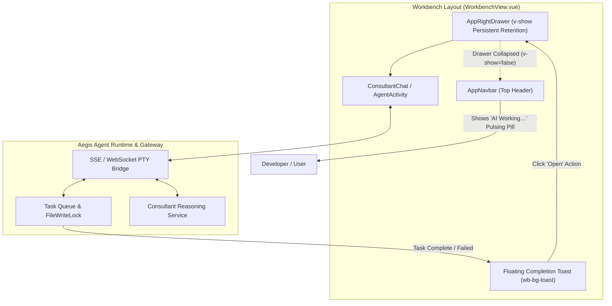
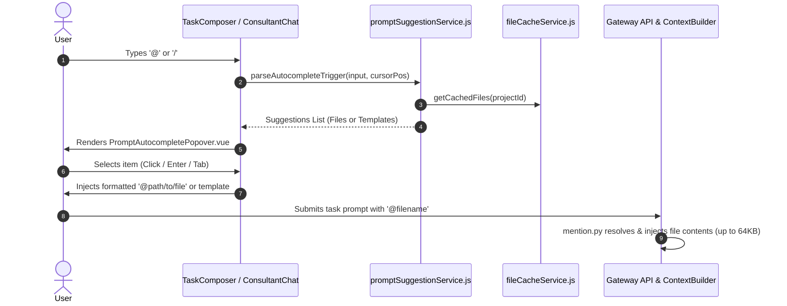

# AegisCode Studio Workbench IDE Features & Runtime Guardrails

This document describes the modern AI-first IDE capabilities, interactive subsystems, and execution guardrails implemented across the **AegisCode Studio Workbench** (`web/frontend` and `web/django_app`).
---

## 1. Background Execution & Assistant Guardrail Architecture

To ensure uninterrupted autonomous task execution and long-running consultant reasoning, the workbench employs a **Decoupled Execution & Persistent View Retention** model:

### 1.1 Persistent View Retention (`v-show`)
- The AI Assistant column in [`WorkbenchView.vue`](file:///Users/aditwicaksono/Documents/Project-AI/Aether-Agent/web/frontend/src/pages/WorkbenchView.vue) is preserved in the DOM via `v-show="assistantVisible"`.
- Closing or toggling the assistant drawer (via `✕`, `Cmd+J`, `Ctrl+B`, or responsive breakpoint collapse) hides the container with `display: none;` without destroying the component instance.
- **Invariants Preserved**:
  - In-flight `consult(...)` promises and agent polling loops continue unaffected.
  - Active chat history, tool calls, and scroll positions remain intact in memory.
  - Re-opening the assistant immediately surfaces current progress without reloading.

### 1.2 Top Navigation Background Indicator
- When an AI process (Agent task or Consultant query) is executing while the assistant drawer is hidden:
  - [`AppNavbar.vue`](file:///Users/aditwicaksono/Documents/Project-AI/Aether-Agent/web/frontend/src/components/layout/AppNavbar.vue) displays a dedicated `.nav-assistant-pill` with a pulsating amber dot and `"AI Working…"` label.
  - The Assistant toggle button receives `.is-running` styling with a continuous subtle glow pulse.
  - Clicking either the pill or toggle button immediately re-opens the assistant.

### 1.3 Non-Intrusive Completion Toast Notification
- If an agent task or consultant response completes while the assistant sidebar is closed:
  - A notification toast (`.wb-bg-toast`) appears at the bottom-right of the workbench.
  - Displays status color (Green for Success, Amber for Warning/Failed), prompt preview, and an **"Open"** action button.
  - Clicking "Open" opens the assistant drawer and switches directly to the relevant tab (`agents` or `consultant`).
  - Auto-dismisses after 6 seconds or can be manually dismissed via `✕`.

---

## 2. Prompt Autocomplete & Context Mention Engine (`@file` and `/template`)

AegisCode Studio features an integrated suggestion and context-resolution pipeline:

### 2.1 File Mentions (`@file`)
- **Trigger**: Typing `@` immediately queries cached workspace files.
- **Backend Resolution (`src/agent_ai/contextbuilder/mention.py`)**:
  - Validates relative paths against project root with strict path traversal prevention (`..` escaping is blocked).
  - Enforces a safety limit (default 64KB per file) to prevent context window dilution.
  - Injects file content directly into the prompt before sending to the model, ensuring tools-free modes (such as Quick Mode) still retain context.

### 2.2 Template Shortcuts (`/template`)
- **Trigger**: Typing `/` suggests pre-configured engineering prompts (e.g., `/refactor`, `/test`, `/audit`, `/explain`, `/fix-bugs`).
- Includes shortcut descriptions and instant template replacement.

### 2.3 Keyboard Ergonomics
- Full keyboard control inside [`PromptAutocompletePopover.vue`](file:///Users/aditwicaksono/Documents/Project-AI/Aether-Agent/web/frontend/src/components/ui/PromptAutocompletePopover.vue):
  - `ArrowDown` / `ArrowUp`: Traverse items.
  - `Enter` / `Tab`: Apply suggestion.
  - `Escape`: Dismiss popover.

---

## 3. Interactive PTY Terminal & Process Streaming Subsystem

Located inside the collapsible [`AppBottomDock.vue`](file:///Users/aditwicaksono/Documents/Project-AI/Aether-Agent/web/frontend/src/components/layout/AppBottomDock.vue):

- **Backend PTY Bridge (`web/django_app/api/views.py`)**:
  - Endpoint `/api/terminal/stream/`: Streams sub-process and interactive PTY output over WebSocket/SSE.
  - Endpoint `/api/terminal/input/`: Writes user input into the running process's interactive PTY session.
  - Endpoint `/api/terminal/cancel/`: Terminates active processes cleanly with **zero-zombie process tree kill** (`SIGTERM` / `SIGKILL`).
- **Frontend Console (`TerminalView.vue`)**:
  - Full `@xterm/xterm` interactive terminal emulation with real-time ANSI escape code color rendering.
  - Interactive command prompt with history recall (50 entries) and keyboard shortcuts.
  - Clear, auto-scroll, and copy/paste controls.

---

## 4. Human-in-the-Loop (HITL) Guardrails & Supervised Mode

To prevent unauthorized filesystem destruction and ensure high-trust autonomous coding:
- **Supervised Mode Policy**: When supervised mode is enabled, `write_file`, `edit_file`, and `delete_file` are intercepted prior to disk mutation.
- **Interactive Diff Modal (`DiffModal.vue`)**: Surfaces side-by-side or unified diff previews directly to the developer for explicit approval or rejection.
- **1-Click Rollback**: Automatically captures Git checkpoint stashes before each task turn, enabling one-click instant rollback of unwanted code alterations.
---

## 5. Diagnostics & Problems Engine

The workbench incorporates client-side static analysis and Monaco marker synchronization:

- **Service (`web/frontend/src/services/diagnosticService.js`)**:
  - Validates code syntax on the fly for bracket imbalances, JSON errors, duplicate keys, and Python colon syntax.
  - Converts Monaco Editor markers into categorized diagnostic objects (`error`, `warning`, `info`).
- **Problems Dock**:
  - Displays total error and warning count badges in `AppFooter.vue` and `AppBottomDock.vue`.
  - Clicking a problem navigates directly to the offending line in the editor canvas.

---

## 6. Welcome Canvas & Project Onboarding

- [`WelcomeView.vue`](file:///Users/aditwicaksono/Documents/Project-AI/Aether-Agent/web/frontend/src/components/WelcomeView.vue):
  - Renders when no editor tabs are open.
  - Displays recent workspaces, quick clone Git repository modal, folder opener, and quick command shortcuts (`⌘K`, `⌘P`, `Ctrl+\``).
