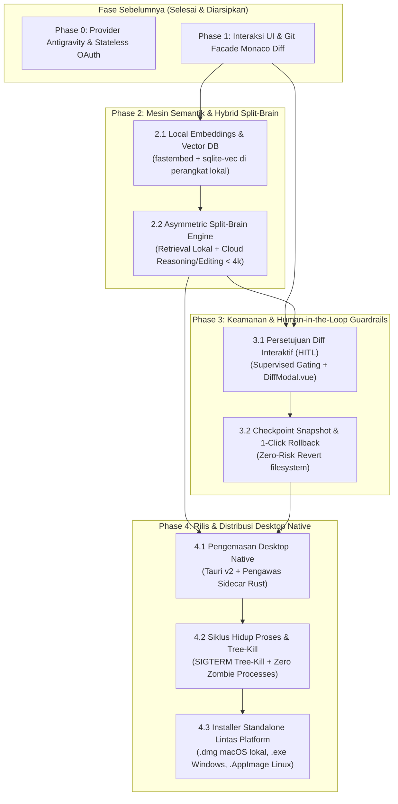

# AegisCode Future Execution Roadmap

Dokumen ini mendefinisikan peta jalan pelaksanaan berorientasi dependensi teknis untuk pengembangan lanjutan **AegisCode** (AegisCode Studio & Aegis Agent). Seluruh fase dan fitur yang telah selesai diimplementasikan (Phase 0 dan Phase 1) telah diarsipkan pada [docs/history/completed-features.md](file:///Users/aditwicaksono/Documents/Project-AI/AegisCode/docs/history/completed-features.md).

---

## 1. Diagram Alur Ketergantungan Fase Mendatang

---

## 2. Matriks Rincian Tugas & Verifikasi Masa Depan

| Fase / Modul | Tugas Implementasi | Berkas & Komponen Terdampak | Kriteria Keberterimaan | Rencana Pengujian (*Unit & Integration*) | Status |
|---|---|---|---|---|:---:|
| **Phase 2.1: Local Embeddings & Vector DB** | • Integrasi `fastembed` lokal (`bge-small-en-v1.5` atau `all-MiniLM-L6-v2`).  • Konfigurasi basis data vektor embedded `sqlite-vec` pada `.aegis/vectors.db` (dengan fallback otomatis `.aether/vectors.db`).  • Implementasi chunking berbasis AST untuk fungsi dan kelas Python/JS/TS.  • Penambahan cache sidik jari SHA-256 untuk melewati file yang tidak berubah saat re-indexing. | `src/agent_ai/repointel/semantic/`  `src/agent_ai/repointel/indexer.py`  `src/agent_ai/tools/semantic.py`  `src/agent_ai/runtime/telemetry/hardware.py` | • Vektor tersimpan lokal di `.aegis/vectors.db` tanpa latensi panggilan API eksternal.  • Ekstraksi AST mempertahankan signature fungsi, docstrings, dan scope kelas secara utuh.  • Berkas yang tidak dimodifikasi dilewati secara otomatis. | `tests/test_fastembed_indexer.py`  `tests/test_sqlite_vec_store.py` | Direncanakan |
| **Phase 2.2: Asymmetric Split-Brain Engine** | • Konfigurasi Local Worker untuk kueri AST, kesamaan vektor, dan pemadatan token.  • Konfigurasi Cloud Orchestrator untuk menerima paket konteks terkurasi (< 4.000 token) untuk pembuatan diff.  • Implementasi Reciprocal Rank Fusion (RRF) menggabungkan pencarian leksikal `atlas.json` dengan kemiripan `sqlite-vec`.  • Penerapan patch diff Cloud ke disk lokal dengan proteksi `FileWriteLock`. | `src/agent_ai/routing/`  `src/agent_ai/contextbuilder/`  `src/agent_ai/contextbudget/budget.py`  `src/agent_ai/tools/project_map.py` | • Paket konteks yang dikirim ke LLM Cloud tidak pernah melebihi batas kuota (< 4.000 token).  • Seluruh kode mentah repositori tidak pernah dikirim sembarangan melalui jaringan.  • Akurasi RRF mengungguli pencarian leksikal murni. | `tests/test_split_brain_budget.py`  `tests/test_rrf_ranker.py` | Direncanakan |
| **Phase 3: Keamanan & Guardrails HITL** | • Integrasi `SupervisedModePolicy` ke dalam permission gateway runtime.  • Render modal persetujuan interaktif `DiffModal.vue` saat agen mengajukan perintah `write_file`, `delete_file`, atau eksekusi perintah destruktif.  • Implementasi checkpoint Git otomatis pra-tugas untuk rollback 1-klik. | `src/agent_ai/permission/`  `src/agent_ai/runtime/policy.py`  `src/agent_ai/git/checkpoint.py`  `web/frontend/src/components/DiffModal.vue`  `web/frontend/src/components/SourceControlDrawer.vue` | • Eksekusi agen berhenti otomatis sebelum pemanggilan tool yang mengubah sistem berkas pada mode terawasi.  • Pengguna dapat menekan Setuju atau Tolak.  • Rollback checkpoint mengembalikan kondisi ruang kerja secara bersih. | `tests/test_supervised_policy.py`  `tests/test_checkpoint_rollback.py`  `web/frontend/tests/DiffModal.test.ts` | Direncanakan |
| **Phase 4: Aplikasi Desktop Native (Tauri v2)** | • Pembuatan shell aplikasi Tauri v2 (`src-tauri/`) dengan backend Rust.  • Implementasi pengawas proses latar belakang Python (mengelola daemon Django/Aegis Agent).  • Penegakan tree-kill proses native OS (`SIGTERM` / `taskkill /T /F`) saat jendela aplikasi ditutup.  • Integrasi dialog sistem operasi (`tauri-plugin-dialog`) dan notifikasi sistem (`tauri-plugin-notification`).  • Pemaketan berkas installer standalone (`.dmg` macOS pada branch `release`, `.exe` Windows, `.AppImage` Linux). | `src-tauri/src/main.rs`  `src-tauri/src/sidecar.rs`  `src-tauri/Cargo.toml`  `src-tauri/tauri.conf.json`  `.github/workflows/release.yml` | • Instalasi desktop sekali klik tanpa memerlukan pengaturan terminal Python atau Node manual.  • Terminasi total proses anak saat aplikasi ditutup (zero zombies). | `tests/test_sidecar_lifecycle.rs`  `.github/workflows/verify_packaging.yml` | Direncanakan |

---

## 3. Backlog Pasca-MVP (Fitur Ditangguhkan)

Untuk menjaga momentum rilis terarah dan mencegah over-engineering yang melanggar prinsip YAGNI, inisiatif berikut ditempatkan pada backlog lanjutan:

1. **Autonomous Fine-Tuning LoRA**: Pelatihan model lokal pada commit history repositori tertentu.
2. **Multi-Agent Swarm Orchestration**: Koordinasi paralel antar sub-agent di mesin terdistribusi di luar framework OMJ lokal.
3. **Penyimpanan Vektor Terdistribusi**: Pilihan konektor cloud vector database pihak ketiga (Pinecone, Qdrant Cloud).
