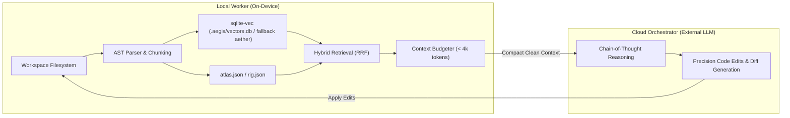

# AegisCode Local Hybrid RAG & Asymmetric Split-Brain Engine Roadmap

This document establishes the comprehensive architectural roadmap, implementation checklist, and deterministic verification framework for the **Local Hybrid RAG (Retrieval-Augmented Generation)** and **Asymmetric Split-Brain Engine** in AegisCode (Aegis Agent & AegisCode Studio).
---

## 1. Executive Summary & Design Principles

Retrieval for code requires high precision and deterministic behavior: identical queries against an unchanging codebase must return consistent chunk structures and ranked file lists. 

AegisCode adopts a **Hybrid Asymmetric Split-Brain Model** that pairs local-device retrieval with cloud reasoning:
- **Local Worker ("The Eyes & Indexer")**: Executes on-device semantic search, AST boundary parsing, and relational TOC lookup with zero network latency or cloud bandwidth consumption.
- **Cloud Orchestrator ("The Brain & Hands")**: Receives compact, pre-budgeted context (< 4,000 tokens) to perform high-level Chain-of-Thought planning, architectural synthesis, and precise code modifications.


---

## 2. Hybrid RAG Implementation Phases

### Phase 1: Vector Infrastructure & Local LLM Embeddings
*Goal*: Establish an independent, on-device vector database and embedding pipeline with zero external API dependencies.

- [x] Initialize `sqlite-vec` embedded database inside `.aegis/vectors.db` (with backward-compatible fallback to `.aether/vectors.db` and `BruteForceVectorStore` dual-engine).
- [x] Integrate `fastembed` for fast, lightweight on-device embeddings (`BAAI/bge-small-en-v1.5`, 384 dim, ~67MB).
- [ ] Implement local runner adapters for Ollama and llama.cpp (`providers/local/`) *(Ditunda ke Phase 2.2 / Pasca-MVP)*.
- [ ] Provide auto-detection and health checks for local runner availability *(Ditunda ke Phase 2.2 / Pasca-MVP)*.

| Property | Details |
| :--- | :--- |
| **Impacted Modules** | `src/agent_ai/repointel/semantic/`, `src/agent_ai/runtime/telemetry/hardware.py` |
| **Unit Test Focus** | • **Vector DB I/O**: Verify insertion consistency, indexing speed, and mock vector cosine retrieval.<br>• **Runner Auto-Detection**: Validate behavior when local port (e.g. `11434`) is offline, busy, or times out. |

---

### Phase 2: AST Chunking & Ingestion Pipeline
*Goal*: Chunk source files along syntactic boundaries (functions, classes) rather than raw character counts to preserve code semantics.

- [x] Implement language-aware AST parsers to slice code into logical function and class units (Python AST stdlib, JS/TS brace-matching, LangChain text splitter fallback).
- [x] Bind relational metadata from symbol hierarchy, file path, and line spans to every chunk.
- [x] Introduce SHA-256 content hashing to ensure idempotent incremental indexing (skip unchanged files).

| Property | Details |
| :--- | :--- |
| **Impacted Modules** | `src/agent_ai/repointel/semantic/chunker.py`, `src/agent_ai/repointel/semantic/indexer.py` |
| **Unit Test Focus** | • **AST Boundary Preservation**: Verify that functions and methods retain complete signatures, docstrings, and return statements without mid-statement splits.<br>• **Hash Idempotency**: Verify modifying 1 line in file A triggers re-indexing solely for file A while file B is bypassed. |


---

### Phase 3: Hybrid Retrieval Orchestration
*Goal*: Combine exact lexical lookup (TOC/Map) with semantic similarity (VectorDB) using Reciprocal Rank Fusion.

- [ ] Implement dual query routing: Lexical keyword search across `atlas.json` + semantic search in `sqlite-vec`.
- [ ] Implement **Reciprocal Rank Fusion (RRF)** to normalize and interleave ranked candidate lists.
- [ ] Register hybrid retrieval capabilities as tools in `ToolRegistry` (`tools/project_map.py`, `tools/semantic.py`).

| Property | Details |
| :--- | :--- |
| **Impacted Modules** | `src/agent_ai/tools/project_map.py`, `src/agent_ai/tools/semantic.py`, `src/agent_ai/runtime/` |
| **Unit Test Focus** | • **RRF Ranking Precision**: Verify exact symbol name queries rank TOC matches above loose vector embeddings.<br>• **Tool Schema Validation**: Ensure JSON-RPC tool schemas match OpenAI and Claude function calling formats. |

---

### Phase 4: Context Budgeting & Compaction
*Goal*: Enforce strict token limits to prevent context window dilution on models with limited context.

- [ ] Integrate retrieval outputs into the existing sliding window compaction pipeline.
- [ ] Implement chunk deduplication between RAG search results and currently open editor tabs.
- [ ] Format retrieved snippets using structured XML delimiters (e.g. `<retrieved_context>`).

| Property | Details |
| :--- | :--- |
| **Impacted Modules** | `src/agent_ai/contextbudget/budget.py`, `src/agent_ai/contextbudget/dedup.py` |
| **Unit Test Focus** | • **Token Overload Guard**: Push > 8,000 tokens through retriever; verify low-priority chunks are trimmed cleanly without breaking XML tags.<br>• **Deduplication**: Inject identical code ranges from separate tools; verify they are counted and displayed only once. |

---

### Phase 5: UI Telemetry & Observability
*Goal*: Provide real-time hardware metrics and transparent retrieval inspection in the workbench.

- [ ] Implement a non-blocking hardware monitor daemon (CPU, RAM, VRAM/Metal/CUDA, and TTFT latency).
- [ ] Stream real-time telemetry updates to `AppBottomDock.vue` via SSE.
- [ ] Build a RAG Transparency panel in the UI to display the exact chunks and confidence scores used in each turn.

| Property | Details |
| :--- | :--- |
| **Impacted Modules** | `src/agent_ai/runtime/telemetry/`, `web/frontend/src/components/layout/AppBottomDock.vue` |
| **Unit Test Focus** | • **Async Non-Blocking**: Verify 500ms hardware polling does not introduce latency or jitter to LLM streaming.<br>• **UI Memory Guard**: Verify Vue 3 telemetry charts execute with zero DOM element leaks over long sessions. |

---

## 3. Feature Specification: Hybrid Asymmetric Split-Brain Engine

### 3.1 Overview
Executing an entire coding turn on frontier cloud models wastes tokens and network bandwidth by repeatedly sending hundreds of thousands of raw repository tokens. Conversely, delegating code generation to small local models often leads to syntax errors and hallucinated edits.

The **Hybrid Asymmetric Split-Brain Engine** dynamically partitions duties:
- **Local Worker**: Runs index queries, vector searches, and AST traversals on local NVMe storage.
- **Cloud Orchestrator**: Receives synthesized context packets (< 4,000 tokens) to plan and output code diffs.

```
┌────────────────────────────────────────────────────────────────────────┐
│                        TASK EXECUTION MODES                            │
├─────────────────────┬──────────────────────────────────────────────────┤
│ Mode                │ Execution Pipeline                               │
├─────────────────────┼──────────────────────────────────────────────────┤
│ Full Cloud          │ 100% Cloud (Context + Planning + Generation)     │
│ Full Local          │ 100% Local / Air-Gapped (Ollama / llama.cpp)     │
│ Hybrid Asymmetric   │ Local Indexing & Retrieval + Cloud Code Diffing  │
└─────────────────────┴──────────────────────────────────────────────────┘
```

### 3.2 Single Pipeline Context Handover
1. **Dynamic Model Routing (`src/agent_ai/routing/`)**:
   - The runtime dynamically dispatches sub-steps: read/query steps execute locally, whereas generative reasoning steps route to high-capacity external models (DeepSeek, Claude, GPT-4o).
2. **Bandwidth Optimization**:
   - Only the user's prompt instruction and the minimal extracted code blocks are transmitted across the network, preserving confidential workspace code.
3. **Air-Gapped / Zero-Cloud Privacy Fallback**:
   - When the user selects **Full Local** or privacy mode is toggled, all sub-steps revert automatically to the local engine with zero outbound traffic.

---

## 4. Verification & Testing Strategy

To avoid false positives, **retrieval logic testing is strictly decoupled from LLM generation**:

1. **Deterministic Test Codebases**:
   - Maintain a dedicated mock repository under `tests/fixtures/mock_repo/` with intentionally obscure or overloaded function names.
2. **Retrieval Verification**:
   - Evaluate hit-rate metrics (Recall@K, MRR) independently from LLM prompt responses.
   - Assert that semantic vector retrieval locates functions where lexical keyword search fails, and vice versa.
3. **Zero-Regression Guarantee**:
   - Any modifications to `src/agent_ai/contextbudget/` or `src/agent_ai/repointel/` must maintain 100% pass rates across all existing test suites.