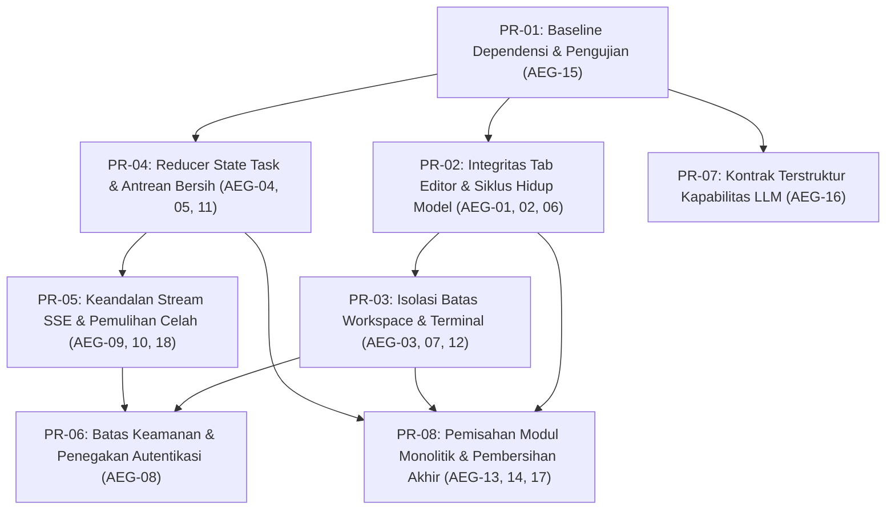

# Laporan Audit Verifikasi Isu Komunitas dan Rencana Perbaikan Sistemik

Dokumen ini menyajikan hasil audit verifikasi teknis terhadap 18 kelompok temuan dalam berkas [report-issues-community.md](file:///Users/aditwicaksono/Documents/Project-AI/AegisCode/docs/issues/report-issues-community.md) (snapshot commit `8dcf9debba763b25cd56f408a7b6f9962c5091d5` pada branch `main`), serta perbandingannya dengan kondisi basis kode aktif pada branch pengembangan (`master`). Dokumen ini juga memuat rencana perbaikan bertahap berbasis prioritas.

---

## 1. Ringkasan Eksekutif Hasil Audit

Audit komparatif membuktikan bahwa **mayoritas klaim komunitas (17 dari 18 isu) terbukti benar secara faktual** pada snapshot branch `main` (`8dcf9de`), dengan satu isu (AEG-14) terbukti pada `main` namun telah dibersihkan sebagian pada branch `master`.

### Matriks Status Verifikasi Lintas-Branch (AEG-01 hingga AEG-18)

| ID | Prioritas | Topik Temuan | Status di `main` (`8dcf9de`) | Status di `master` (`bb93485`) | Kategori Dampak |
| :--- | :--- | :--- | :--- | :--- | :--- |
| **AEG-01** | P1 | Model Monaco dilepas saat beralih file; edit hilang | **TERBUKTI BENAR** | **TERBUKTI BENAR** | Kehilangan Data Edit |
| **AEG-02** | P1 | Dialog Save lalu Close mengabaikan kegagalan save | **TERBUKTI BENAR** | **TERBUKTI BENAR** | Kehilangan Data Edit |
| **AEG-03** | P1 | Pergantian project mempertahankan tab dan model lama | **TERBUKTI BENAR** | **TERBUKTI BENAR** | Kontaminasi Workspace |
| **AEG-04** | P1 | Event stream global mengontaminasi state task aktif | **TERBUKTI BENAR** | **TERBUKTI BENAR** | Inkonsistensi Konkurensi |
| **AEG-05** | P1 | Task pending langsung dianggap running; helper terputus | **TERBUKTI BENAR** | **TERBUKTI SEBAGIAN** | Inkonsistensi Status Antrean |
| **AEG-06** | P1 | Operasi editor async tanpa generation token/cancellation | **TERBUKTI BENAR** | **TERBUKTI BENAR** | Race Condition Frontend |
| **AEG-07** | P1 | Terminal PTY tetap terhubung ke project lama saat beralih | **TERBUKTI BENAR** | **TERBUKTI BENAR** | Kebocoran Eksekusi Shell |
| **AEG-08** | P1* | Autentikasi tidak membatasi API operasional dan PTY | **TERBUKTI BENAR** | **TERBUKTI BENAR** | Keamanan / Akses Terbuka |
| **AEG-09** | P2 | Event backend tertentu tidak terdaftar di listener SSE | **TERBUKTI BENAR** | **TERBUKTI BENAR** | Hilang Telemetri Observabilitas |
| **AEG-10** | P2 | Reconnect SSE tidak melakukan pemulihan celah (gap) | **TERBUKTI BENAR** | **TERBUKTI BENAR** | Hilang Sinkronisasi Status |
| **AEG-11** | P2 | Kegagalan pembatalan task tetap menyetel UI ke idle | **TERBUKTI BENAR** | **TERBUKTI BENAR** | Ilusi State Task |
| **AEG-12** | P2 | Cache berkas global tidak memiliki identitas workspace | **TERBUKTI BENAR** | **TERBUKTI BENAR** | Kontaminasi Cache Berkas |
| **AEG-13** | P2 | Tombol Git Clone adalah mockup timer tanpa backend | **TERBUKTI BENAR** | **TERBUKTI BENAR** | Fitur Palsu / Dead Feature |
| **AEG-14** | P2 | Helper murni dan komponen UI menjadi kode yatim | **TERBUKTI BENAR** | **SUDAH DIBERSIHKAN SEBAGIAN** | Dead Code / Code Bloat |
| **AEG-15** | P2 | Inkonsistensi dependensi, script test, dan lockfile | **TERBUKTI BENAR** | **TERBUKTI BENAR** | Reproduksibilitas Build & CI |
| **AEG-16** | P2 | Kontrak kapabilitas dan reasoning LLM belum terpadu | **TERBUKTI BENAR** | **TERBUKTI SEBAGIAN** | Keterbatasan Provider LLM |
| **AEG-17** | P2 | Struktur file koordinator monolitik dan substring error | **TERBUKTI BENAR** | **TERBUKTI BENAR** | Pemeliharaan & Kode Rapuh |
| **AEG-18** | P2 | Telemetri jendela geser menurun dan status sehat keliru | **TERBUKTI BENAR** | **TERBUKTI BENAR** | Observabilitas Menyesatkan |

---

## 2. Laporan Verifikasi Mendalam (Fakta Kode)

### Kelompok P1 (Prioritas Tertinggi: Risiko Integritas Data & Keamanan)

#### AEG-01 — Model Monaco Dimiliki Editor View, Bukan Tab
- **Klaim**: Beralih dari Tab A ke Tab B lalu kembali ke A menghilangkan edit yang belum disimpan dan riwayat undo.
- **Verifikasi Kode**:
  - Pada [CodeEditor.vue](file:///Users/aditwicaksono/Documents/Project-AI/AegisCode/web/frontend/src/components/CodeEditor.vue#L118-L120):
    ```javascript
    const oldP = previousPath || currentPath.value;
    if (oldP && oldP !== targetPath) {
      releaseModel(oldP);
    }
    ```
  - Pada [monacoModelRegistry.js](file:///Users/aditwicaksono/Documents/Project-AI/AegisCode/web/frontend/src/services/monacoModelRegistry.js#L96-L106):
    ```javascript
    entry.refCount = Math.max(0, entry.refCount - 1);
    if (entry.refCount === 0) {
      if (entry.model && typeof entry.model.dispose === "function") {
        entry.model.dispose();
      }
      registry.delete(path);
    }
    ```
- **Kesimpulan**: **TERBUKTI BENAR**. Karena hanya ada satu editor aktif yang memegang referensi (`refCount = 1`), perpindahan tab langsung memicu pelepasan dan penghancuran model (`dispose()`). Tab tetap tertera di tab-bar, namun isinya dimuat ulang dari disk saat diklik kembali.

#### AEG-02 — Dialog Save Lalu Close Mengabaikan Status Kegagalan
- **Klaim**: Jika penyimpanan berkas gagal (misalnya error 500 atau 403), dialog tetap mematikan tab secara paksa. Jika tab kotor berada di latar belakang, target simpan mengarah ke tab aktif.
- **Verifikasi Kode**:
  - Pada [WorkbenchView.vue](file:///Users/aditwicaksono/Documents/Project-AI/AegisCode/web/frontend/src/pages/WorkbenchView.vue#L768-L777):
    ```javascript
    if (editorRef?.save) {
      try {
        await editorRef.save();
      } catch (e) {
        // save error handled in editor
      }
    }
    closeTab(state, targetTab.path, { force: true });
    ```
  - Pada [CodeEditor.vue](file:///Users/aditwicaksono/Documents/Project-AI/AegisCode/web/frontend/src/components/CodeEditor.vue#L277-L280): Metode `save()` menangkap exception sendiri dan mengembalikan boolean `false`, sehingga blok `catch` di `WorkbenchView` tidak pernah terpanggil dan tab selalu ditutup paksa.
  - Selain itu, `editorRef` diambil dari `activeCodeEditorRef.value`, yang selalu menyimpan berkas yang sedang aktif di layar, bukan berkas `targetTab` yang hendak ditutup.
- **Kesimpulan**: **TERBUKTI BENAR**. Terjadi kehilangan data permanen bila penyimpanan gagal dan potensi salah tulis isi file jika menutup tab tidak aktif.

#### AEG-03 — Workspace dan Identitas Model Tidak Terisolasi
- **Klaim**: Mengganti project tidak mereset tab dan model pada kedua pane secara bersih; backend beroperasi dengan satu global active project.
- **Verifikasi Kode**:
  - Pada [WorkbenchView.vue](file:///Users/aditwicaksono/Documents/Project-AI/AegisCode/web/frontend/src/pages/WorkbenchView.vue#L1012-L1019):
    ```javascript
    watch(
      () => props.activeProject?.id,
      (newId, oldId) => {
        if (!newId && oldId) {
          clearAllTabs();
        }
      }
    );
    ```
    Kondisi `if (!newId && oldId)` hanya bernilai benar saat project dinonaktifkan (`null`), bukan saat berganti dari Project A ke Project B (`newId` terisi). Pane 2 juga tidak pernah dibersihkan oleh `clearAllTabs()`.
  - Pada backend [views.py](file:///Users/aditwicaksono/Documents/Project-AI/AegisCode/web/django_app/api/views.py#L535-L555), endpoint `/api/files/content` tidak menerima `project_id`, melainkan selalu mengambil root dari global active project.
- **Kesimpulan**: **TERBUKTI BENAR**. Berkas dari Project A dapat disimpan ke path Project B jika nama relatifnya bertepatan.

#### AEG-04 — Kontaminasi Event Antar-Task
- **Klaim**: Satu stream SSE menerima semua event dari semua task dan memodifikasi satu state task aktif secara bersamaan.
- **Verifikasi Kode**:
  - Pada [App.vue](file:///Users/aditwicaksono/Documents/Project-AI/AegisCode/web/frontend/src/App.vue#L145-L204):
    Fungsi `handleEvent(evt)` menangani event tanpa memvalidasi `evt.task_id === task.id`. Ketika event `task_completed` datang dari Task B di latar belakang, `task.status` disetel selesai, ticker dihentikan, dan file changes dicampur.
- **Kesimpulan**: **TERBUKTI BENAR**. Tidak ada isolasi multi-task pada frontend.

#### AEG-05 — Task Pending Langsung Dianggap Running
- **Klaim**: Task baru yang berada dalam status antrean (`pending`) langsung diubah menjadi `running` oleh UI, mengabaikan status backend.
- **Verifikasi Kode**:
  - Pada [App.vue](file:///Users/aditwicaksono/Documents/Project-AI/AegisCode/web/frontend/src/App.vue#L235-L242):
    ```javascript
    if (res && res.task_id) {
      if (isRunning.value) {
        deferredTaskIds.add(res.task_id);
      } else {
        task.id = res.task_id;
        task.status = "running";
        runningTaskId.value = res.task_id;
    ```
    Jika aplikasi sedang `idle`, task baru langsung dianggap `running` sekalipun backend mengembalikan `queue_state="pending"`.
  - Pada branch `master`, fungsi `shouldFollowStartedTask` dari `taskView.js` sudah diimpor, namun fungsi `shouldAdoptSubmittedTask` tetap tidak digunakan.
- **Kesimpulan**: **TERBUKTI BENAR** (dengan sebagian integrasi di `master`, tetapi inti logika adopsi antrean masih belum tersambung).

#### AEG-06 — Async Editor Tidak Memiliki Guard Generasi / Target
- **Klaim**: Pemuatan berkas asinkron (`readFileContent`), penyimpanan berkas, dan aksi "Apply to Editor" tidak memiliki token pembatalan atau generasi permintaan, sehingga rentan race condition.
- **Verifikasi Kode**:
  - Pada [CodeEditor.vue](file:///Users/aditwicaksono/Documents/Project-AI/AegisCode/web/frontend/src/components/CodeEditor.vue#L105-L135): Tidak ada pengecekan generasi atau status `disposed` setelah pemanggilan `await readFileContent(targetPath)`.
  - Pada [WorkbenchView.vue](file:///Users/aditwicaksono/Documents/Project-AI/AegisCode/web/frontend/src/pages/WorkbenchView.vue#L1058-L1075):
    ```javascript
    if (!currentPath || (payload?.path && currentPath !== payload.path)) {
      openTab(state, targetPath);
      await nextTick();
    }
    if (editorRef?.applyContent) {
      editorRef.applyContent(code);
    ```
    `openTab` memicu pemuatan berkas asinkron di editor. `await nextTick()` hanya menunggu siklus render DOM, bukan selesainya pemuatan berkas di editor. Akibatnya, `applyContent` menyuntikkan kode ke model lama, lalu sesaat kemudian model tersebut ditimpa oleh hasil pembacaan berkas dari disk.
- **Kesimpulan**: **TERBUKTI BENAR**.

#### AEG-07 — Terminal PTY Tetap Terhubung ke Project Lama
- **Klaim**: Pergantian project tidak memutus koneksi socket PTY terminal yang sudah terpasang.
- **Verifikasi Kode**:
  - Pada [TerminalView.vue](file:///Users/aditwicaksono/Documents/Project-AI/AegisCode/web/frontend/src/components/TerminalView.vue#L77-L87): Pembuatan WebSocket hanya dilakukan di `onMounted` tanpa watcher pada `props.projectId`.
  - Pada [AppBottomDock.vue](file:///Users/aditwicaksono/Documents/Project-AI/AegisCode/web/frontend/src/components/layout/AppBottomDock.vue#L331-L334): Komponen `TerminalView` tidak dipasangi atribut `:key="projectId"`.
  - Pada backend [consumers.py](file:///Users/aditwicaksono/Documents/Project-AI/AegisCode/web/django_app/api/consumers.py#L42-L47): Jika `project_id` tidak valid atau tidak ditemukan, sistem diam-diam jatuh kembali ke direktori kerja proses server (`Path.cwd()`).
- **Kesimpulan**: **TERBUKTI BENAR**. Perintah shell yang diketik pengguna di project baru akan dieksekusi di dalam root project lama.

#### AEG-08 — Autentikasi Tidak Menjaga Operasi Sensitif
- **Klaim**: `@require_auth` didefinisikan namun tidak dipasang pada views backend, dan WebSocket PTY tidak memiliki validasi identitas maupun origin.
- **Verifikasi Kode**:
  - Pada backend [views.py](file:///Users/aditwicaksono/Documents/Project-AI/AegisCode/web/django_app/api/views.py), tidak ada satu pun fungsi endpoint yang menggunakan decorator `@require_auth`. Endpoint `/api/files/content`, `/api/tasks`, `/api/terminal/run` dapat dipanggil secara anonim tanpa token.
  - Pada [asgi.py](file:///Users/aditwicaksono/Documents/Project-AI/AegisCode/web/django_app/config/asgi.py#L17-L22): `ProtocolTypeRouter` mengarahkan `websocket` langsung ke `URLRouter(websocket_urlpatterns)` tanpa middleware autentikasi token atau proteksi origin.
  - Pada branch `master`, `LoginOverlay.vue` telah dipasang di `App.vue:521`, namun sifatnya murni kosmetik di sisi frontend; backend tetap terbuka penuh.
- **Kesimpulan**: **TERBUKTI BENAR**.

---

### Kelompok P2 (Prioritas Menengah: Kontrak, Ketahanan, & Pembersihan)

#### AEG-09 — Celah Kontrak Event Backend vs Listener SSE Frontend
- **Klaim**: Event `tool_result`, `agent_observation`, `policy_applied`, `policy_escalated`, dan `verification_strategy_applied` dikirim backend tetapi diabaikan oleh frontend.
- **Verifikasi Kode**:
  - Pada backend [events.py](file:///Users/aditwicaksono/Documents/Project-AI/AegisCode/src/agent_ai/session/events.py#L31-L58): Tipe-tipe event di atas didefinisikan secara resmi.
  - Pada frontend [api.js](file:///Users/aditwicaksono/Documents/Project-AI/AegisCode/web/frontend/src/api.js#L621-L641): Array `KNOWN_EVENTS` tidak mencantumkan kelima event tersebut. Browser `EventSource` tidak memicu `onmessage` untuk event dengan header nama kustom (`event: policy_applied`).
- **Kesimpulan**: **TERBUKTI BENAR**. Seluruh event eskalasi kebijakan dan observasi agen hilang tanpa jejak di antarmuka pengguna.

#### AEG-10 — Tidak Ada Pemulihan Celah Event Saat Reconnect
- **Klaim**: Reconnect SSE tidak mengirimkan header `Last-Event-ID` atau memutar ulang event yang terlewat.
- **Verifikasi Kode**:
  - Pada backend [views.py](file:///Users/aditwicaksono/Documents/Project-AI/AegisCode/web/django_app/api/views.py#L1185-L1215): Fungsi `events` tidak memeriksa header `Last-Event-ID`.
  - Pada [streaming.py](file:///Users/aditwicaksono/Documents/Project-AI/AegisCode/web/django_app/api/streaming.py#L103-L107): `queue.Full` ditangani dengan `pass`, membuang event secara diam-diam.
- **Kesimpulan**: **TERBUKTI BENAR**.

#### AEG-11 — UI Idle Walaupun Pembatalan Task Gagal
- **Klaim**: Permintaan pembatalan task yang gagal tetap memaksa status antarmuka menjadi idle.
- **Verifikasi Kode**:
  - Pada [App.vue](file:///Users/aditwicaksono/Documents/Project-AI/AegisCode/web/frontend/src/App.vue#L272-L277):
    ```javascript
    try { await cancelTask(targetId); }
    catch (err) { console.warn("Cancel task notice:", err); }
    finally {
      task.status = "idle";
      runningTaskId.value = "";
    }
    ```
- **Kesimpulan**: **TERBUKTI BENAR**. Jika server mengembalikan HTTP 500 saat cancel, UI menganggap task sudah berhenti padahal proses agen di backend masih terus berjalan.

#### AEG-12 — Cache Berkas Tanpa Identitas Workspace
- **Klaim**: `fileCacheService.js` memakai cache tunggal dan `force=true` tetap mengembalikan permintaan yang sedang berjalan milik project sebelumnya.
- **Verifikasi Kode**:
  - Pada [fileCacheService.js](file:///Users/aditwicaksono/Documents/Project-AI/AegisCode/web/frontend/src/services/fileCacheService.js#L40-L46):
    ```javascript
    if (!force && workspaceFiles.value.length > 0) return workspaceFiles.value;
    if (inflightPromise) return inflightPromise;
    ```
    Pengecekan `inflightPromise` tidak memeriksa parameter `force`. Selain itu, tidak ada pemisahan cache berbasis ID workspace.
- **Kesimpulan**: **TERBUKTI BENAR**.

#### AEG-13 — Fitur Git Clone Adalah Placeholder Aktif
- **Klaim**: Form Git Clone hanya menjalankan timer statis tanpa menghubungkan backend.
- **Verifikasi Kode**:
  - Pada [WorkbenchView.vue](file:///Users/aditwicaksono/Documents/Project-AI/AegisCode/web/frontend/src/pages/WorkbenchView.vue#L1032-L1040):
    ```javascript
    setTimeout(() => {
      cloneGitBusy.value = false;
      cloneGitNotice.value = "Git Clone pipeline initialized. Full background sync will connect in the next milestone.";
    }, 1000);
    ```
- **Kesimpulan**: **TERBUKTI BENAR**.

#### AEG-14 — Kode Yatim (Orphan Helpers & UI)
- **Klaim**: Berkas `taskView.js`, `activityCopy.js`, `tokenFormat.js`, `LoginOverlay.vue`, `AppThinkingBlock.vue`, `AppDrawer.vue`, dan `AppToggle.vue` tidak diimpor.
- **Verifikasi Lintas-Branch**:
  - Pada branch `main`: **TERBUKTI BENAR**. Seluruh berkas tersebut tidak memiliki referensi impor dari aplikasi utama.
  - Pada branch `master`: **TELAH DIBERSIHKAN SEBAGIAN**.
    - `AppDrawer.vue` dan `AppToggle.vue` telah dihapus.
    - `activityCopy.js` dihubungkan ke [AgentActivity.vue](file:///Users/aditwicaksono/Documents/Project-AI/AegisCode/web/frontend/src/components/AgentActivity.vue#L34).
    - `tokenFormat.js` dihubungkan ke [App.vue](file:///Users/aditwicaksono/Documents/Project-AI/AegisCode/web/frontend/src/App.vue#L21).
    - `LoginOverlay.vue` dihubungkan ke [App.vue](file:///Users/aditwicaksono/Documents/Project-AI/AegisCode/web/frontend/src/App.vue#L20).
    - `AppThinkingBlock.vue` dihubungkan ke [AgentActivity.vue](file:///Users/aditwicaksono/Documents/Project-AI/AegisCode/web/frontend/src/components/AgentActivity.vue#L33) dan [ConsultantChat.vue](file:///Users/aditwicaksono/Documents/Project-AI/AegisCode/web/frontend/src/components/ConsultantChat.vue#L22).
    - `taskView.js` diimpor di `App.vue:22`, namun fungsi pengambil keputusan antreannya belum sepenuhnya tersambung.
- **Kesimpulan**: **TERBUKTI BENAR** pada `main`, dan sebagian telah ditangani pada `master`.

#### AEG-15 — Inkonsistensi Kontrak Dependensi dan Pengujian
- **Klaim**: `package.json` tidak memiliki script `test`; `requirements.txt` dan `pyproject.toml` bertentangan mengenai dependensi daphne/channels vs PyJWT/google-auth.
- **Verifikasi Kode**:
  - Pada [package.json](file:///Users/aditwicaksono/Documents/Project-AI/AegisCode/web/frontend/package.json#L7-L11): Script `"test"` tidak ada.
  - Pada [requirements.txt](file:///Users/aditwicaksono/Documents/Project-AI/AegisCode/requirements.txt): Memuat `PyJWT` dan `google-auth`, tetapi **tidak ada** `daphne` dan `channels`.
  - Pada [pyproject.toml](file:///Users/aditwicaksono/Documents/Project-AI/AegisCode/pyproject.toml#L17-L24): Memuat `channels` dan `daphne`, tetapi **tidak ada** `PyJWT` dan `google-auth`.
- **Kesimpulan**: **TERBUKTI BENAR**. Menjalankan `pip install -r requirements.txt` menghasilkan kegagalan fatal saat startup Django ASGI karena modul `daphne` tidak ditemukan.

#### AEG-16 — Penanganan Reasoning & Kapabilitas Model LLM Belum Terstruktur
- **Klaim**: Parsing respon provider membuang metadata reasoning; `ModelConfig` tidak menyimpan kapabilitas konteks atau timeout.
- **Verifikasi Lintas-Branch**:
  - Pada `main`: Provider `OpenAICompatibleProvider` membuang blok reasoning.
  - Pada `master`: Fungsi `_extract_text_and_reasoning` telah ditambahkan di [openai_compatible.py](file:///Users/aditwicaksono/Documents/Project-AI/AegisCode/src/agent_ai/providers/openai_compatible.py#L463-L474).
  - Namun, pada [models.py](file:///Users/aditwicaksono/Documents/Project-AI/AegisCode/src/agent_ai/llm_config/models.py#L94-L110) dan [service.py](file:///Users/aditwicaksono/Documents/Project-AI/AegisCode/src/agent_ai/llm_config/service.py#L580-L592), konfigurasi model (`ModelConfig`) tetap tidak memiliki bidang metadata untuk `context_window`, `reasoning_effort`, dan `timeout`, sehingga parameter tersebut tidak diteruskan ke runtime factory.
- **Kesimpulan**: **TERBUKTI BENAR** pada `main`, dan **TERBUKTI SEBAGIAN** pada `master`.

#### AEG-17 — Batasan Tanggung Jawab Kode Monolitik & Substring Error Mapping
- **Klaim**: Berkas koordinator terlalu gemuk; decorator `_handle` menggunakan pencocokan substring yang salah mengklasifikasikan error not-found bertuliskan "unknown" sebagai 400.
- **Verifikasi Kode**:
  - Pada [views.py](file:///Users/aditwicaksono/Documents/Project-AI/AegisCode/web/django_app/api/views.py#L73-L77):
    ```python
    if "validation" in msg.lower() or "enum" in msg.lower() or "unknown" in msg.lower():
        return _json_response({"error": {"code": "validation_error", "message": msg}}, status=400)
    if "not found" in msg.lower() or "unknown" in msg.lower():
        return _json_response({"error": {"code": "not_found", "message": msg}}, status=404)
    ```
    Kata kunci `"unknown"` dievaluasi pada baris 73 (status 400), sehingga baris 76 (status 404) tidak akan pernah tersentuh oleh pesan error yang memuat kata `"unknown"`.
- **Kesimpulan**: **TERBUKTI BENAR**.

#### AEG-18 — Telemetri Sliding Window Menurun & Status Koneksi Keliru
- **Klaim**: Telemetri dihitung dari array batas 500 event yang bergeser; health check HTTP menandai koneksi aktif padahal stream SSE mati.
- **Verifikasi Kode**:
  - Pada [App.vue](file:///Users/aditwicaksono/Documents/Project-AI/AegisCode/web/frontend/src/App.vue#L135-L137): Array dipotong dengan `activityEvents.value.shift()`, lalu `computeTaskTelemetry` menghitung ulang dari elemen yang tersisa, menyebabkan angka akumulasi tool call berkurang.
  - Pada [App.vue](file:///Users/aditwicaksono/Documents/Project-AI/AegisCode/web/frontend/src/App.vue#L443): Polling `health()` yang mengembalikan `ok` langsung menyetel `connected.value = true` tanpa memverifikasi `eventSource.readyState === 1`.
- **Kesimpulan**: **TERBUKTI BENAR**.

---

## 3. User Review Required (Keputusan Teknis Sebelum Eksekusi)

> [!IMPORTANT]
> **Keputusan 1: Batas Autentikasi Backend (AEG-08)**
> Repositori saat ini memiliki arsitektur hybrid (desktop lokal via Tauri v2 dan server web gateway via Django/Daphne).
> Apakah sistem akan dioperasikan secara **Eksklusif Trusted-Local** (hanya loopback `127.0.0.1`, tanpa token wajib) atau **Dual-Mode (Trusted-Local vs Authenticated Network)**?
> **Rekomendasi**: Menerapkan konfigurasi berbasis lingkungan (`AEGIS_AUTH_REQUIRED=true/false`). Jika bernilai `false` (default lokal), seluruh endpoint mengizinkan akses loopback lokal. Jika bernilai `true`, seluruh endpoint sensitif (`files/content`, `tasks`, `terminal`, dan WebSocket PTY) wajib membawa Bearer token JWT valid dan melakukan validasi origin header.

> [!WARNING]
> **Keputusan 2: Penanganan Mockup Git Clone (AEG-13)**
> Fitur Git Clone pada WorkbenchView saat ini adalah simulasi satu detik.
> Opsi A: Menonaktifkan tombol / menambahkan badge "Segera Hadir" (YAGNI & aman).
> Opsi B: Membangun endpoint backend `/api/git/clone` yang terhubung ke service Git lokal.
> **Rekomendasi**: Opsi A untuk tahap awal (PR-08) guna menjaga fokus pada perbaikan integritas data (P1), disusul implementasi penuh pada milestone berikutnya.

---

## 4. Rencana Perbaikan Bertahap (Roadmap 8 PR)



---

### Tahap 1: PR-01 — Baseline Dependensi, Script Pengujian, dan Lockfile (AEG-15)

#### Rincian Perubahan:
1. **[MODIFY] [pyproject.toml](file:///Users/aditwicaksono/Documents/Project-AI/AegisCode/pyproject.toml)**: Tambahkan dependensi `PyJWT>=2.8.0` dan `google-auth>=2.20.0` ke dalam daftar runtime utama.
2. **[MODIFY] [requirements.txt](file:///Users/aditwicaksono/Documents/Project-AI/AegisCode/requirements.txt)**: Tambahkan `channels>=4.0.0` dan `daphne>=4.0.0` agar selaras sempurna dengan `pyproject.toml`.
3. **[MODIFY] [package.json](file:///Users/aditwicaksono/Documents/Project-AI/AegisCode/web/frontend/package.json)**: Tambahkan skrip pengujian native:
   ```json
   "scripts": {
     "dev": "vite",
     "build": "vite build",
     "preview": "vite preview",
     "test": "node --test src/*.test.mjs"
   }
   ```
4. Regenerasi `package-lock.json` yang bersih dan bebas missing dependencies.

---

### Tahap 2: PR-02 — Integritas Tab Editor, Kepemilikan Model, dan Operasi Asinkron (AEG-01, AEG-02, AEG-06)

#### Rincian Perubahan:
1. **[MODIFY] [monacoModelRegistry.js](file:///Users/aditwicaksono/Documents/Project-AI/AegisCode/web/frontend/src/services/monacoModelRegistry.js)**:
   - Ubah siklus hidup model: model Monaco dimiliki oleh session tab yang terbuka, bukan editor view.
   - Pindahkan pemanggilan `releaseModel` hanya saat sebuah tab **benar-benar ditutup** dari tab-bar, bukan saat berganti tab.
2. **[MODIFY] [CodeEditor.vue](file:///Users/aditwicaksono/Documents/Project-AI/AegisCode/web/frontend/src/components/CodeEditor.vue)**:
   - Di `switchToFile`: Hapus pelepasan model saat perpindahan tab. Gunakan generasi token (`loadGenerationId`) dan AbortController untuk mencegah respon asinkron lama menimpa berkas yang baru dipilih.
   - Di `save`: Kunci path target saat awal pemanggilan (`const targetPath = props.path`). Kembalikan status sukses/gagal yang jelas atau lemparkan exception jika gagal.
3. **[MODIFY] [WorkbenchView.vue](file:///Users/aditwicaksono/Documents/Project-AI/AegisCode/web/frontend/src/pages/WorkbenchView.vue)**:
   - Di `handleConfirmCloseSave`: Pastikan penutupan tab memeriksa hasil `editorRef.save()`. Jika gagal, batalkan penutupan dan pertahankan status kotor.
   - Sediakan mekanisme penyimpanan berkas spesifik (`saveFilePath(path)`) alih-alih mengandalkan editor aktif saat menutup tab di latar belakang.
   - Di `handleApplyToEditor`: Tunggu kesiapan pemuatan model editor sebelum mengeksekusi `applyContent`.

---

### Tahap 3: PR-03 — Isolasi Batas Workspace, Terminal PTY, dan Cache (AEG-03, AEG-07, AEG-12)

#### Rincian Perubahan:
1. **[MODIFY] [WorkbenchView.vue](file:///Users/aditwicaksono/Documents/Project-AI/AegisCode/web/frontend/src/pages/WorkbenchView.vue)**:
   - Perbaiki watcher `props.activeProject?.id`: saat project berubah (`newId !== oldId`), bersihkan tab pada kedua pane (`pane1TabsState` dan `pane2TabsState`) serta lepaskan seluruh model registry terkait.
2. **[MODIFY] [views.py](file:///Users/aditwicaksono/Documents/Project-AI/AegisCode/web/django_app/api/views.py)** & **[services.py](file:///Users/aditwicaksono/Documents/Project-AI/AegisCode/web/django_app/api/services.py)**:
   - Perbarui endpoint `/api/files/content` untuk menerima parameter `project_id` baik pada metode GET maupun POST. Validasi path terhadap root project yang bersangkutan secara eksplisit.
3. **[MODIFY] [AppBottomDock.vue](file:///Users/aditwicaksono/Documents/Project-AI/AegisCode/web/frontend/src/components/layout/AppBottomDock.vue)** & **[TerminalView.vue](file:///Users/aditwicaksono/Documents/Project-AI/AegisCode/web/frontend/src/components/TerminalView.vue)**:
   - Tambahkan `:key="projectId"` pada komponen `TerminalView` di `AppBottomDock.vue`.
   - Di `TerminalView.vue`, tambahkan watcher untuk `props.projectId`: putuskan soket PTY lama dan inisialisasi ulang soket baru saat project berubah.
4. **[MODIFY] [consumers.py](file:///Users/aditwicaksono/Documents/Project-AI/AegisCode/web/django_app/api/consumers.py)**:
   - Tolak koneksi WebSocket (`await self.close(code=4004)`) jika `project_id` yang diminta tidak valid atau foldernya tidak ditemukan, jangan jatuh kembali ke `Path.cwd()`.
5. **[MODIFY] [fileCacheService.js](file:///Users/aditwicaksono/Documents/Project-AI/AegisCode/web/frontend/src/services/fileCacheService.js)**:
   - Konversikan cache menjadi dictionary/Map berbasis `projectId` (`Map<string, string[]>`).
   - Batalkan atau abaikan `inflightPromise` jika parameter `force = true` diberikan atau jika project telah berganti.

---

### Tahap 4: PR-04 — Reducer State Task, Penanganan Antrean, dan Pembatalan (AEG-04, AEG-05, AEG-11)

#### Rincian Perubahan:
1. **[NEW] [web/frontend/src/services/taskStateReducer.js](file:///Users/aditwicaksono/Documents/Project-AI/AegisCode/web/frontend/src/services/taskStateReducer.js)**:
   - Buat reducer terpusat untuk state multi-task: pisahkan antara `monitoredTaskId`, `runningTasksMap`, dan `taskHistoryMap`.
2. **[MODIFY] [App.vue](file:///Users/aditwicaksono/Documents/Project-AI/AegisCode/web/frontend/src/App.vue)**:
   - Filter seluruh event di `handleEvent(evt)` berdasarkan `evt.task_id`. Jangan ubah tampilan utama jika event berasal dari task latar belakang yang berbeda.
   - Sambungkan logika `shouldAdoptSubmittedTask` dari `taskView.js` ke dalam `submitTask`. Jangan set `task.status = "running"` jika respons pembuatan task adalah `queue_state: "pending"`.
   - Di `requestStop`: Setel status sementara `"cancelling"`. Jika pemanggilan API gagal, kembalikan status ke keadaan semula dan tampilkan notifikasi error; jangan menyetel ke `"idle"` di blok `finally`.

---

### Tahap 5: PR-05 — Keandalan Kontrak Event SSE, Gap Recovery, dan Observabilitas (AEG-09, AEG-10, AEG-18)

#### Rincian Perubahan:
1. **[MODIFY] [api.js](file:///Users/aditwicaksono/Documents/Project-AI/AegisCode/web/frontend/src/api.js)**:
   - Daftarkan seluruh event dari backend ke dalam `KNOWN_EVENTS`:
     - `tool_result`
     - `agent_observation`
     - `policy_applied`
     - `policy_escalated`
     - `verification_strategy_applied`
2. **[MODIFY] [views.py](file:///Users/aditwicaksono/Documents/Project-AI/AegisCode/web/django_app/api/views.py)** & **[streaming.py](file:///Users/aditwicaksono/Documents/Project-AI/AegisCode/web/django_app/api/streaming.py)**:
   - Dukung header `Last-Event-ID` pada endpoint SSE `/api/events`. Jika klien terputus, putar ulang event dari memory ring-buffer session store sejak ID terakhir.
3. **[MODIFY] [App.vue](file:///Users/aditwicaksono/Documents/Project-AI/AegisCode/web/frontend/src/App.vue)**:
   - Pertahankan penghitungan akumulasi telemetri (`cumulativeTelemetry`) secara monotonik naik, terpisah dari pemangkasan array tampilan visual 500 baris.
   - Pisahkan indikator status koneksi: `gatewayHttpConnected` dan `sseStreamConnected`.

---

### Tahap 6: PR-06 — Batas Keamanan dan Autentikasi Sensitif (AEG-08)

#### Rincian Perubahan:
1. **[MODIFY] [settings.py](file:///Users/aditwicaksono/Documents/Project-AI/AegisCode/web/django_app/config/settings.py)**:
   - Tambahkan setting `AEGIS_AUTH_REQUIRED = _env_bool("AEGIS_AUTH_REQUIRED", default=IS_PRODUCTION)`.
   - Masukkan `SecurityMiddleware` pada daftar `MIDDLEWARE` saat `IS_PRODUCTION` aktif.
2. **[MODIFY] [auth.py](file:///Users/aditwicaksono/Documents/Project-AI/AegisCode/web/django_app/api/auth.py)** & **[views.py](file:///Users/aditwicaksono/Documents/Project-AI/AegisCode/web/django_app/api/views.py)**:
   - Terapkan decorator `@require_auth` ke seluruh endpoint operasional: `file_content`, `tasks`, `terminal_run`, `config`.
   - Buat decorator bypass otomatis jika `AEGIS_AUTH_REQUIRED=false` dan request berasal dari IP loopback (`127.0.0.1` / `::1`).
3. **[MODIFY] [asgi.py](file:///Users/aditwicaksono/Documents/Project-AI/AegisCode/web/django_app/config/asgi.py)** & **[consumers.py](file:///Users/aditwicaksono/Documents/Project-AI/AegisCode/web/django_app/api/consumers.py)**:
   - Pasang verifikasi token dan origin check pada WebSocket terminal sebelum shell PTY dialokasikan.

---

### Tahap 7: PR-07 — Kontrak Terstruktur Kapabilitas LLM (AEG-16)

#### Rincian Perubahan:
1. **[MODIFY] [models.py](file:///Users/aditwicaksono/Documents/Project-AI/AegisCode/src/agent_ai/llm_config/models.py)**:
   - Perluas kelas data `ModelConfig` dengan bidang metadata kapabilitas:
     - `context_window: int = 128000`
     - `supports_thinking: bool = False`
     - `reasoning_budget: Optional[int] = None`
     - `timeout: int = 60`
2. **[MODIFY] [service.py](file:///Users/aditwicaksono/Documents/Project-AI/AegisCode/src/agent_ai/llm_config/service.py)**:
   - Perbarui `resolve_runtime_config` untuk meneruskan metadata kapabilitas ini ke factory provider.

---

### Tahap 8: PR-08 — Dekopling Modul Monolitik, Penanganan Substring Error, dan Pembersihan Akhir (AEG-13, AEG-14, AEG-17)

#### Rincian Perubahan:
1. **[MODIFY] [views.py](file:///Users/aditwicaksono/Documents/Project-AI/AegisCode/web/django_app/api/views.py)**:
   - Perbaiki decorator `_handle` dengan hierarki exception terstruktur (mis. `NotFoundError` sebelum penanganan string generic) agar error "unknown" tidak salah dipetakan menjadi HTTP 400.
2. **[MODIFY] [WorkbenchView.vue](file:///Users/aditwicaksono/Documents/Project-AI/AegisCode/web/frontend/src/pages/WorkbenchView.vue)**:
   - Ganti modal Git Clone sementara dengan pesan yang jelas (atau sembunyikan tombol hingga backend didukung).
   - Ekstrak sub-logika editor tabs ke service/composable terpisah.

---

## 5. Rencana Pengujian dan Verifikasi (Verification Plan)

### Pengujian Otomatis

1. **Frontend Unit & Integration Tests**:
   - Menjalankan suite pengujian native Node:
     ```bash
     node --test web/frontend/src/*.test.mjs
     ```
   - Membuat berkas uji baru:
     - `web/frontend/src/editorModelLifecycle.test.mjs`: Menguji beralih A -> B -> A tidak menghancurkan model A dan mempertahankan dirty state.
     - `web/frontend/src/taskStateReducer.test.mjs`: Menguji isolasi event antartask dan transisi status queue.

2. **Backend Unit & API Tests**:
   - Menjalankan seluruh test backend dengan virtual environment:
     ```bash
     ./venv/bin/pytest -q tests/
     ```
   - Membuat pengujian isolasi workspace dan auth:
     - Uji akses anonim ke `/api/files/content` saat `AEGIS_AUTH_REQUIRED=true` (menghasilkan HTTP 401).
     - Uji ganti workspace pada WebSocket terminal (menghasilkan penutupan sesi bersih).

### Verifikasi Manual
1. Buka Workspace A, buat berkas `test.js`, ketik teks tanpa simpan, buka berkas lain `other.js`, lalu buka kembali `test.js`. Pastikan teks editan tidak hilang.
2. Buka dialog penutupan tab dengan perubahan kotor, simulasikan kegagalan jaringan saat simpan, pastikan tab tetap terbuka dan bertanda kotor.
3. Buka dua task sekaligus dalam mode antrean, verifikasi bahwa penyelesaian task kedua tidak mengganggu tampilan status task pertama.
