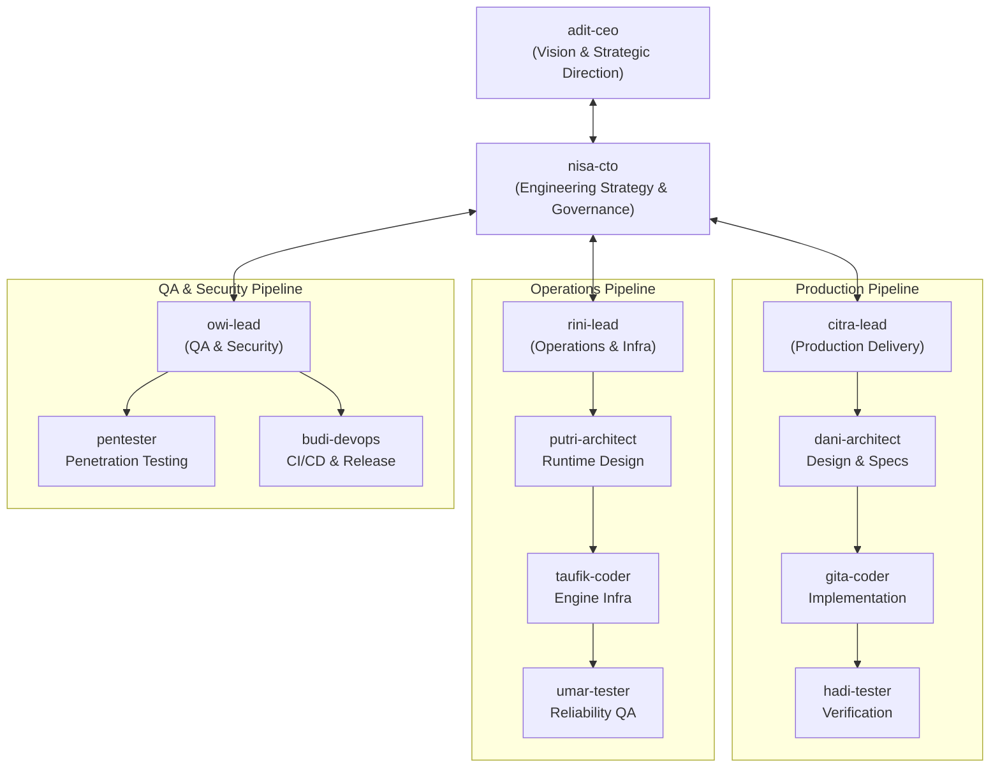

# Oh My Company (OMC) Agent Framework

This document outlines the organization, persona profiles, workflow mechanics, and communication protocols for the **Oh My Company (OMC)** multi-agent system in AETHER.

---

## 1. System Architecture & Topology

OMC organizes autonomous software development into a corporate hierarchy with a **star topology**. Executive leadership coordinates departmental leads, who subsequently drive specialized internal 4-role delivery pipelines.



---

## 2. Agent Roster & Profiles

The framework coordinates **13 specialized agents** divided into 4 departments:

### 2.1 Executive Department
- **`adit-ceo` (Chief Executive Officer):** Sets product direction, scope priorities, business invariants, and milestone acceptance. Accountable for high-level roadmap delivery.
- **`nisa-cto` (Chief Technology Officer):** Sets overall architectural direction, engineering standards, cross-department alignment, and technical trade-offs.

### 2.2 Production Department (Product Core)
- **`citra-lead` (Production Lead):** Orchestrates product features, decomposes user prompts into technical epics, manages context, and assigns subtasks.
- **`dani-architect` (Product Architect):** Formulates component designs, interfaces, data contracts, and dependency graphs. Recommends lean architectural solutions.
- **`gita-coder` (Product Coder):** Implements clean, maintainable, production-ready code. Strictly adheres to YAGNI and the 5-Stage CoT protocol.
- **`hadi-tester` (Product QA Tester):** Independently audits feature implementations. Writes and runs dual-stack tests (Pytest/Vitest), reproducing edge cases.

### 2.3 Operations Department (Infra & Runtime Engine)
- **`rini-lead` (Operations Lead):** Orchestrates agent runtime stability, performance optimization, and operational infrastructure.
- **`putri-architect` (Runtime Architect):** Researches and designs execution loops, context budgeting, token compaction, and provider connectivity.
- **`taufik-coder` (Runtime Coder):** Implements low-level engine modules (`src/agent_ai/runtime`, `contextbudget`, `providers`).
- **`umar-tester` (Runtime Tester):** Validates engine resilience, benchmark suites, provider failovers, and memory/token leaks.

### 2.4 QA & Security Department
- **`owi-lead` (Security & QA Lead):** Establishes test matrices, security gatekeeping, vulnerability assessments, and release qualifications.
- **`pentester` (Security Auditor):** Audits sandbox permissions, command blacklists, AST safety, injection vectors, and secret leaks.
- **`budi-devops` (DevOps & Release):** Manages build pipelines, Docker environments, environment profiles, and dependency packaging.

---

## 3. The 4-Role Delivery Pipeline

Within both Production and Operations, work travels linearly through the 4-role pipeline:

```
[ Lead: citra / rini ]
       │
       │ Decompose task & establish context
       ▼
[ Architect: dani / putri ]
       │
       │ Design specs, interfaces, verify YAGNI
       ▼
[ Coder: gita / taufik ]
       │
       │ Implement code adhering to 5-stage CoT
       ▼
[ QA Tester: hadi / umar ]
       │
       │ Run Pytest & Vitest independently
       ▼
[ Delivery Confirmation ]
```

---

## 4. Workflow Modes

Agents operate across four distinct workflow modes:

1. **Orchestrator Mode (Steps 1–5):**
   - High-level project coordination.
   - Monitors cross-department deliverables and maintains global task tracking.
2. **Plan Mode (Step 2):**
   - Deep codebase exploration, symbol indexing, dependency mapping.
   - Drafts explicit, numbered execution blueprints before touching disk.
3. **Executor Mode (Steps 3–4):**
   - Modifies files, executes build commands, inspects observations.
   - Dynamically re-plans when errors are encountered.
4. **Auditor Mode (Step 4–5):**
   - Enforces zero regression via test execution.
   - Evaluates security posture and code cleanliness.

---

## 5. Real-Time Knowledge (RTK) Protocol

To prevent state desynchronization between autonomous agents:
- **Shared Working State:** All mutations to working files, symbols, and environment flags are propagated through `working_state.py`.
- **Read-Before-Write Mandate:** No agent may edit code without first inspecting the target region in the active session.
- **Atomic Handoffs:** When passing a task from Architect to Coder or Coder to Tester, the handoff packet must include:
  1. Modified file paths.
  2. Targeted test commands.
  3. Known remaining risks or edge cases.

---

## 6. Lean Code Policy (YAGNI)

OMC agents strictly adhere to **You Aren't Gonna Need It**:
- Reject pre-optimization and multi-layer abstraction when a simple function suffices.
- Every introduced class or helper must have an immediate, active consumer.
- Code should be as small, clear, and focused as possible.
