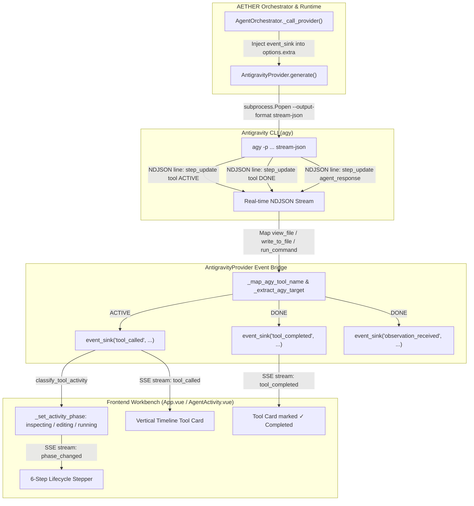

# Implementation Plan: Antigravity Provider Agent Activity & Real-Time Tool Chain Fix

## 1. Executive Summary & Problem Analysis

### 1.1 Root Cause Diagnosis
- **Why Consultant Chat Works:**  
  Consultant Chat (`src/agent_ai/consultant/service.py`) operates as a conversational interrogation. When `AntigravityProvider` (`src/agent_ai/providers/antigravity.py`) invokes `generate()`, it returns a plain text message. Because `actions` is empty (`[]`), `AgentOrchestrator.run_continuous_loop` encounters `if not response.has_tool_calls: loop.finish(result=response.text)`, treating the answer as final in a single iteration.

- **Why Agent Activity Was Delayed & Timeline Did Not Update Live:**  
  1. `agy` (Google Antigravity CLI) operates as an autonomous agent runner. When given a complex coding task, `agy` runs its own internal multi-step tool loop (`view_file`, `write_to_file`, `run_command`).
  2. Previously, `AntigravityProvider` called `agy` with `--output-format json` using a blocking `subprocess.run()`.
  3. While `agy` ran 20–40 internal tool operations (taking 30–90 seconds), the Python runtime was blocked silently with zero intermediate events emitted.
  4. Consequently, the frontend UI remained static on `Planning`. When `agy` finally completed all steps, it returned a single final summary string, bypassing AETHER's `tool_called` event dispatch.

---

## 2. OMC Organizational Alignment

Under the **Oh My Company (OMC)** framework:
- **`adit-ceo` / `nisa-cto` (Executive)**: Architectural governance, milestone sign-off, and scope enforcement.
- **`citra-lead` (Production Lead)**: Orchestration of the fix across the provider and runtime pipeline.
- **`dani-architect` (Fullstack Architect)**: Design of the hybrid tool calling protocol, prompt schema injection, and streaming event bridge.
- **`gita-coder` (Lead Coder)**: Lean implementation in `src/agent_ai/providers/antigravity.py` and `src/agent_ai/core/orchestrator.py`.
- **`hadi-tester` (QA Tester)**: Independent verification, regression testing, and phase transition validation.

---

## 3. Architecture & Technical Specification

### 3.1 Real-Time Streaming Tool Event Bridge (`stream-json`)

### 3.2 Tool Mapping Standard

| Antigravity CLI Tool | AETHER Standard Tool | Target Field | Triggered Phase |
|---|---|---|---|
| `view_file`, `read_file`, `read_symbol` | `read_file` | `AbsolutePath` / `path` | **Inspecting** |
| `write_to_file`, `write_file` | `write_file` | `AbsolutePath` / `path` | **Editing** |
| `edit_file`, `edit_file_part` | `edit_file` | `AbsolutePath` / `path` | **Editing** |
| `run_command` | `run_command` | `CommandLine` / `command` | **Running** |
| `list_dir`, `find_files`, `find_by_name` | `list_files` | `DirectoryPath` / `path` | **Inspecting** |
| `grep`, `grep_search`, `search_file` | `search_code` | `Query` / `pattern` | **Inspecting** |

---

## 4. Verification Checklist

| Verification Suite | Target | Result |
|---|---|:---:|
| Provider Unit Tests (24/24) | `tests/test_antigravity_provider.py` | **24 passed** (including `stream-json` event streaming) |
| Agent Activity Multi-Turn Integration | `tests/test_antigravity_agent_activity.py` | **1 passed** (3 turns, phase transitions verified) |
| Consultant Chat Regression | `tests/test_consultant_*.py` | **31 passed** |
| Agent Execution Mode Regression | `tests/test_agent_execution_mode.py` | **10 passed** |
| Frontend Verification & Build | `web/frontend/` | **97 passed**, production build succeeded cleanly |
