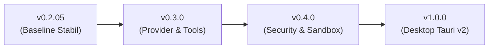

# Roadmap Publik AegisCode Studio

Dokumen ini memuat peta jalan pengembangan (*Roadmap*) publik AegisCode Studio untuk komunitas sumber terbuka, dimulai dari baseline saat ini (**v0.2.05**) menuju rilis stabil berskala penuh.

---

## 📌 Status Pengembangan Saat Ini (v0.2.05)

AegisCode saat ini berada pada tahap **v0.2.05: Stabilisasi Arsitektur & Antarmuka Studio**. Pada versi ini, pondasi utama antarmuka pengembang, kedaulatan data lokal, dan integrasi remote companion telah beroperasi penuh secara andal.

---

## 🗺️ Tahapan Milestone Komunitas

### 1. Milestone v0.2.05 / v0.2.06 (Rilis Saat Ini) — *Baseline Studio, Remote Companion & Autonomous Olympus Architecture*
- [x] **Sovereign Local Authentication**: Autentikasi sandi lokal PBKDF2-HMAC-SHA256 tanpa ketergantungan server luar.
- [x] **Telegram Remote Companion**: Outbound long-polling zero-trust, pairing QR code instan, dan permanen Agents Mode ⚡ dengan audit streaming real-time.
- [x] **Monaco Workbench IDE**: Editor multi-tab, layout responsif dengan splitter adaptif, dan pelacakan status berkas.
- [x] **Olympus Multi-Agent Framework**: 6 tahapan siklus hidup dinamis (DEFINE, PLAN, BUILD, VERIFY, REVIEW, SHIP) dan delegasi peran terkoordinasi (Zeus, Athena, Hermes, Hephaestus, Heracles, Themis).
- [x] **Unified Single-Mode "Agents"**: Konsolidasi asisten ke 100% otonom penuh, eliminasi mode "Ask" dan penghapusan total throttling (Quick / Balanced / Deep) di workbench dan settings.
- [x] **Interactive Agent Question Dialogues**: Dialog tanya-balik interaktif langsung di kartu timeline agen (`AgentActivity.vue`) tanpa perlu berpindah mode.
- [x] **Active Project Root Specifications**: Penyimpanan artefak `SPEC.md` dan `TODO.md` langsung di `<active_project_root>/specs/` dengan aksi 1-klik buka di Monaco Editor.
- [x] **Unthrottled Runner & Resilient Retry**: Penghapusan circuit-breaker runner (`proc.kill()`), izin refactoring skala besar, dan auto-retry eksponensial untuk koneksi drop.
- [x] **Rust Token Killer (`rtk`) CLI Proxy**: Kompresi output shell cerdas dan penghematan token konteks LLM secara real-time.
- [x] **Unified Dual-Theming**: 10 preset tema (6 gelap, 4 terang) berbasis token warna murni tanpa hardcoded hex.
- [x] **Smart Web Terminal**: Integrasi xterm.js dengan manajemen proses lokal.

---

### 2. Milestone v0.3.0 (Target Berikutnya) — *Normalisasi Provider BYOK & Tool Registry*
- [ ] **Adapter Provider BYOK Terpadu**: Antarmuka terstandardisasi untuk menyambungkan Google Gemini, OpenAI, Anthropic Claude, dan model lokal (Ollama / vLLM).
- [ ] **Community Tool Registry**: Kemampuan bagi pengembang untuk mendaftarkan alat (*tools*) kustom berbasis Python/Node.js yang dapat dipanggil oleh agen.
- [ ] **Smart Context Compaction**: Pemadatan konteks percakapan otomatis untuk menghemat konsumsi token tanpa kehilangan memori instruksi.
- [ ] **Enhanced File Search**: Fitur pencarian teks global (*full-text workspace search*) di panel kiri Workbench.

---

### 3. Milestone v0.4.0 — *Keamanan Sandbox & Reliability Gate*
- [ ] **Command Execution Sandbox**: Batasan izin eksekusi shell yang dapat dikonfigurasi (*allowlist & denylist*) untuk keamanan eksekusi perintah terminal oleh agen.
- [ ] **Automated Security Linter**: Pemindaian otomatis terhadap kerentanan injeksi, eksposur rahasia (*secrets leak*), dan kode berbahaya sebelum pengajuan diff persetujuan.
- [ ] **Triple-Gate QA Verification**: Framework pengujian otomatis komprehensif untuk memverifikasi fungsionalitas kode yang dihasilkan agent secara independen.

---

### 4. Milestone v1.0.0 — *Aplikasi Desktop Native & Ekosistem Rilis*
- [ ] **Paket Desktop Native (Tauri v2)**: Rilis installer native untuk macOS (`.dmg`), Linux (`.deb`/`AppImage`), dan Windows (`.msi`).
- [ ] **Sistem Plugin & Ekstensi Komunitas**: Dukungan modul tambahan pihak ketiga untuk memperluas antarmuka Studio.
- [ ] **Full Offline Workflow**: Optimalisasi eksekusi agen dengan model LLM lokal berbobot ringan saat bekerja tanpa sambungan internet.

---

## 💬 Umpan Balik & Saran Fitur
Kami sangat terbuka terhadap masukan dari komunitas! Jika Anda memiliki usulan perbaikan atau fitur baru yang ingin dimasukkan ke dalam roadmap, silakan buka diskusi di [GitHub Issues](https://github.com/aditlab-code/aegiscode/issues).
